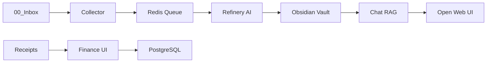
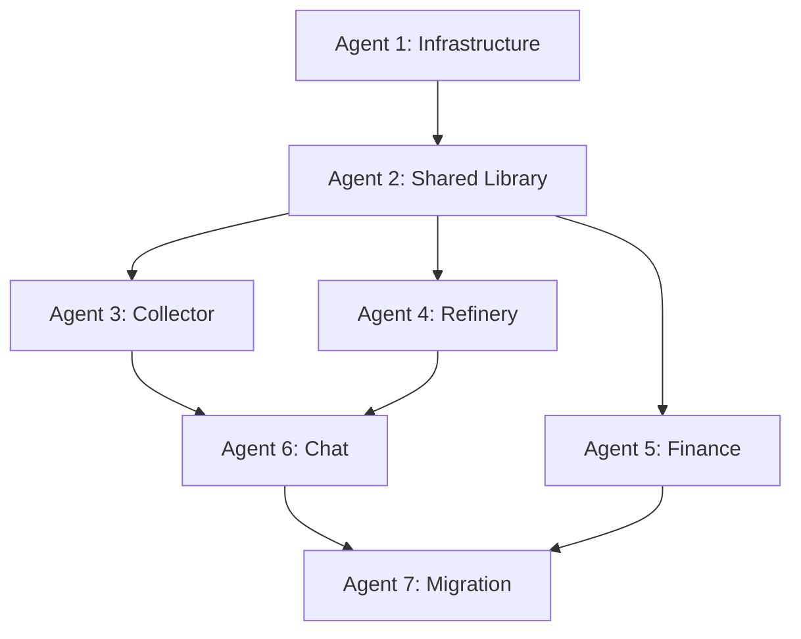

# Obsidian Brain v2 - Refaktoryzacja do Mikroserwisów

## 📋 Przegląd Projektu

Projekt refaktoryzacji monolitycznej aplikacji "Obsidian Brain" do architektury mikroserwisowej z wykorzystaniem Docker i Google Antigravity Agents.

## 🎯 Cel Refaktoryzacji

Transformacja obecnego systemu z:
- **Monolitycznego skryptu Python** → **Niezależne mikroserwisy**
- **Sterowanie tagami w Obsidian** → **Dedykowane UI i kolejki zadań**
- **Synchroniczne przetwarzanie** → **Asynchroniczne pipeline'y**
- **Brak separacji warstw** → **Czysta architektura (Collector → Refinery → Storage)**

## 🏗️ Docelowa Architektura

```
obsidian-brain-v2/
├── docker-compose.yml          # Orkiestracja wszystkich serwisów
├── .env                        # Zmienne środowiskowe
├── shared/                     # Wspólna biblioteka Python
│   ├── messaging.py           # Redis client
│   ├── types.py              # Pydantic models
│   ├── config.py             # Konfiguracja
│   └── logging.py            # Strukturalne logi
├── modules/
│   ├── collector/            # Pobieranie treści (YouTube, WWW)
│   ├── refinery/             # Przetwarzanie AI → Markdown
│   ├── finance/              # Streamlit app dla paragonów
│   └── chat/                 # Open Web UI + RAG
├── data/                      # Wolumeny Docker
│   ├── redis/
│   ├── postgres/
│   └── qdrant/
└── scripts/                   # Narzędzia pomocnicze
    ├── migrate_data.py
    └── health_check.py
```

## 🔄 Przepływ Danych



## 👥 Agenci i Kolejność Wykonania

### Faza 1: Fundament (Sekwencyjnie)
1. **Agent 1: Infrastructure** - Docker Compose, Redis, PostgreSQL, Ollama
2. **Agent 2: Shared Library** - Wspólny kod dla wszystkich serwisów

### Faza 2: Serwisy Podstawowe (Równolegle)
3. **Agent 3: Collector** - Pobieranie YouTube i WWW
4. **Agent 4: Refinery** - Przetwarzanie AI i generowanie Markdown
5. **Agent 5: Finance** - Aplikacja do paragonów

### Faza 3: Integracja (Sekwencyjnie)
6. **Agent 6: Chat** - Open Web UI z RAG
7. **Agent 7: Migration** - Testy i migracja danych

## 📊 Graf Zależności



## 🎯 Kluczowe Zmiany

| Aspekt | Stary System | Nowy System |
|--------|-------------|-------------|
| **Sterowanie** | Tagi w Obsidian (#do_zrobienia) | Redis Queue + Web UI |
| **YouTube** | Synchroniczne blokowanie | Asynchroniczny Collector |
| **Paragony** | Auto-zapis (błędy trafiają do bazy) | Weryfikacja przez człowieka |
| **Czat** | CLI w terminalu | Open Web UI (przeglądarka) |
| **Obsidian** | Kontroler + Widok | Tylko Widok (read-only) |

## 🚀 Jak Uruchomić z Google Antigravity

### Krok 1: Przygotowanie
```bash
# Stwórz nowy folder projektu
mkdir obsidian-brain-v2
cd obsidian-brain-v2

# Backup starego systemu
cp -r ../stary-projekt ../backup-$(date +%Y%m%d)
```

### Krok 2: Uruchom Agentów
1. Otwórz Google Antigravity
2. Stwórz nowy projekt "Obsidian Brain v2"
3. Dla każdego agenta (01-07):
   - Stwórz nowego agenta w Antigravity
   - Skopiuj treść z pliku `agent-XX-nazwa.md`
   - Uruchom agenta
   - Zweryfikuj output przed przejściem dalej

### Krok 3: Weryfikacja Po Każdej Fazie

**Po Agencie 1 (Infrastructure):**
```bash
docker compose up -d
docker ps  # Wszystkie kontenery powinny być "healthy"
```

**Po Agencie 2 (Shared):**
```bash
cd shared
pip install -e .
python -c "from shared.messaging import RedisClient; print('OK')"
```

**Po Agencie 3 (Collector):**
```bash
# Wrzuć testowy link do 00_Inbox/
echo "https://www.youtube.com/watch?v=dQw4w9WgXcQ" > 00_Inbox/test.txt
# Sprawdź Redis
docker exec -it redis redis-cli LLEN queue:refinery
```

## 📦 Infrastruktura Docker

### Serwisy Bazowe
- **Redis** - Kolejka zadań między serwisami
- **PostgreSQL** - Baza danych dla paragonów
- **Ollama** - Serwer modeli AI (GPU)
- **Qdrant** - Baza wektorowa dla RAG

### Serwisy Aplikacyjne
- **Collector** - Python worker (watchdog + yt-dlp)
- **Refinery** - Python worker (LangChain + LLM)
- **Finance** - Streamlit (port 8501)
- **Chat** - Open Web UI (port 3000)

## 🔐 Bezpieczeństwo

### Dane Wrażliwe
- Wszystkie API keys w `.env` (NIE commitować do git)
- PostgreSQL z hasłem (zmień w produkcji)
- Obsidian Vault montowany read-only dla większości serwisów

### Backup
- Regularne snapshoty PostgreSQL (`scripts/backup_db.sh`)
- Obsidian Vault w Git (osobne repo)
- Export konfiguracji Docker (`docker compose config`)

## 📈 Monitoring i Logi

### Logi Centralne
```bash
# Wszystkie logi w jednym miejscu
docker compose logs -f

# Konkretny serwis
docker compose logs -f refinery
```

### Metryki (Agent 7)
- Prometheus - zbieranie metryk
- Grafana - wizualizacja
- Dashboardy: zadania/s, błędy, czas przetwarzania

## ⚠️ Znane Ograniczenia

1. **GPU dla Ollama** - Wymaga NVIDIA GPU + nvidia-docker
2. **Whisper** - Wolny bez GPU (rozważ API)
3. **Redis** - Single point of failure (bez replikacji)
4. **Open Web UI** - Pierwsze uruchomienie pobiera modele (długo)

## 🆘 Troubleshooting

### Problem: Ollama nie startuje
```bash
# Sprawdź czy GPU jest dostępne
nvidia-smi
# Sprawdź logi
docker compose logs ollama
```

### Problem: Redis kolejka rośnie, ale nic się nie dzieje
```bash
# Sprawdź czy Refinery działa
docker compose ps refinery
# Sprawdź logi
docker compose logs refinery --tail=50
```

### Problem: Finance UI nie widzi zdjęć
```bash
# Sprawdź montowanie wolumenu
docker compose config | grep -A5 finance
# Uprawnienia do folderu
ls -la ./00_Inbox/Receipts/
```

## 📚 Dodatkowe Zasoby

- [Docker Compose Docs](https://docs.docker.com/compose/)
- [Ollama Documentation](https://ollama.ai/docs)
- [Open Web UI Guide](https://docs.openwebui.com/)
- [LangChain Docs](https://python.langchain.com/)

## 🎓 Najlepsze Praktyki

### Development
- Każdy agent tworzy testy jednostkowe
- Kod review przed merge (nawet dla AI 😉)
- Dokumentuj decyzje architektoniczne

### Deployment
- Zawsze testuj na kopii Vault przed produkcją
- Stopniowa migracja (nie wszystko naraz)
- Zachowaj stary system jako fallback przez 2 tygodnie

### Maintenance
- Cotygodniowy backup PostgreSQL
- Miesięczne czyszczenie starych logów
- Aktualizacja obrazów Docker co kwartał

---

**Status:** 🚧 W trakcie refaktoryzacji
**Wersja:** 2.0.0-alpha
**Ostatnia aktualizacja:** 2025-01-18
