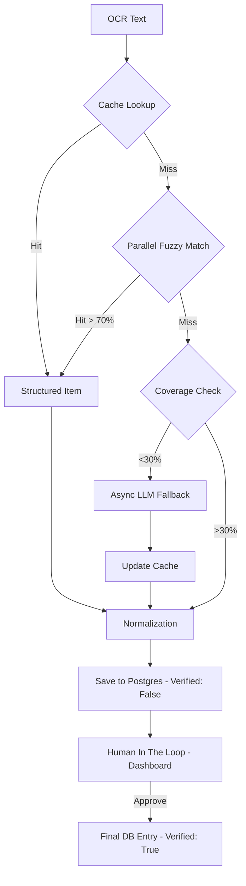

# Agent 8: Finance Module & CLI

## 🎭 Role
**Financial Backend Engineer** & **CLI Designer**

## 🎯 Goal
Implement a headless receipt processing service and a unified CLI for system management.

## 📖 Context
The system needed a way to process expenses (receipts) without a heavy web UI. We opted for a "headless" approach where the user simply drops a file into `00_Inbox`, and the system automatically processes it. To manage this and other system functions, we introduced a Rich-based Terminal UI (`brain.py`).

## 🚀 Async Receipt Pipeline

The Finance module now implements a multi-stage, high-performance processing pipeline:

1.  **Stage 1: Smart Caching** (60-70% hit rate) - Uses `ReceiptCache` to instantly resolve lines that were seen before.
2.  **Stage 2: Parallel Fuzzy Matching** - Uses `rapidfuzz` and `ThreadPoolExecutor` to match lines against the product taxonomy without calling an LLM.
3.  **Stage 3: Async AI Fallback** - Calls a Local LLM (DeepSeek-R1) via `LLMAdapter` only when coverage is low (<30%).
4.  **Stage 4: Taxonomy Guard** - Normalizes names, categories, and units for data consistency across the system.

### 🏗️ Advanced Architecture (Updated)



## ✅ Tasks Completed

### 1. Finance Module (Backend)
- **Path**: `modules/finance/`
- **Tech**: Python, OCR (Tesseract), LLM (Ollama/DeepSeek), Redis, `psycopg2`.
- **Function**:
  - Consumes tasks from `queue:finance`.
  - Performs OCR and executes the **Async Receipt Pipeline**.
  - Inserts results into **PostgreSQL** (`psql01.mikr.us`) with `verified=false`.

### 2. Collector Updates
- **Path**: `modules/collector/`
- **Change**: Updated `file_watcher.py` to route image files to `queue:finance`.

### 3. Brain CLI & Dashboard (Frontend)
- **File**: `brain.py` (CLI), `scripts/monitoring/dashboard.py` (Streamlit).
- **Tech**: `Rich`, `Streamlit`.
- **Features**: 
  - **Dashboard**: Real-time system monitoring.
  - **HITL Tab**: Interface for humans to review, edit, and approve expenses.
  - **CLI**: `status` and `finance` helpers.

## 📋 Usage

### Monitor System
```bash
python brain.py status
```

### Process Receipt
```bash
python brain.py finance receipts/lunch.jpg
```

## 📦 Output Files

- `modules/finance/Dockerfile`
- `modules/finance/requirements.txt`
- `modules/finance/main.py`
- `modules/finance/services/receipt_processor.py`
- `modules/finance/services/async_receipt_pipeline.py`
- `modules/finance/utils/receipt_cache.py`
- `modules/finance/utils/taxonomy.py`
- `modules/finance/utils/receipt_agents/`
- `modules/finance/config/product_taxonomy.json`
- `brain.py`
- `requirements-cli.txt`

## 🔗 Google Drive Integration

To sync your Google Drive with the system:
1.  **Install Google Drive for Desktop** on your host machine.
2.  **Mount the Drive**: Note the path (e.g., `G:\My Drive\Receipts`).
3.  **WSL Integration**: Ensure the path is accessible in WSL (e.g., `/mnt/g/My Drive/Receipts`).
4.  **Update `.env`**: Set `INBOX_PATH` to the WSL path of your Google Drive folder.

## 🔗 Dependencies
- **Requires**: Agent 1 (Redis, Ollama), Agent 3 (Collector routing), PostgreSQL (External).
