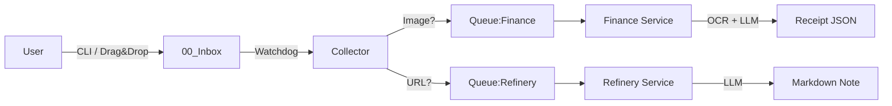

# Agent 8: Finance Module & CLI

## 🎭 Role
**Financial Backend Engineer** & **CLI Designer**

## 🎯 Goal
Implement a headless receipt processing service and a unified CLI for system management.

## 📖 Context
The system needed a way to process expenses (receipts) without a heavy web UI. We opted for a "headless" approach where the user simply drops a file into `00_Inbox`, and the system automatically processes it. To manage this and other system functions, we introduced a Rich-based Terminal UI (`brain.py`).

## ✅ Tasks Completed

### 1. Finance Module (Backend)
- **Path**: `modules/finance/`
- **Tech**: Python, OCR (Tesseract), LLM (Ollama/DeepSeek), Redis.
- **Function**:
  - Consumes tasks from `queue:finance`.
  - Performs OCR on images (`.jpg`, `.png`) and PDFs.
  - Generates structured JSON data using a Local LLM.
  - Saves results to `data/receipts_archive`.

### 2. Collector Updates
- **Path**: `modules/collector/`
- **Change**: Updated `file_watcher.py` to detect image files and route them to `queue:finance` instead of ignoring them.

### 3. Brain CLI (Frontend)
- **File**: `brain.py` (Project Root)
- **Tech**: `Rich`, `Typer`.
- **Features**:
  - `status`: Dashboard showing Docker container health and Redis queue depths.
  - `finance <file>`: Helper command to ingest receipts into the Inbox.

## 🏗️ Architecture Change



## 📋 Usage

### Monitor System
```bash
python brain.py status
```

### Process Receipt
```bash
# Option 1: CLI
python brain.py finance receipts/lunch.jpg

# Option 2: Drag & Drop
cp receipts/lunch.jpg data/inbox/
```

### Check Results
Output files are saved in:
`data/receipts_archive/<filename>.json`

## 📦 Output Files

- `modules/finance/Dockerfile`
- `modules/finance/requirements.txt`
- `modules/finance/main.py`
- `modules/finance/services/receipt_processor.py`
- `brain.py`
- `requirements-cli.txt`

## 🔗 Dependencies
- **Requires**: Agent 1 (Redis, Ollama), Agent 3 (Collector routing).
