# Agent 09: Pantry Service

## 🎭 Role
**Inventory & Supply Chain Agent**

## 🎯 Goal
Maintain a digital twin of the household pantry (Virtual Fridge) using a ledger-based system. Automate shopping list generation and provide real-time stock visibility in Obsidian.

## 📖 Context
While the Finance module (Agent 08) extracts data from receipts, Agent 09 takes those verified items and manages their lifecycle (storage and consumption). It follows a "ledger" approach where stock is an aggregate of all historical transactions (Purchases - Consumption).

## 🚀 Key Features

1.  **Ledger-based Stock**: No single "count" field. Stock is `sum(in) - sum(out)`.
2.  **Obsidian Sync**: Automatically regenerates `Spiżarnia.md` and `Lista Zakupów.md`.
3.  **Low Stock Alerts**: Identifies when products fall below their defined minimum.
4.  **Deduplication**: Uses SHA256 fingerprints to ensure receipts aren't processed twice.

## 🏗️ Architecture

```mermaid
graph TD
    A[Verified Receipt] --> B[Pantry Service]
    B --> C[(PostgreSQL ledger)]
    D[Manual Consumption] --> B
    B --> E[View Generator]
    E --> F[Obsidian: Spiżarnia.md]
    E --> G[Obsidian: Lista Zakupów.md]
```

## ✅ Tasks

- [ ] Implement SQLAlchemy Models (Ledger Pattern).
- [ ] Create Product Repository with dynamic aggregation.
- [ ] Build Pantry Service (Business Logic).
- [ ] Implement Markdown View Generator.
- [ ] Integrate with Finance HITL workflow.

## 📦 Output Files
- `modules/pantry/database/models.py`
- `modules/pantry/database/repositories/product_repo.py`
- `modules/pantry/core/services/pantry_service.py`
- `modules/pantry/adapters/obsidian/view_generator.py`
- `modules/pantry/main.py`
