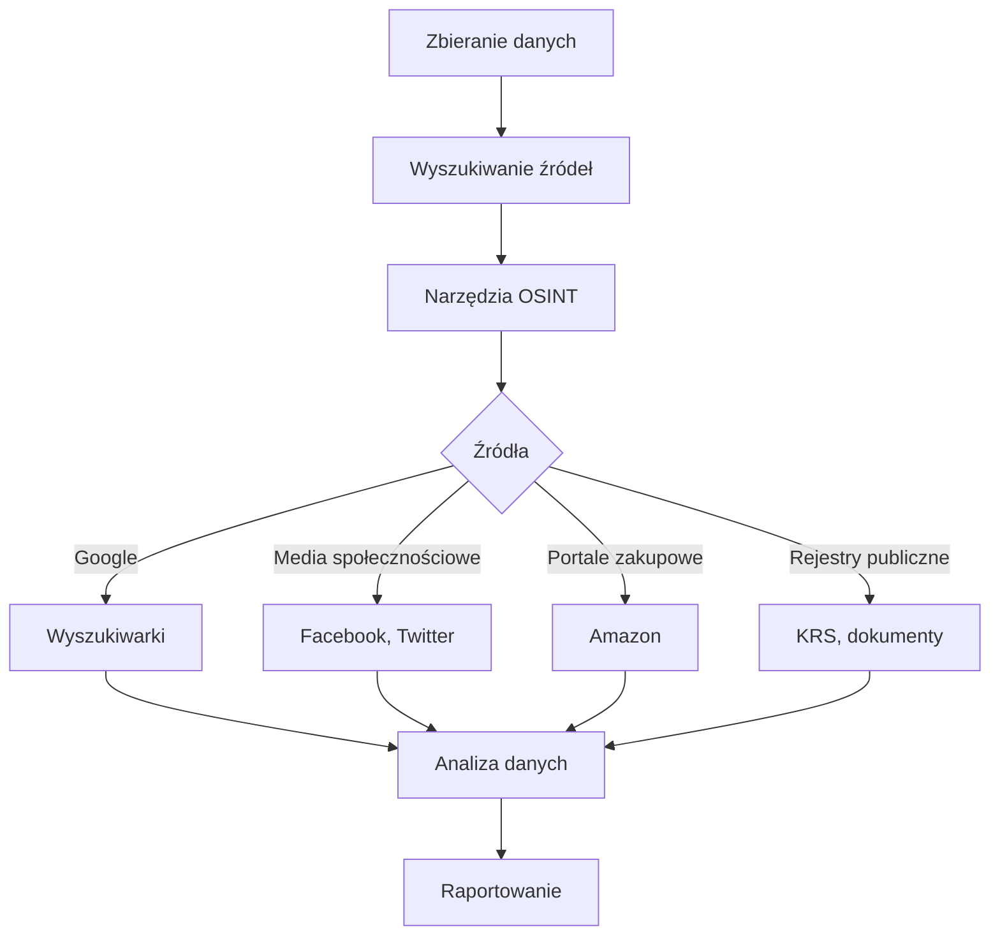
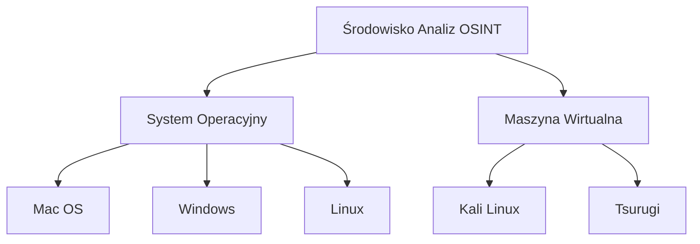

# Drive_0824_Narzędziownik OSINT 20 Reloaded - sesja 1_transkrypcja

> [!abstract] Podsumowanie
> Szkolenie z zakresu OSINT dostarcza kluczowych informacji o narzędziach i technikach analizy danych z otwartych źródeł, podkreślając znaczenie przestrzegania zasad etycznych i regulacji prawnych.

## 📝 Treść

---
title: Drive_0824_Narzędziownik OSINT 20 Reloaded - sesja 1_transkrypcja
created: "2026-01-16 09:41"
summary: Szkolenie z zakresu OSINT, prowadzone przez Tomka Turbę, przyciąga ponad 200 uczestników, prezentując nową formułę oraz zapowiedzi flagowej konferencji Mega Securac Hacking Party i nowej publikacji.
type: transcript
tags:
  - biznes
  - calendar
  - compliance
  - compliance/dora
  - compliance/nis2
  - compliance/rodo
  - cybersec
  - cybersec/osint
  - productivity
  - tech
  - tech/python
  - todo
  - source/drive_import
status: do-weryfikacji
source_file: Drive_0824_Narzędziownik OSINT 2.0 Reloaded - sesja 1_transkrypcja.txt
---

# Drive_0824_Narzędziownik OSINT 20 Reloaded - sesja 1_transkrypcja

> [!abstract] Podsumowanie
> Szkolenie z zakresu OSINT, prowadzone przez Tomka Turbę, przyciąga ponad 200 uczestników, prezentując nową formułę oraz zapowiedzi flagowej konferencji Mega Securac Hacking Party i nowej publikacji.

## 📝 Treść

## Szkolenie Narzędziownik OSINT

### Wprowadzenie

Dobry wieczór, witam na kolejnej edycji Narzędziownika OSINT. Celem dzisiejszego spotkania jest wprowadzenie do tematyki OSINT oraz omówienie narzędzi i technik zbierania informacji.

### Agenda Szkolenia

1. Wprowadzenie do OSINT
   - Definicja OSINT i jego zastosowania
2. Historie przypadków
   - Realne zastosowanie OSINT w analizie wywiadowczej
3. Techniki poszukiwania
   - Narzędzia automatyzujące procesy

### Prowadzący

Szkolenie poprowadzi Tomek Turba, ekspert w dziedzinie cyberbezpieczeństwa oraz osint, oraz Krzysztof Smaga, były administrator instytucji krytycznej.

### Logistyka Spotkań

- Czas trwania: ~3 godziny z przerwami
- Przerwy: 5-10 minut, co najmniej dwie podczas sesji
- Zasady Q&A: Udzielanie odpowiedzi na pytania z oznaczeniem "Q"

### Zasady Bezpieczeństwa i Etyki

Wszelkie informacje przedstawiane podczas szkolenia służą wyłącznie do celów edukacyjnych. Należy pamiętać o aspekcie zgodności z DORA i NIS2, które regulują bezpieczeństwo i ochronę danych.

### 📅 Calendar

- **TERMIN**: 20 października - Mega Securac Hacking Party
- **TERMIN**: 3 października - wprowadzenie do OSINT
- **TERMIN**: 7 października - poszukiwanie informacji o firmach
- **TERMIN**: 13 października - narzędzia AI oraz Operation Security
- **TERMIN**: 30 października - analiza białego wywiadu

## 📝 Actions

TODO: Przygotować materiały do każdych zajęć.
TODO: Uczestnicy mają dostęp do nagrań przez 6 miesięcy po zakończeniu szkolenia.

## 🧠 Flashcards

#flashcard Co to jest OSINT? :: Open Source Intelligence, zbieranie informacji z publicznych źródeł.
#flashcard Kto prowadzi szkolenie? :: Tomek Turba i Krzysztof Smaga.
#flashcard Jak długo trwa szkolenie? :: Około 3 godziny, z przerwami.

## Rozwiązanie problematyki porwania dziecka

### Wprowadzenie

Celem jest analiza sprawy porwania dziecka na podstawie dostępnych materiałów. Wnioskowanie w tej kwestii wymaga zastosowania technik OSINT (Open Source Intelligence).

### Przypadek z agencją detektywistyczną

Agencja detektywistyczna skontaktowała się z Securitum, zwracając się o pomoc w identyfikacji miejsca widocznego na zdjęciach. Zwana rekomendacją, aby zwrócić się do ekspertów w tej dziedzinie, została zainicjowana analiza zdjęcia.

### Narzędzia analityczne

1. **Metadane zdjęcia:** 
   - Użycie narzędzia Exif Tool do wydobycia metadanych z pliku zdjęcia.
  
2. **Analiza numeru telefonu:** 
   - Narzędzie Phone Info Ga oraz techniki dorkowania Google do identyfikacji porywacza.

3. **Profil sprawcy i ofiary:** 
   - Analiza osadzenia w mediach społecznościowych oraz zbieranie danych o rodzicach i potencjalnych świadkach.

### Wyzwania

1. **Ograniczenia RODO:** 
   - Obowiązek ochrony danych osobowych utrudnia dostęp do istotnych informacji.
  
2. **Ograniczone materiały:** 
   - Otrzymane materiały to tylko zrzut ekranu z komputera detektywa, bez danych identyfikacyjnych.

### Narzędzia wspierające analizę zdjęć

- **Forensically:** 
  - Narzędzie do analizy zdjęć, pozwalające na identyfikację klonowania, różnic poziomów i innych modyfikacji obrazu.

- **Sankalk.org:** 
  - Umożliwia określenie kierunku wschodów i zachodów słońca w kontekście analizyświetlnych warunków miejsca, co może wskazywać na czas zdarzenia.

### Techniki OSINT

- Analiza wizualna zdjęcia na podstawie danych ze źródeł otwartych.
- Wyszukiwanie informacji w Internecie, w tym wykorzystanie map i lokalizacji.

## 📝 Actions
TODO: Zastosować narzędzia Exif Tool i Phone Info Ga dla dalszej analizy metadanych.  
TODO: Wykorzystać Forensically do analizy zdjęcia pod kątem modyfikacji.  
TODO: Przygotować raport na temat możliwości lokalizacji miejsca porwania na podstawie analizy zdjęcia. 

## 📅 Calendar
TERMIN: Przygotować raport do 30 listopada 2023.  [Synced](https://www.google.com/calendar/event?eid=aDc2bGNtYnNyajZuYnRuanJrMXBvcXBmdWcgbWFyY2luLnVib2dpQG0)

## 🧠 Flashcards
#flashcard Co to jest OSINT? :: Open Source Intelligence, czyli pozyskiwanie informacji z otwartych źródeł.  
#flashcard Jakie narzędzie można użyć do analizy metadanych zdjęcia? :: Exif Tool.  
#flashcard Jakie są wyzwania związane z RODO? :: Ograniczenie dostępu do danych osobowych.

## 🌞 Analiza Położenia Słońca i Zasięgu Anten

### Wprowadzenie
Podczas analizy położenia antypersonalnych anten oraz ich zasięgu, kluczowym aspektem jest określenie kierunków — Słońca, budynków oraz znaków towarzyszących.

### Narzędzia
- **Sankalk.org**: Aplikacja do określania pozycji Słońca.
- **Mapy zasięgu**: Źródła takie jak strony Kanal+ i Polsatu do wizualizacji obszarów pokrycia.

### Wskazówki Dotyczące Ustawiania Anten
1. Anteny satelitarne w Polsce powinny być skierowane na południe.
2. Każde pomiary należy zweryfikować z kątami elewacji i azymutu.
3. Warto zwrócić uwagę na specyfikę dachu budynku, co może wpływać na jakość odbioru.

### Analiza Zasięgów
Porównanie map zasięgów różnych dostawców usług telewizyjnych ujawnia obszary, które mogą mieć problemy z pokryciem. Istnieje ryzyko, że w małych miejscowościach sygnał może być obecny, mimo braku wskazania na mapach.

### Detale Architektoniczne
Zwrócenie uwagi na rodzaj dachów, w tym dachy mansardowe, może wskazywać na regiony, z których mogą pochodzić konkretne struktury. Budynki z charakterystycznym układem są często ścisłe związane z danym regionem.

### Elementy Psychologiczne
Graffiti i inne oznaczenia na budynkach mogą dostarczyć informacji o lokalnych subkulturach oraz przynależności do grup (np. kibiców).

## 📝 Actions
TODO: Przeanalizować lokalizacje anten względem kierunków Słońca i zasięgu.
TODO: Zastosować narzędzia analityczne do określenia możliwych obszarów zasięgu w małych miejscowościach.
TODO: Zidentyfikować charakterystyczne elementy architektoniczne w badanym regionie.

## 📅 Calendar
SPOTKANIE: Ustalenie szczegółowych kierunków analizy w przyszłym tygodniu. [Synced](https://www.google.com/calendar/event?eid=dm5ya3YzZmozdGIzNGhmcnY1NThiNjQwam8gbWFyY2luLnVib2dpQG0)

## 🧠 Flashcards
#flashcard Jakie jest zalecane położenie anten satelitarnych w Polsce? :: W stronę południową.
#flashcard Jakie są podstawowe narzędzia do analizy zasięgów anten? :: Sankalk.org i mapy zasięgu dostawców usług.

## Analiza Graffiti i Praktyki OSINT

Graffiti na ścianach jest często symbolem emocji oraz identyfikacji z kimś lub czymś. Przykład kibica, który wyraża swoje uczucia poprzez graffiti, obrazuje silny związek socjologiczny oraz psychologiczny z daną grupą.

### Wykrywanie i Analiza

Osoby analizujące graffiti mogą zidentyfikować intencje wyrażone w tych działań:

- **Emocje**: Graffiti może wyrażać emocje związane z danym klubem sportowym.
- **Interakcja z innym miastem**: Często kibice odwiedzają inne miasta i wyrażają swoje opinie w formie graffiti.

### Narzędzia Graficzne w Analizie

Zadania związane z rozczytywaniem i analizowaniem napisów, które mogą być ciężkie do zrozumienia, mogą być wspierane przez narzędzia graficzne:

- **IrfanView** i **Adobe Photoshop**: Umożliwiają zwiększenie kontrastu, co ułatwia odczyt tekstu.
- **Fotopea**: Darmowy odpowiednik Photoshopa dostępny online, umożliwia podobne operacje na obrazach.

### AI w Analityce Graficznej

Dzisiaj dostępne są narzędzia AI, które mogą wspierać procesy analityczne, takie jak:

- Odpikselizowanie obrazów.
- Wzmocnienie jakości niskiej rozdzielczości.

### Przykłady Działań OSINT

Działania związane z OSINT, takie jak badanie graffiti, mogą prowadzić do zaskakujących odkryć, jak na przykład lokalizacja osób za pomocą szczegółowych analiz wizualnych.

### Elementy Bezpieczeństwa i Etyki

Z perspektywy etycznej, ważne jest zrozumienie granic OSINT. Informacje mogą być pozyskiwane w sposób legalny, jednak nie wszystkie metody są akceptowalne. Należy pamiętać o aspekcie stalkingu i ochrony danych osobowych.

## 📝 Actions
TODO: Zbadać różne narzędzia graficzne i AI przydatne w analizie graffiti.  
TODO: Przygotować raport dotyczący zachowań kibiców i ich wpływu na lokalną społeczność.  
TODO: Rozważyć aspekty etyczne związane z analizą danych osobowych w kontekście OSINT.

## 📅 Calendar
SPOTKANIE: Zorganizować spotkanie dotyczące wzmocnienia jakości obrazów używając AI w przyszłym tygodniu. [Synced](https://www.google.com/calendar/event?eid=bGcyNjViMTc1ZnVrN3R1cGQ1dmNjMzNsajAgbWFyY2luLnVib2dpQG0)

## 🧠 Flashcards
#flashcard Co oznacza graffiti na ścianie? :: Wyraża emocje i identyfikację z danym klubem.  
#flashcard Jakie narzędzia graficzne można wykorzystać do analizy graffiti? :: IrfanView, Adobe Photoshop, Fotopea.  
#flashcard Czym jest OSINT? :: Technika gromadzenia i analizy danych z ogólnodostępnych źródeł.  
#flashcard Jakie problemy mogą pojawić się w praktykach OSINT? :: Stalking, naruszenie prywatności, nieetyczne wykorzystywanie informacji.

## 📚 Dokumentacja Techniczna - OSINT w Japonii i Typy OSINT

### 1. Wprowadzenie do OSINT w Japonii
Japonia stanowi szczególny obszar zainteresowania w dziedzinie OSINT (Open Source Intelligence). Zjawisko to związane jest z ethosami i normami kulturowymi w Japonii, które mogą prowadzić do bardziej intensywnej współpracy w zakresie zbierania informacji, nawet w przypadkach, które w innych krajach mogą być uznawane za nieetyczne.

### 2. Przykład zastosowania OSINT
Analityk OSINT, "Tokuteya", może otrzymać zlecenie na odnalezienie konkretnej osoby, co może budzić wątpliwości etyczne. Przykład ten obrazuje, jak w Japonii, w przeciwieństwie do Polski, mentalność i podejście do prywatności mogą być znacznie odmienne. 

### 3. Zbieranie informacji
OSINT stało się nową nauką, która umożliwia zbieranie i analiza danych z różnych źródeł. Współczesne narzędzia pozwalają na analizę danych wizualnych oraz przetwarzanie informacji z różnych platform, przypominając metody wykorzystywane w Hollywood. Badania naukowe wskazują, że odtwarzanie złożonych sytuacji na podstawie dostępnych danych jest możliwe.

### 4. Proces gromadzenia informacji
Zbieranie danych wymaga ich analizy i destylacji w celu uzyskania wartościowych informacji. Surowe dane, takie jak teksty, obrazy czy lokalizacje, wykorzystuje się do tworzenia informacji, które mają konkretne znaczenie dla analityków.

### 5. Rodzaje OSINT
OSINT można klasyfikować na dwie kategorie:
- OSINT defensywny: Używany do analizy i zbierania informacji w celach obronnych (np. w służbach wywiadowczych, policji).
- OSINT ofensywny: Może być stosowany do działań wywiadowczych oraz w kontekście rekonwersji ataków.

#### 5.1 OSINT pasywny i aktywny
- **OSINT pasywny**: Analitycy nie wchodzą w interakcję z badanym celem, co może być używane do zbierania informacji bez ujawniania źródła.
- **OSINT aktywny**: Wymaga bezpośrednich interakcji z celem, takich jak skanowanie sieci czy stosowanie socjotechnik.

### 6. Zmiany w komunikacji
Zrozumienie ewolucji komunikacji od jednokierunkowych form informacji (media tradycyjne) do interaktywnych platform społecznościowych jest kluczowe dla analityków OSINT. Od 2008 roku znaczenie social mediów jako głównego źródła informacji rośnie, co ma wpływ na badania i gromadzenie danych.

### 7. Wpływ AI na OSINT
Od 2022 roku sztuczna inteligencja zyskuje na znaczeniu w kontekście OSINT, umożliwiając szybsze i bardziej zaawansowane analizy danych.

## 📝 Actions
TODO: Zbadać etyczne implikacje OSINT w Japonii.  
TODO: Przeanalizować wpływ mediów społecznościowych na badania OSINT.  
TODO: Zastosować narzędzia AI w analizach OSINT.

## 📅 Calendar
SPOTKANIE: Analiza etyki w OSINT - Termin: 15.03.2024   [Synced](https://www.google.com/calendar/event?eid=bzlwa2lwamo2dDRnODNzNTYwYTJqZjg5ZG8gbWFyY2luLnVib2dpQG0)
SPOTKANIE: Przegląd narzędzi AI dla OSINT - Termin: 25.04.2024   [Synced](https://www.google.com/calendar/event?eid=azRiNmVudGdnM3JkdXF0YWlxMjhldXVxZW8gbWFyY2luLnVib2dpQG0)

## 🧠 Flashcards
#flashcard Jakie są dwa rodzaje OSINT? :: Defensywny i ofensywny.  
#flashcard Co oznacza OSINT pasywny? :: Brak interakcji z celem.  
#flashcard Jakie jest znaczenie AI w OSINT? :: Umożliwia szybsze analizy danych.  

## Osint - Analiza i Zbieranie Danych

### Interakcje z Celem
Podczas badań nad figurantami lub analizie firm, nie należy wchodzić w interakcje z celem. To oznacza:

- Unikanie komunikacji za pośrednictwem czatu.
- Niezadzwonienie do analizowanych firm.
- Nie wykonywanie skanowania ich infrastruktury bezpośrednio z własnego komputera.

### Aktywny vs Pasywny OSINT
Aktywny OSINT to przeciwieństwo pasywnego:

- Aktywny OSINT angażuje interakcję z systemem (np. skanowanie sieci, wykorzystanie socjotechniki).
- W przypadku aktywnego OSINT, badacz staje się namierzalny.

### Znaczenie Notatek w OSINT
Notatki są kluczowym elementem w procesie OSINT. Pomagają stworzyć solidny fundament i pozwalają na:

- Organizowanie zebranych informacji.
- Przechowywanie i analizowanie danych.

### Fazy Procesu OSINT
Proces OSINT można podzielić na pięć faz:

1. **Przygotowanie**
   - Zdefiniowanie celu badań.
   - Przygotowanie "jałowego" środowiska do pracy.

2. **Zbieranie Danych**
   - Gromadzenie danych przy zachowaniu zasad (wszystko powinno być dokumentowane).
   - Robienie zrzutów ekranu oraz notatek, aby uniknąć utraty informacji.

3. **Odszumienie Danych**
   - Filtrowanie zbioru danych w celu wyeliminowania nieprzydatnych informacji.

4. **Analiza**
   - Przeprowadzanie analizy opłukanych danych, w celu wyciągnięcia wniosków.
   - Unikanie błędnych decyzji, które mogą prowadzić do niewłaściwych wniosków.

5. **Wnioski**
   - Opracowywanie ukierunkowanych wniosków na podstawie przeprowadzonej analizy.

### Błędy Poznawcze
Zidentyfikowane błędy poznawcze mogą wpływać na analizę. Wydatek czasu na studiowanie literatury psychologicznej, jak np. prace Heurera, może pomóc zrozumieć, jak unikać takich pułapek.

## 📝 Actions
TODO: Przygotować jałowe środowisko do przeprowadzenia badań.  
TODO: Ustanowić zasady gromadzenia danych.  
TODO: Zrealizować analizę zebranych danych, uwzględniając możliwe błędy poznawcze.  

## 📅 Calendar
TERMIN: Spotkanie: 20 października 2023, Kraków - Mega Securac Hacking Party. [Synced](https://www.google.com/calendar/event?eid=NXRwZDVwYml1ZW41MmtzOG1naTYzY3AzanMgbWFyY2luLnVib2dpQG0)

## 🧠 Flashcards
#flashcard Co to jest aktywny OSINT? :: Interakcja z systemem lub celem, np. skanowanie sieci.  
#flashcard Jakie są fazy procesu OSINT? :: Przygotowanie, Zbieranie Danych, Odszumienie, Analiza, Wnioski.  
#flashcard Dlaczego notatki są ważne w OSINT? :: Umożliwiają organizację i analizę zebranych informacji.  
#flashcard Co to jest "jałowe" środowisko? :: Środowisko wolne od interakcji ze sprawdzanym celem.

## Dokumentacja: Zbieranie Danych w Procesie Śledczym

### Wprowadzenie
Zbieranie danych w kontekście analizy kryminalnej lub śledczej wymaga uwzględnienia zarówno informacji osobistych, jak i technicznych. Istotne jest zrozumienie, jakie właściwości fizyczne i cyfrowe są dostępne oraz jak można je gromadzić, aby wspierały dalszą analizę.

### Typy informacji do zbierania
- **Wygląd zewnętrzny**:
  - Kolor włosów
  - Kolor oczu
  - Cechy szczególne (tatuaże, blizny)
  
- **Pojazdy**:
  - Marka i model auta
  - Numer rejestracyjny
  - Numer VIN
  
- **Adresy e-mail**:
  - Nazwa użytkownika
  - Domeny
  - Potencjalne wycieki danych

### Narzędzia do zbierania danych
Istnieje wiele narzędzi oraz metod, które można wykorzystać do kolekcjonowania informacji, w tym:
- **Zrzuty ekranu**: Sposób na uchwycenie istotnych informacji wizualnych w postaci obrazów.
- **Oprogramowanie do notacji i organizacji**: Przydatne do zapisania zrzutów oraz notatek.
- **Narzędzia przeglądarkowe**: Dodatki takie jak `Fire Shot` umożliwiają zrzut całej strony internetowej w jednym pliku PDF, zamiast oddzielnych obrazów.

### Proces zbierania danych
1. **Ręczne zbieranie danych**:
   - Robienie zrzutów ekranu i zapisywanie w folderach tematycznych (np. „śledztwo fly grant”).
   - Użycie kombinacji klawiszy do robienia zrzutów na różnych systemach operacyjnych (Windows, Mac, Linux).

2. **Automatyzacja procesu**:
   - Używanie narzędzi takich jak `Hunchly`, które automatycznie zapisują odwiedzane strony i umożliwiają późniejsze zaznaczenie interesujących fragmentów.
   - Korzystanie z narzędzi developerskich w przeglądarkach do analizy i zapisu zasobów z witryn internetowych.

### Uwagi dotyczące bezpieczeństwa
- Podczas zbierania danych należy zwracać uwagę na przepisy dotyczące RODO oraz inne regulacje związane z prywatnością danych. Zbieranie danych osobowych powinno być uzasadnione i zgodne z zasadami minimalizacji danych.

## 📝 Actions
- TODO: Zdefiniować standardy zbierania danych, aby były zgodne z regulacjami prawnymi (RODO, NIS2).
- TODO: Zainstalować i skonfigurować zalecane narzędzia do zbierania danych.
- TODO: Przeprowadzić szkolenie zespołu dotyczące metod zbierania i analizy danych.

## 📅 Calendar
- SPOTKANIE: Ustalenie protokołów bezpieczeństwa - 2023-10-15. [Synced](https://www.google.com/calendar/event?eid=MmU0aTZ0ZzhwOHJhOWJrYm1xZjJtZzJwNjQgbWFyY2luLnVib2dpQG0)

## 🧠 Flashcards
#flashcard Jakie są kluczowe cechy, które powinny być zbierane przy analizie osobowej? :: Kolor włosów, kolor oczu, cechy szczególne.
#flashcard Jakie narzędzie umożliwia zapis całej strony internetowej w formacie PDF? :: Fire Shot.
#flashcard Jakie regulacje dotyczące prywatności powinny być uwzględniane przy zbieraniu danych? :: RODO.

## 📝 Actions
TODO: Zasymilować informację na temat narzędzi OSINT, takich jak Hunchly oraz Xmind.
TODO: Zaktualizować listę źródeł informacji o narzędziach OSINT.
TODO: Zgromadzić i skategoryzować dane z portali, takich jak OSINT Framework oraz otwarte-źródła.pl.

## 📅 Calendar
SPOTKANIE: Wprowadzenie do narzędzi OSINT - data do ustalenia. [Synced](https://www.google.com/calendar/event?eid=bWQwdmI1NjEyOG0wcTRyYW1wMG5tZXRpbmcgbWFyY2luLnVib2dpQG0)

## Architektura Procesu Zbierania Danych OSINT
Diagram ilustrujący proces zbierania danych:


## 🧠 Flashcards
#flashcard Jakie narzędzie do analizy danych używa Hunchly? :: Hunchly zbiera dane z przeglądarek w kontekście OSINT.
#flashcard Co to jest OSINT Framework? :: OSINT Framework to zbiór narzędzi i źródeł dane do badań OSINT.
#flashcard Jaką funkcję pełni Xmind w kontekście analizy OSINT? :: Xmind umożliwia tworzenie map myśli do organizacji i analizy danych.

## Dokumentacja Techniczna dotycząca Środowiska Analizy OSINT

### Wprowadzenie
Dokumentacja dotyczy konfiguracji środowiska analizy OSINT (Open Source Intelligence) oraz wyboru odpowiednich systemów operacyjnych i narzędzi. W kontekście bezpieczeństwa, niniejsza dokumentacja podkreśla zalecenia zgodne z DORA oraz NIS2.

### Wyposażenie Środowiska
Aby przygotować odpowiednie środowisko do analizy, należy uwzględnić kilka kluczowych aspektów:

1. **Lokalizacja**: Warto wybrać miejsce, które zapewnia ciszę i skupienie.
2. **System operacyjny**: Do wyboru mamy kilka możliwości, w tym Mac OS, Windows oraz różne dystrybucje Linuxa.
3. **Narzędzia**:
   - Narzędzia online.
   - Narzędzia instalowane lokalnie.

### Systemy Operacyjne

#### Mac OS
- **Zalety**: Kontrolowane środowisko, mniejsze ryzyko ataków.
- **Wady**: Wysokie koszty sprzętu.

#### Windows
- **Zalety**: Szeroka gama aplikacji dostępnych dla analityków.
- **Wady**: Trudności z utworzeniem konta offline, podatność na złośliwe oprogramowanie, gromadzenie danych telemetrycznych.

#### Linux
- **Zalety**: Darmowość, duża możliwość konfiguracji, mniejsze ryzyko ataków.
- **Wady**: Wyższy poziom skomplikowania w użyciu, wymaga od użytkownika znajomości systemu.

### Wirtualizacja
Zaleca się stosowanie maszyn wirtualnych do testowania i analizy. Pozwala to na bezpieczne prowadzenie działań analitycznych:

```bash
# Przykład instalacji VirtualBox
sudo apt update
sudo apt install virtualbox
```

#### Wykorzystanie VirtualBox
- Umożliwia jednoczesne uruchamianie różnych systemów operacyjnych.
- Możliwość klonowania maszyn wirtualnych dla odizolowania środowiska.

### Maszyny Wirtualne
- **Kali Linux**: Dystrybucja dla bezpieczeństwa i analizy.
- **Tsurugi**: Narzędzie do informatyki śledczej.

### Diagram Architektury


## 📝 Actions
TODO: Przygotować dokumentację z ustawieniami dla każdego systemu operacyjnego.  
TODO: Opracować szczegółowe wytyczne dotyczące maszyn wirtualnych.  
TODO: Zaimplementować polityki bezpieczeństwa zgodne z DORA i NIS2.

## 🧠 Flashcards
#flashcard Co to jest OSINT? :: Inteligencja z otwartych źródeł.  
#flashcard Jakie są główne systemy operacyjne dla analityków? :: Mac OS, Windows, Linux.  
#flashcard Dlaczego warto używać maszyny wirtualnej? :: Aby zapewnić bezpieczeństwo i izolację środowiska analizy.

## Bezpieczeństwo danych w kontekście OSINT

### Anonimowe dystrybucje Linuxa
Huonix to przykład dystrybucji Linuxa skoncentrowanej na anonimowości oraz OSINT. Posiada szereg funkcji zapewniających ciche przetwarzanie danych, zmniejszając ryzyko śledzenia oraz logowania aktywności.

### Zasady działania OSINT
OSINT (Open Source Intelligence) wymaga unikania działań, które mogą prowadzić do profilowania użytkownika, co w kontekście zgodności z RODO jest kluczowe w osób pracujących z danymi osobowymi. Profilowanie może prowadzić do niezamierzonego ujawnienia wrażliwych informacji.

### Elementy profilowania
- Windows oraz smartfony często przeprowadzają profilowanie użytkowników na podstawie ich aktywności. 
- Przykładowo, jeśli użytkownik prowadzi wyszukiwania związane z tematyką zwierząt, systemy mogą zaproponować reklamy, które nie są związane z pierwotnym celem wyszukiwania, co narusza prywatność.

### DNS i bezpieczeństwo danych
DNS (Domain Name System) to protokół niezbędny do przetwarzania zapytań internetowych. W kontekście bezpieczeństwa danych istotne jest korzystanie z serwerów DNS, które nie profilują użytkowników. 

#### Ustawienia DNS
Przykładowe adresy DNS, które można ustawić, aby zminimalizować profilowanie:
- 1111 (Cloudflare)
- 1112 (Cloudflare)

Użytkownik może ustawić te adresy na poziomie routera, co zapewni, że cała sieć będzie korzystać z ustawionych serwerów DNS.

### Konfiguracja protokołów bezpieczeństwa
W celu dalszego wzmocnienia bezpieczeństwa, zaleca się skonfigurowanie przeglądarki do używania DNS over HTTPS. To szyfrowane zapytanie utrudnia osobom trzecim przechwytywanie zapytań o nazwę domeny.

## 📝 Actions
TODO: Przeanalizować dostępność dystrybucji Huonix dla zastosowań OSINT.  
TODO: Ustawić serwery DNS w routerze (1111 i 1112) dla zwiększenia prywatności.  
TODO: Zaktualizować przeglądarki do korzystania z DNS over HTTPS.  
TODO: Zastosować techniki minimalizacji profilowania w codziennym użytkowaniu urządzeń.

## 🧠 Flashcards
#flashcard Co to jest Huonix? :: Anonimowa dystrybucja Linuxa skoncentrowana na OSINT.  
#flashcard Jakie są przykładowe adresy DNS zapewniające prywatność? :: 1111 i 1112 (Cloudflare).  
#flashcard Co to jest DNS over HTTPS? :: Protokół szyfrujący zapytania DNS, zwiększający prywatność.  

## VPN i Bezpieczeństwo Internetowe

### Wprowadzenie do VPN
Usługa portalu VPN, jak ProtonVPN, jest dostępna w wersji darmowej. Istnieje wiele darmowych portali VPN, jednak ich użyteczność i bezpieczeństwo mogą się różnić. 

### Szyfrowanie i Geolokalizacja
Szyfrowanie kanału komunikacyjnego uniemożliwia dostawcy internetowemu oraz osobom trzecim zobaczenie, jakie działania użytkownik podejmuje online. Ruch internetowy stanie się widoczny jedynie w końcowej lokalizacji, co może sprawić, że geolokalizacja wydaje się zmieniona. W przypadku przestępców, to rozwiązanie nie jest wystarczające, ponieważ służby międzynarodowe mogą łatwo uzyskać logi działalności.

### Typy VPN
Zalecanym płatnym rozwiązaniem jest Mullvad VPN. ProtonVPN jest dobrą opcją, choć wymaga również płatności w niektórych wariantach. Można również wykorzystać funkcjonalność proxy, ale należy mieć na uwadze ryzyko związane z bezpieczeństwem takich serwerów.

### Proxy Chains
Program Proxy Chains umożliwia tworzenie łańcucha połączeń za pomocą różnych serwerów proxy, co zwiększa anonimowość. Należy jednak zauważyć, że korzystanie z tych narzędzi wiąże się z ryzykiem.

### Sojusz Oczu
Kwestia bezpieczeństwa w kontekście VPN jest również związana z tzw. Sojuszem Oczy. Ten sojusz, pierwotnie pięciu krajów (USA, Kanada, UK, Nowa Zelandia, Australia), rozwinął się o kolejne państwa, co daje służbom możliwość współpracy przy zbieraniu danych i logów.

### Korzystanie z Tor Browser
Tor Browser zapewnia dodatkowy poziom bezpieczeństwa. Połączenie przez Tor skrywa geolokalizację, ale nie zapewnia pełnej kontroli nad połączeniem. Pożądane jest, aby użytkownicy byli świadomi, jakie informacje są przekazywane.

### Zalecenia dla Użytkowników
- Używać unikalnych haseł do różnych serwisów.
- Zastosować dwuczynnikowe uwierzytelnianie, gdy to możliwe.
- Korzystać z menedżerów haseł (np. Bitwarden, 1Password).

## 📝 Actions
TODO: Przetestować działanie ProtonVPN i Mullvad VPN.
TODO: Zbadać efektywność Proxy Chains w poprawie anonimowości.
TODO: Sprawdzić różnicę w użyciu Tor over VPN versus VPN over Tor.

## 🧠 Flashcards
#flashcard Co to jest VPN? :: Wirtualna sieć prywatna, która szyfruje ruch internetowy.
#flashcard Jakie są zalety korzystania z Tor Browser? :: Zwiększa anonimowość, ukrywa geolokalizację użytkownika.
#flashcard Co to jest Sojusz Oczy? :: Międzynarodowy sojusz krajów współpracujących w zakresie wywiadu i bezpieczeństwa danych.

## Techniki Generowania Profilu w OSINT

### Jailbreak i Wyciek Danych
- Technika jailbreak umożliwia uzyskanie nieautoryzowanego dostępu do urządzeń, co może prowadzić do wycieku danych.

### Szkolenia i Prezentacje
- Istnieją szkolenia dotyczące hackowania oraz analizy AI, które mogą być pomocne w zrozumieniu zagrożeń związanych z bezpieczeństwem infrastruktury.

### Tworzenie Profili
- Tworzenie profili do działań analitycznych wymaga zrozumienia dostępnych narzędzi oraz etykietowania prawidłowych informacji.

### Generowanie Fałszywych Profilów
- Narzędzia takie jak "this person does not exist" wykorzystują sieci neuronowe do generowania wizerunków nieistniejących ludzi. Te obrazy mogą być używane jako tzw. "kukiełki" do różnych działań, jednak istnieją ograniczenia w analizie ich autentyczności.

### Wykorzystanie Deepfake'ów
- Stosowanie technologii deepfake do tworzenia animacji profili nie jest nielegalne, co otwiera nowe możliwości dla analityków OSINT. Ważne jest jednak przestrzeganie przepisów prawa.

## Zasady Tworzenia Konta
- Konta sokpapetowe powinny przedstawiać się naturalnie i nie rzucać się w oczy.
- Warto budować sieć kontaktów bezkontaktowo, unikając pozostawiania osobistych danych na świeżych kontach.

## Aspekty Bezpieczeństwa
- VPN nie zapewnia całkowitej anonimowości; wiele dostawców może posiadać logi, które mogą zostać udostępnione służbom.  
- Blokowanie ciasteczek oraz skryptów jest kluczowe dla ochrony prywatności. Użycie dodatków takich jak NoScript może pomóc w zabezpieczeniu.

## 📝 Actions
- TODO: Zgłębić techniki jailbreak oraz ich implikacje dla bezpieczeństwa.
- TODO: Przeanalizować narzędzia do generowania fałszywych profili w kontekście OSINT.
- TODO: Rozważyć etyczne aspekty używania deepfake'ów w analizie danych.
- TODO: Opracować politykę bezpiecznego tworzenia kont sokpapetowych z uwzględnieniem przepisów prawa.

## 📅 Calendar
- SPOTKANIE: Zgłębienie aspektów analizowania bezpieczeństwa w infrastrukturze krytycznej - DATA DO USTALENIA. [Synced](https://www.google.com/calendar/event?eid=NzJrbm1ycHRtamp1N2QwZDI2MWxkaTQyYmMgbWFyY2luLnVib2dpQG0)

## 🧠 Flashcards
#flashcard Czym jest jailbreak? :: Technika uzyskiwania nieautoryzowanego dostępu do urządzeń.
#flashcard Jakie narzędzie generuje fałszywe wizerunki ludzi? :: "this person does not exist".
#flashcard Jakie są kluczowe zasady tworzenia konta sokpapetowego? :: Konto powinno być naturalne i nie rzucać się w oczy.
#flashcard Co jest istotne przy korzystaniu z VPN? :: VPN nie zapewnia całkowitej anonimowości.

## Wyszukiwanie i Operatory Wyszukiwania

### Rodzaje Wyszukiwania
Wyszukiwanie informacji w Internecie może przybierać różne formy. Użytkownik ma możliwość przeszukiwania:
- Grafiki
- Materiałów wideo
- Informacji finansowych poprzez Google Finance
- Książek

### Wyszukiwanie zaawansowane
Google oferuje opcję wyszukiwania zaawansowanego, która ułatwia odnalezienie informacji poprzez użycie różnych operatorów. Użytkownicy mogą wyszukiwać dane na:
- Specyficznych stronach
- Po rozszerzeniach plików

### Operatory Wyszukiwania
Podstawowe operatory, które należy znać i stosować:
- `site:` - Wyszukiwanie tylko na konkretnych stronach.
- `filetype:` - Wyszukiwanie po typie pliku (np. dokumenty, PDF).
- `-` (minus) - Wyklucza wyniki z określonej domeny lub zawierające konkretne słowo np. `donald tusk -wikipedia`.

### Techniki OSINT
Podczas poszukiwań informacji istotne są również techniki Open Source Intelligence (OSINT). Przykłady użycia:
- `indexof:` - Użycie do przeszukiwania otwartych folderów na serwerach.
- Wyszukiwanie plików poufnych (np. `confidential`) na stronach internetowych.

## Bezpieczeństwo a Użycie Dorków
Należy pamiętać, że korzystanie z dorków (czyli zaawansowanych technik wyszukiwania) może być postrzegane jako działalność szkodliwa, jeśli nie jest stosowane ostrożnie. Przykładowe użycie:
- Przeszukiwanie serwerów internetowych, na których mogą być narażone nieautoryzowane dane (np. logi dostępne publicznie).

## 📝 Actions
TODO: Udokumentować zastosowanie operatorów wyszukiwania w codziennej praktyce.  
TODO: Przeprowadzić szkolenie na temat bezpiecznego używania wyszukiwarek do analizy OSINT.

## 📅 Calendar
SPOTKANIE: Zaplanować sesję na temat wyszukiwania zaawansowanego - data do ustalenia.   [Synced](https://www.google.com/calendar/event?eid=OTc5NmdmdWw3MDNoZXVjNnE4amxuc2F0aTggbWFyY2luLnVib2dpQG0)

## 🧠 Flashcards
#flashcard Jakie są podstawowe operatory wyszukiwania? :: site:, filetype:, - (minus)  
#flashcard Co to jest OSINT? :: Open Source Intelligence (wywiad z otwartych źródeł)  
#flashcard Jak można wyszukiwać pliki poufne? :: Używając dorków takich jak indexof i wyszukując po frazach jak "confidential".

## Narzędzie Numint

Narzędzie numint zostało opracowane przez Krzysztofa Wosińskiego i jest niezwykle pomocne do wykonywania operacji reconnaissance w Internecie. Umożliwia użytkownikom generowanie tzw. "dorków", które ułatwiają poszukiwanie informacji na temat osób na podstawie imienia i nazwiska, adresu e-mail lub innych danych identyfikujących.

### Generowanie Dorek

Użytkownik może wpisać dane figuranta, takie jak imię i nazwisko, a numint automatycznie kreuje odpowiednie dorki, które mogą być używane do wyszukiwania zdjęć, numerów telefonów oraz adresów e-mail na różnych platformach, takich jak:

- Facebook
- Twitter
- TikTok
- Yandex

### Przykład Użycia

Przykładowe wyszukiwanie można przeprowadzić na numer telefonu poprzez użycie operatorów Google. W sytuacji, gdy potrzebne są informacje o figurancie, użytkownik kliknie w odpowiedni przycisk i zidentyfikuje elementy potrzebne do stworzenia dorki.

```bash
# Przykład wyszukiwania
"nr.tel:" [numer_telefonu]
```

### Popularne Narzędzia

Oprócz numint, warto wspomnieć o innych narzędziach, takich jak:

- EpiEOS
- G-Hunt

Te narzędzia pozwalają na szersze przeszukiwanie dostępnych danych i powiązań online, co może prowadzić do bardziej klarownego obrazu poszukiwanego.

## Wskazówki do Wyszukiwania

Podczas wyszukiwania informacji warto zwrócić uwagę na:

- Typ używanych emoji; obecnie wiele stron internetowych używa ikon do oznaczania numerów telefonów. W związku z tym należy przeszukiwać również pod tym kątem.

- Włączenie filtru NSFW, aby móc uzyskać dostęp do profili użytkowników na portalach społecznościowych, które nie są typowo poruszane w standardowym wyszukiwaniu.

### Wskazanie Ograniczeń

Należy pamiętać, że niektóre systemy wykrywają nietypowy ruch i mogą wymagać potwierdzenia, czy to rzeczywiście użytkownik angażuje się w proces wyszukiwania, czy może jest to automat. Przykładami są strony takie jak G-Hunt.

## 📝 Actions

TODO: Dalsze zapoznanie się z funkcjami numint i jego implementacją w codziennych działaniach analitycznych.  
TODO: Przeprowadzenie testów z użyciem EpiEOS i G-Hunt w celu weryfikacji ich skuteczności.

## 🧠 Flashcards

#flashcard Co to jest numint? :: Narzędzie do generowania dorków i wyszukiwania informacji o osobach w sieci.  
#flashcard Jakie platformy wspiera numint? :: Facebook, Twitter, TikTok, Yandex.  
#flashcard Co powinno się zrobić przed wyszukiwaniem NSFW? :: Włączyć filtr "pokazuj strony NSFW".

## 📅 Calendar
TERMIN: 1 kwietnia 97 rok - Prezentacja historycznego wyglądu portalu Onet. [Synced](https://www.google.com/calendar/event?eid=bnQ5cjJkM290MzNkOXVqdDIwdnNlMnRpcjAgbWFyY2luLnVib2dpQG0)

## ## Opis narzędzi OSINT
Proces zbierania informacji o osobach za pomocą narzędzi OSINT (Open Source Intelligence) opiera się na wykorzystaniu publicznie dostępnych danych. Wiele narzędzi do analizy tych danych jest powszechnie używanych w celu zabezpieczenia prywatności oraz cyberbezpieczeństwa.

### Zakres informacji
Informacje, które można zdobyć, obejmują:
- Profile użytkowników na różnych platformach społecznościowych.
- Atrybuty kont, takie jak numery telefonów i adresy e-mail.
- Historia internetu z internet archive (The Wayback Machine).
  
## Zasady działania narzędzi
Wiele narzędzi do zbierania danych wymaga:
- Założenia konta użytkownika, które musi być aktywne przez określony czas.
- Użycia API do interakcji z platformami i uzyskiwania danych.

## Przykłady narzędzi
### OSINTgram
OSINTgram to poważne narzędzie do zbierania informacji, które zezwala na analizę kont oraz ich publicznych atrybutów. Wymaga subskrypcji i działającego konta użytkownika.

### User Search Platforms
Portale takie jak usersearch.org czy whatsmyname.app umożliwiają poszukiwanie danych kontaktowych. Często oferują ograniczoną liczbę darmowych wyszukiwań.

### Grawatar
Grawatar, łącząc obrazy z kontami e-mail, może ujawniać tożsamość użytkowników oraz dane kontaktowe. Konieczne jest weryfikowanie autentyczności danych.

### Powiązania z deep web
Odnalezienie i analiza danych w deep webie może wprowadzać dodatkowe wyzwania. Większość wyszukiwarek internetowych nie indeksuje tych danych.

## 📝 Actions
TODO: Zarejestrować i sprawdzić funkcjonalność OSINTgram.
TODO: Zbadać platformy usersearch.org i whatsmyname.app.
TODO: Dokonać analizy narzędzi do przeszukiwania deep web oraz analizować odnalezione dane w internet archive.
TODO: Przeanalizować przypadki użycia grawatar w kontekście ochrony prywatności.

## 🧠 Flashcards
#flashcard Jakie informacje można uzyskać za pomocą OSINT? :: Profile użytkowników, numery telefonów, adresy e-mail.
#flashcard Co to jest grawatar? :: Usługa łącząca obrazy z kontami e-mail w celu identyfikacji użytkowników. 
#flashcard Jakie są typowe ograniczenia narzędzi OSINT? :: Wymagają aktywnego użytkownika, ograniczone darmowe zasoby.

## ⚠️ Zastosowanie Skrótów w Atakach 

### Opis Ataku
Złośliwe pliki mogą być maskowane jako dokumenty, co utrudnia ich wykrycie. Przykład pliku „regulamin współpracy.docx” może w rzeczywistości być skrótem do pliku skryptu PowerShell „mnóstwo spacji.ps1”. W przypadku takiego ataku może być użyta technika living off the land, gdzie legalne narzędzia systemowe są wykorzystywane do przeprowadzenia ataku.

### Identyfikacja Złośliwych Plików
- Użytkownik może nie zauważyć, że plik jest skrótem, a nie rzeczywistym dokumentem. 
- Istnieje ryzyko, że otwarcie takiego pliku prowadzi do samodzielnego pobrania złośliwego oprogramowania, jak stealer.
- Działania przestępców często polegają na atakach skojarzonych z analizą OSINT, gdzie skróty mogą być pułapką.

### Zasady Bezpieczeństwa
- W przypadku analizy plików należy być ostrożnym przy identyfikacji rozszerzeń oraz nazw plików.
- Skróty powinny być zawsze weryfikowane przed ich otwarciem, szczególnie te pobrane z nieznanych źródeł.

### Mechanizm Ataku
Przykładowy skrypt PowerShell może być używany do:
```bash
# Przykład komendy uruchamiania skryptu
cd var/www/html
python stiler.py
```
W takim przypadku atakujący może wykorzystywać połączenie z zainfekowanym komputerem do zbierania danych przez DNS.

## DORA, NIS2, RODO
W kontekście bezpieczeństwa danych, ataki typu stealer są niezgodne z regulacjami RODO. Ochrona danych osobowych jest kluczowa, a każda próba kradzieży danych oraz ich nienależyte wykorzystanie podlega karom.

## 📝 Actions
TODO: Upewnić się, że użytkownicy są edukowani na temat rozpoznawania złośliwych plików.  
TODO: Przygotować procedury bezpieczeństwa dotyczące przetwarzania plików z niezidentyfikowanych źródeł.  
TODO: Wprowadzić polityki dotyczące używania skryptów w organizacji.  

## 📅 Calendar
TERMIN: 7 października, o godzinie 19:00 - Kontynuacja sesji dotyczących pracy z następnymi narzędziami. [Synced](https://www.google.com/calendar/event?eid=MWxla3BhamVhb3Ryc2tvNzRjdTJ0ZmMxZmcgbWFyY2luLnVib2dpQG0)

## 🧠 Flashcards
#flashcard Jakie jest zagrożenie ze strony skrótów do plików? :: Mogą być to złośliwe pliki, maskujące się jako normalne dokumenty.  
#flashcard Co to jest living off the land? :: Technika ataku, w której wykorzystywane są legalne narzędzia do przeprowadzenia ataku.  
#flashcard Jakie są zasady ochrony danych osobowych? :: Regulacje RODO wyznaczają ramy ochrony danych osobowych.

## 📅 Calendar
TERMIN: Szkolenie subsidiana - zapisane [Synced](https://www.google.com/calendar/event?eid=amVnMWJkMGYyYTM4YTg4Ymh0Nm44czJvZTggbWFyY2luLnVib2dpQG0)

## ## Security and Privacy Considerations

### Ustawa o usługach detektywistycznych
W kontekście bezpieczeństwa IT, zespół bezpieczeństwa musi rozważyć, czy wykorzystanie własnych skryptów, takich jak te napisane w Pythonie, jest zgodne z polityką bezpieczeństwa organizacji. Wdrożenie takich skryptów może wymagać analizy ryzyk oraz zastosowania zasad wynikających z DORA i NIS2.

### Narzędzia i technologie
Zaleca się używanie sprawdzonych narzędzi do analizy, jak np. te od Krisa Titusa dotyczące bloatu i telemetrii. Do działań OSINT rekomendowane są urządzenia takie jak Raspberry Pi z Kali Linux, które efektywnie wykonują operacje w kontekście zbierania informacji.

### Wirtualizacja i bezpieczeństwo
Podczas korzystania z maszyn wirtualnych, ważne jest ich odpowiednie skonfigurowanie, aby zminimalizować ryzyko. Tails powinien być instalowany na maszynie wirtualnej w celu zwiększenia prywatności i bezpieczeństwa.

### Rozdzielanie sygnału w sieci
Propozycja rozdzielenia sygnału na routerze w celu stworzenia trzech oddzielnych sieci Wi-Fi (dla głównych urządzeń, dzieci oraz gości) wymaga odpowiedniego sprzętu, takiego jak MikroTik. Konfiguracja adresów IP oraz serwerów DNS dla każdej sieci może poprawić bezpieczeństwo i monitorowanie.

### VPN i prywatność
Korzystanie z VPN (np. NordVPN, Surfshark) zwiększa prywatność, ale wiąże się z pewnymi ograniczeniami, szczególnie w kontekście sojuszu 14 oczu. Użytkownicy muszą być świadomi, że działania związane z VPN mogą być monitorowane, jeśli użytkownik nie dba o bezpieczeństwo swoich działań w sieci.

### Bezpieczeństwo przeglądarek i agentów
Korzystanie z jednorazowych adresów e-mail do rejestracji kont jest dobrym zabezpieczeniem, aczkolwiek większość serwisów blokuje takie adresy. Posiadanie własnej domeny z adresem e-mail może być skutecznym rozwiązaniem.

### Checklist dla internautów
Osoby, które przechowywały hasła na platformach lub korzystały z ryzykownych zachowań, powinny jak najszybciej zmienić hasła i włączyć dodatkowe formy uwierzytelniania. Rekomendowane jest unikanie przechowywania haseł w przeglądarkach internetowych.

## 📝 Actions
TODO: Ustalić politykę bezpieczeństwa dotyczącą użycia skryptów autorstwa użytkowników.
TODO: Przeanalizować potrzebę zakupu potencjalnych narzędzi dla OSINT (np. Raspberry Pi).
TODO: Skonfigurować maszynę wirtualną z Tails w celu zapewnienia prywatności.
TODO: Rozważyć zakup routera z funkcjonalnością rozdzielania sieci ogólnodostępnych.
TODO: Przeprowadzić audyt używanych VPN pod kątem prywatności.
TODO: Wdrożyć procedury związane ze zmianą haseł i zabezpieczeniami na wszystkich platformach.

## 🧠 Flashcards
#flashcard Jakie narzędzia są rekomendowane do bloatu i telemetrii? :: Narzędzia od Krisa Titusa.
#flashcard Jakie zabezpieczenie zaproponować dla dzieci w sieci? :: Oddzielna sieć Wi-Fi z odpowiednią konfiguracją DNS.
#flashcard Co zrobić, jeśli korzystało się z jednorazowych maili? :: Zarejestrować własną domenę z adresem e-mail.
#flashcard Co jest dobrą praktyką przy zmianie haseł na portalu? :: Ustawienie dodatkowego uwierzytelnienia.

## 📅 Calendar
TERMIN: 2023-XX-XX - Zaproszenie na następną część [Synced](https://www.google.com/calendar/event?eid=OHNnNTY5a3Zob2hkOGpkZmY3OGs1dDJiaDQgbWFyY2luLnVib2dpQG0)

## 📝 Actions
TODO: Dziękuję za uczestnictwo i przypomnienie o wypełnieniu ankietki.
TODO: Zapewnij dostęp do linków z prezentacją oraz Discordem.
TODO: Wzmocnij dyskusję na temat bezpiecznych narzędzi OSINT.

## Bezpieczeństwo i Wirtualizacja
Wysoka jakość narzędzi bezpieczeństwa i ochrony prywatności jest kluczowa w kontekście regulacji takich jak DORA, NIS2 i RODO. Wirtualizacja za pomocą maszyn, takich jak VMware, jest rekomendowana, aby zapewnić dodatkową warstwę bezpieczeństwa w stosunku do systemów operacyjnych. 

### Narzędzia OSINT
- Zainstalować narzędzia OSINT na maszynie wirtualnej, wykorzystując dystrybucje takie jak Tails, Onyx, Tsurugi lub Kali, które zawierają preinstalowane aplikacje.
  
### Problematyka Bezpieczeństwa
Dyskusja o bezpieczeństwie danych w kontekście dostępności zewnętrznych systemów. Zachowanie właściwych standardów zabezpieczeń zapobiega nieautoryzowanemu dostępowi. Regulacje DORA i NIS2 zaznaczają potrzebę ochrony danych oraz infrastruktury krytycznej.

### Przeglądarki i Bezpieczeństwo
Używanie rozszerzeń takich jak NoScript i Privacy Badger w celu kontroli i ograniczenia potencjalnego śledzenia przez skrypty. 

### Wirtualizacja i Bezpieczeństwo
Wirtualizacja systemów na Windowsie jest możliwa, niezbędne jest jednak przemyślenie konfiguracji zabezpieczeń, aby zapobiec ewentualnym incydentom.

## 🧠 Flashcards
#flashcard Co to jest OSINT? :: OSINT to zbieranie informacji publicznie dostępnych w Internecie.
#flashcard Jakie są rekomendowane dystrybucje do OSINT? :: Tails, Onyx, Tsurugi, Kali.
#flashcard Co to jest token kanarkowy? :: Token kanarkowy to metoda zabezpieczenia, która sygnalizuje hackerom, że bezpieczeństwo jest w trybie prewencyjnym.
#flashcard Czy można bezpiecznie korzystać z wirtualizacji na Windowsie? :: Tak, ale należy odpowiednio skonfigurować środowisko zabezpieczeń.

## Powiązane notatki

- [[000_MOC_Cybersec]]
- [[000_MOC_Compliance]]
- [[000_MOC_Data_engineering]]
