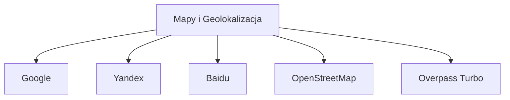

# Drive_0824_Narzędziownik OSINT 20 Reloaded - sesja 4_transkrypcja

> [!abstract] Podsumowanie
> Notatka opisuje szkolenie z narzędzi OSINT, koncentrując się na technikach przeszukiwania danych oraz aspektach zgodności z regulacjami RODO i DORA.

## 📝 Treść

---
title: Drive_0824_Narzędziownik OSINT 20 Reloaded - sesja 4_transkrypcja
created: "2026-01-16 09:44"
type: transcript
tags:
  - calendar
  - compliance
  - compliance/dora
  - compliance/nis2
  - compliance/rodo
  - cybersec
  - cybersec/osint
  - productivity
  - tech
  - tech/python
  - todo
  - source/drive_import
status: do-weryfikacji
source_file: Drive_0824_Narzędziownik OSINT 2.0 Reloaded - sesja 4_transkrypcja.txt
---

# Drive_0824_Narzędziownik OSINT 20 Reloaded - sesja 4_transkrypcja

## 📝 Treść

## Szkolenie z OSINT-u

### Wprowadzenie
Cześć, dzień dobry, dobry wieczór wszystkim, minęła 19, mam na imię Krzysiek i dzisiaj spędzimy razem czas na szkoleniu z OSINT-u (Open Source Intelligence). W planach omówimy różne narzędzia związane z OSINT-em.

### Zakres Szkolenia
* Sprzęt oraz metody działania w OSINT.
* Narzędzia do analizy mediów społecznościowych.
* Zaawansowane narzędzia OSINT.

### Czas trwania
Szkolenie trwa około 2,5-3 godzin, z przerwami co godzinę.

### Interakcja z Uczestnikami
Pytania można zadawać w dowolnym momencie. Proszę, aby pytania były oznaczone literą Q, co ułatwi ich odnalezienie w trakcie dyskusji.

### Disclaimer
Wszystkie informacje przekazywane podczas szkolenia są wyłącznie w celach edukacyjnych.

## Temat Szkolenia: Przykład przypadku zaginięcia dziecka

### Scenariusz
Rodzice czekają na powrót dziecka do domu, które powinno być już w drodze, ale się spóźnia. Po próbie kontaktu telefonicznego rodzice otrzymują wiadomość SMS od dziecka, które jest z nieznajomym "Olkiem". Rodzice postanawiają sprawdzić, kim jest ten Olek.

### Działania
1. **Zbieranie informacji:**
   - Kontakt z przyjaciółmi, którzy mogą mieć informacje o Olku.
   - Rozmowa z instruktorem zajęć sportowych.
2. **RODO:**
   - Instytucje mogą odmawiać udostępniania danych osobowych związanych z ochroną prywatności.
   - Należy jednak przypomnieć, że życie dziecka ma pierwszeństwo, co czasami wymaga pomijania regulacji.

### Dalsze kroki
Po uzyskaniu niezbędnych danych od instruktora, rodzice próbują nawiązać kontakt z matką Olka. Okazuje się, że Olek ma problemy emocjonalne, co wymaga interwencji.

### Wyszukiwanie OSINT
Na podstawie imienia, nazwiska oraz numerów telefonów zbierane są informacje w Internecie. Stosowane są następujące techniki:
- Przeszukiwanie Google z użyciem cudzysłowów dla dokładnego wyszukiwania.
- Wykorzystanie wyszukiwania obrazów i profili społecznościowych.

## Compliance
Aspekty związane z DORA oraz RODO, nakładające obowiązki na instytucje dotyczące ochrony danych osobowych oraz odpowiedzialności za bezpieczeństwo danych.

## 📝 Actions
TODO: Przygotować wyniki szkolenia w formie prezentacji.  
TODO: Udzielić uczestnikom informacji o dostępnych narzędziach OSINT.  
TODO: Zorganizować sesję Q&A na temat bezpieczeństwa danych osobowych w kontekście RODO.

## 📅 Calendar
TERMIN: Prześlemy prezentację w najbliższych dniach. [Synced](https://www.google.com/calendar/event?eid=aWZidWJhbzV0ODRrMzk3azdhM2s0bG5zcDggbWFyY2luLnVib2dpQG0)

## 🧠 Flashcards
#flashcard Czym jest OSINT? :: OSINT (Open Source Intelligence) to zbieranie i analiza informacji dostępnych publicznie.
#flashcard Jakie są kluczowe zasady RODO? :: RODO chroni dane osobowe, nakładając obowiązki na ich przetwarzanie i bezpieczeństwo.
#flashcard Jak można wykorzystać wyszukiwanie Google w OSINT? :: Wyszukiwanie z użyciem cudzysłowów pozwala na dokładniejsze rezultaty.

## Analiza profili na LinkedIn

### Wyszukiwanie profili
W celu zidentyfikowania osób na LinkedIn należy przeprowadzić szczegółowe przeszukiwanie dostępnych profili. Kluczowe kroki obejmują:
- Weryfikacja, czy wyszukiwana osoba to ta, którą chcemy znaleźć.
- Przejrzenie profilu, aby zrozumieć informacje o danej osobie.
- Zwracanie uwagi na lokalizację osoby, ponieważ może to pomóc w dalszych poszukiwaniach.

### Przeszukiwanie według lokalizacji
Możliwe jest przeszukiwanie profili według lokalizacji (miasto, kraj). W przypadku, gdy standardowe metody nie są dostateczne, można wykorzystać narzędzia do wyszukiwania OSINT, które umożliwiają takie operacje.

### Przykłady wyszukiwań
Zastosowanie poprawnych zapytań wyszukiwania bez spacji oraz z uwzględnieniem nazw miejscowości jest kluczowe. Przykładowe kwerendy mogą wyglądać następująco, gdzie lokalizacja jest wstawiana w odpowiednim formacie:
```plaintext
site:linkedin.com "imię nazwisko" "lokalizacja"
```

## Narzędzia do wydobywania informacji
### Phone Infoga i Namit
- **Phone Infoga**: Narzędzie uruchamiane skryptowo, które umożliwia wyszukiwanie informacji za pomocą numerów telefonów.
- **Namit**: Aplikacja webowa działająca w przeglądarce, która może być używana do wyszukiwania osób za pomocą danych osobowych.

Przykład użycia narzędzia można wykazać na własnym przykładzie wyszukiwania danych osobowych, takich jak imię, nazwisko oraz rok urodzenia.

### Przeszukiwanie plików
Przy korzystaniu z narzędzi warto również wyszukiwać dane w plikach PDF, JPG i innych rozszerzeniach. Odpowiednie zapytania mogą wyglądać tak:
```plaintext
site:example.com "imię nazwisko" filetype:pdf
```

## Przykłady dopasowania danych
W przypadku lokalizacji e-maili można również poszukiwać danych powiązanych ze skrzynkami pocztowymi. Dobre praktyki obejmują korzystanie z narzędzi do korelacji danych, takich jak H5Bin, które pomagają w zidentyfikowaniu potencjalnych wycieków danych.

Zwrócić uwagę na to, że legalność poszukiwania danych osobowych wymaga zgody osoby, której dane są wyszukiwane. Wykorzystanie tych narzędzi powinno być zgodne z regulacjami RODO.

## 📝 Actions
TODO: Przeanalizować i zaktualizować procedury przeszukiwania profili na LinkedIn.
TODO: Zdefiniować narzędzia OSINT do wyszukiwania według lokalizacji.
TODO: Przeprowadzić testy użycia Phone Infoga oraz Namit w kontekście przeróżnych zapytań.

## 📅 Calendar
SPOTKANIE: Omówienie narzędzi OSINT - 15.10.2023. [Synced](https://www.google.com/calendar/event?eid=YXBsYmpmMzQ0ZGg2aGgyOGQyYXVjaDh2ZW8gbWFyY2luLnVib2dpQG0)

## 🧠 Flashcards
#flashcard Jakie narzędzia można wykorzystać do wyszukiwania danych osobowych? :: Phone Infoga, Namit, H5Bin.
#flashcard Co oznacza RODO w kontekście przetwarzania danych osobowych? :: Ogólne rozporządzenie o ochronie danych osobowych.

## OSINT i Przeszukiwanie Danych w Social Media

### Wprowadzenie
Przeszukiwanie danych w serwisach społecznościowych jest kluczowym elementem OSINT (Open Source Intelligence). Techniki analizy danych pomagają identyfikować użytkowników oraz ich aktywności online. W tym kontekście, Facebook pozostaje jednym z najważniejszych narzędzi do zdobywania informacji.

### Facebook Directory
Analiza i pozyskiwanie informacji z Facebooka można przeprowadzić bezpośrednio przez Google. Użycie odpowiednich zapytań pozwala na znalezienie profili użytkowników w oparciu o ich imiona, nazwiska oraz numery telefonów. Przykładowe zapytanie może wyglądać następująco:

```bash
site:facebook.com inText:"Imię i Nazwisko" inText:"Numer telefonu"
```

### Analiza Wyników
Podczas przeszukiwania danych, warto zwrócić uwagę na uzyskane rezultaty oraz ocenić, na ile są one wiarygodne. Informacje takie jak obecność na eventach (np. Hacking Party) mogą potwierdzić tożsamość osoby. Analogiczne techniki można zastosować do innych platform, takich jak LinkedIn.

### Narzędzia OSINT
Wśród narzędzi OSINT wymienia się m.in.:

- **Face Check ID**: Umożliwia rozpoznanie twarzy na podstawie przesyłanych zdjęć. Jakość obrazu ma kluczowe znaczenie dla efektywności tego narzędzia.
- **Pimice.com**: Inne narzędzie do analizy zdjęć, które może pomóc w identyfikacji osób na podstawie obrazu.
  
Ważne jest, aby dane pozyskiwane z takich platform były zawsze analizowane krytycznie.

### Discord jako Źródło Informacji
Discord staje się coraz bardziej popularnym źródłem informacji o użytkownikach, szczególnie wśród graczy. Serwery Discordowe zawierają cenne dane, a ich analiza może pomóc w identyfikacji osób oraz ich aktywności.

## 📝 Actions
TODO: Przeanalizować techniki OSINT na podstawie zebranych materiałów.
TODO: Zainstalować i przetestować narzędzia Face Check ID oraz Pimice.com.
TODO: Zainwestować czas w naukę przeszukiwania danych na platformie Discord.

## 📅 Calendar
SPOTKANIE: Kolejna sesja szkoleniowa z narzędzi OSINT odbędzie się w przyszłym miesiącu.  [Synced](https://www.google.com/calendar/event?eid=MW8wM3NoMjE3bGZwZWEyMGJlNzUzMGliODggbWFyY2luLnVib2dpQG0)

## 🧠 Flashcards
#flashcard Jakie zapytanie można użyć, aby znaleźć profil na Facebooku? :: site:facebook.com inText:"Imię i Nazwisko" inText:"Numer telefonu"
#flashcard Co to jest OSINT? :: Open Source Intelligence
#flashcard Jakie narzędzie można użyć do analizy twarzy online? :: Face Check ID

## 📅 Calendar
SPOTKANIE: Szkolenie dotyczące OSINT i narzędzi do przeszukiwania profili społecznościowych [Synced](https://www.google.com/calendar/event?eid=dm00dGF1ZHFyMTlwb2t0N21xNWNwMnVmdjQgbWFyY2luLnVib2dpQG0)

## OSINT i Narzędzia
OSINT (Open Source Intelligence) to proces zbierania informacji z publicznie dostępnych źródeł. W kontekście analizy podejrzanych profili w mediach społecznościowych, takie jak Instagram, używane są specjalistyczne narzędzia, takie jak Osintgram.

### Osintgram
Osintgram to narzędzie do OSINT, które umożliwia przeszukiwanie Instagrama. Umożliwia zdobywanie informacji o kontach, postach, zdjęciach oraz powiązaniach z innymi profilami.

#### Kluczowe Funkcjonalności
- **Funkcjonalność przeszukiwania profili**: Możliwość zbierania informacji o użytkownikach, ich postach i interakcjach.
- **Zbieranie metadanych**: Informacje o lokalizacjach zdjęć, datach publikacji.
- **Zarządzanie danymi**: Możliwość eksportu wyników do plików, aby ułatwić analizę.

### Przykład Użycia
Aby użyć Osintgram, najpierw należy zainstalować Pythona i zainstalować odpowiednie narzędzie z GitHub. Przykładowe polecenie uruchomienia skryptu:

```bash
python osintgram.py nazwa_użytkownika --opcja
```

#### Wyniki analizy
Wyniki działania narzędzia mogą dostarczyć:
- Lokalizacji zdjęć.
- Dat przeszłych postów.
- Powiązań z innymi kontami.

## DORA, NIS2 i RODO
Podczas korzystania z narzędzi OSINT należy pamiętać o zasadach ochrony danych osobowych i spełnianiu wymogów RODO, co szczególnie odnosi się do zbierania i przetwarzania danych osobowych.

## 📝 Actions
TODO: Zainstalować Pythona oraz niezbędne narzędzia OSINT z GitHub.
TODO: Zapoznać się z dokumentacją Osintgram, aby poprawnie zrozumieć jego możliwości.
TODO: Upewnić się, że operacje OSINT są zgodne z zasadami RODO.

## 🧠 Flashcards
#flashcard Co to jest OSINT? :: OSINT (Open Source Intelligence) to proces zbierania informacji z publicznie dostępnych źródeł.
#flashcard Jakie narzędzie umożliwia przeszukiwanie Instagrama? :: Osintgram.
#flashcard Jakie dane można uzyskać przy użyciu Osintgram? :: Lokalizacje zdjęć, daty publikacji, interakcje z innymi profilami.

## 📅 Calendar
TERMIN: Prezentacja dostępna do poniedziałku, do 16:00. [Synced](https://www.google.com/calendar/event?eid=bzh1MHZpcjIzaTluaGcyaHZhODc3ZGh1bmsgbWFyY2luLnVib2dpQG0)

## 5. Narzędzia do analizy danych w mediach społecznościowych

### 5.1 Hoopo Set What
Opis: Narzędzie do przeszukiwania wpisów w mediach społecznościowych. Umożliwia filtrowanie postów według dat i autorów.

### 5.2 Intel X
Opis: Narzędzie do wyszukiwania informacji o ludziach. Wymaga odpowiedniego formatu danych, aby uzyskać wyniki.

### 5.3 Facebook Toolkit
Opis: Narzędzie do analizy danych na Facebooku. Umożliwia uzyskanie informacji o akcjach i dostępnych danych o użytkownikach.

### 5.4 Twitter
Opis: Umożliwia przeszukiwanie tweetów według daty, lokalizacji, autorów oraz treści. Wskazanie geolokalizacji w tweetach jest możliwe.

### 5.5 Snapchat
Opis: Narzędzie do analizy kont na Snapchacie. Umożliwia listowanie postów i interakcję z danymi.

### 5.6 TikTok
Opis: Umożliwia pobieranie i analizę treści wideo. Użytkownik musi pamiętać o przestrzeganiu praw autorskich przy ściąganiu treści.

### 5.7 Księ
Opis: Narzędzie analityczne do badania trendów w mediach społecznościowych. Oferuje ograniczone bezpłatne analizy.

## 📝 Actions
TODO: Przetestować narzędzie Hoopo Set What w celu przeszukiwania starszych postów.  
TODO: Zainstalować i skonfigurować Intel X dla skuteczniejszego wyszukiwania danych.  
TODO: Sprawdzić możliwości Facebook Toolkit i zrozumieć dostępne dane.  
TODO: Przeanalizować sposób wyszukiwania tweetów na Twitterze oraz potencjalne metody geolokalizacji.  
TODO: Wypróbować narzędzie do analizy Snapchata i zgromadzić dane o aktywności użytkowników.  
TODO: Zastosować narzędzie analizujące TikToka, pamiętając o prawach autorskich.  
TODO: Zastosować Księ do analizy trendów w mediach, monitorując te informacje regularnie.  

## 🧠 Flashcards
#flashcard Co to jest Hoopo Set What? :: Narzędzie do przeszukiwania wpisów w mediach społecznościowych, filtrowanie według dat i autorów.  
#flashcard Jakie dane wymaga Intel X? :: Odpowiedni format danych do skutecznego wyszukiwania informacji o osobach.  
#flashcard Co oferuje Facebook Toolkit? :: Analizę dostępnych danych o akcjach i użytkownikach na Facebooku.  
#flashcard Co można wyszukiwać na Twitterze? :: Tweetów według daty, lokalizacji, autorów oraz treści.  
#flashcard Jakie funkcje oferuje narzędzie do analizy Snapchata? :: Listowanie postów i interakcję z danymi użytkowników na Snapchacie.  
#flashcard Jakie są ograniczenia Księ? :: Oferuje ograniczone bezpłatne analizy dotyczące trendów w mediach społecznościowych.

## 📝 Actions
TODO: Zidentyfikować i zbadać narzędzia analityczne dostępne do platformy Telegram.
TODO: Rozważyć zastosowanie narzędzi do analizy wschodnich portali społecznościowych.
TODO: Przeprowadzić przegląd i analiza systemów OSINT w kontekście przeszukiwania LinkedIn i innych mediów społecznościowych.
TODO: Przygotować materiały dotyczące localizowania potencjalnych zagrożeń, w tym farm troli.

## 📅 Calendar
TERMIN: Przerwa do 21:00, następnie drugi konkurs. [Synced](https://www.google.com/calendar/event?eid=cnIwazJwaGxqbmJ2cWV0cjRrYW1tdXF2ZzAgbWFyY2luLnVib2dpQG0)

## Aspects of Compliance
- DORA (Digital Operational Resilience Act) jest istotna przy korzystaniu z narzędzi analitycznych do przetwarzania danych osobowych.
- NIS2 może mieć zastosowanie w kontekście ochrony danych na wschodnich portalach społecznościowych oraz właściwego reagowania na cyberzagrożenia.
- RODO ma zastosowanie do przetwarzania danych osobowych użytkowników platform takich jak LinkedIn, Telegram, i inne w kontekście OSINT.

## 🧠 Flashcards
#flashcard Co to jest OSINT? :: OSINT oznacza Open Source Intelligence, czyli zbieranie informacji z ogólnodostępnych źródeł.
#flashcard Jakie narzędzia można stosować do analizy mediów społecznościowych? :: Narzędzia analityczne, takie jak Social Blade, Racket Rich, i Digital Methods do monitorowania statystyk oraz trendów.
#flashcard Jakie media społecznościowe zostały wspomniane jako przykład? :: Facebook, Telegram, VKontakte, LinkedIn, YouTube, TikTok, Twitch.

## Przegląd Funkcjonalności Narzędzi Poszukiwawczych

### Przykłady Odszukanych Informacji
- Pojawiają się listy filmów związanych z frazą „Selinux” z YouTube.
- Możliwość przeszukiwania portali społecznościowych i forów, takich jak Reddit i Instagram, dla poszukiwanych użytkowników.

### Narzędzia do Poszukiwań w Mediach Społecznościowych
- **Reddit**: Możliwość przeszukiwania postów i dyskusji, jednak nie zawsze przynosi rezultaty.
- **Instagram**: Narzędzia do analizy influencerów, pomocne w poszukiwaniach osób powiązanych z poszukiwanymi tematami.
- **WhatsApp**: Możliwość analizy konwersacji użytkowników, przydatne w uzyskiwaniu statystyk dotyczących rozmów.

### Narzędzia do Telegrama
- Możliwość przeszukiwania grup i lokalizacji przekazów w Telegramie. Istnieje wiele narzędzi dostępnych na Githubie, które umożliwiają łatwe klonowanie oraz uruchamianie.

### Potencjalne Wyzwania
- Narzędzia nie gwarantują odnalezienia stu procent trafności; konieczne jest przemyślane podejście do jakichkolwiek danych uzyskiwanych przez OSINT (Open Source Intelligence).
- Ograniczenia narzędzi, takich jak Karma DK, które przestały działać.

### Zasady Bezpieczeństwa
- Zachowanie ostrożności przy korzystaniu z zewnętrznych narzędzi i applikacji, aby uniknąć nieautoryzowanego dostępu do danych osobowych.
- Warto być świadomym przepisów, takich jak RODO, dotyczących przetwarzania danych osobowych w związku z wykorzystaniem danych z mediów społecznościowych.

## 📝 Actions
TODO: Zbadać dostępność narzędzi do analizy danych z WhatsAppa i Telegrama.  
TODO: Opracować procedury zapewnienia bezpieczeństwa przy korzystaniu z narzędzi do OSINT.  
TODO: Zapoznać się z aspektami RODO związanymi z przetwarzaniem danych osobowych z mediów społecznościowych.

## 📅 Calendar
TERMIN: Opracowanie dokumentacji dotyczącej bezpieczeństwa i procedur OSINT do 2024-02-15. [Synced](https://www.google.com/calendar/event?eid=b3RpNzl1aWZrZjZ2czRsN2Y1MHRyYnBwdWcgbWFyY2luLnVib2dpQG0)

## 🧠 Flashcards
#flashcard Jakie informacje można znaleźć o Selinux w YouTube? :: Lista filmów i wideo.  
#flashcard Jakie narzędzia można wykorzystać do przeszukiwania Reddita? :: Narzędzia OSINT oraz konta użytkowników.  
#flashcard Jakie są zasady bezpieczeństwa przy korzystaniu z narzędzi do OSINT? :: Ostrożność oraz zgodność z RODO.

## Dokumentacja techniczna sesji

### Wprowadzenie
Prezentacja omawia dostępne narzędzia i techniki związane z geolokalizacją oraz wykorzystaniem map do poszukiwania informacji. Zawiera również zasady zakupu, dostępu do materiałów archiwalnych oraz informacje dotyczące dostępnych eventów.

### Narzędzia do geolokalizacji
- **Mapy i Geolokalizacja**: Narzędzia takie jak Google, Yandex, Baidu oraz OpenStreetMap są zalecane do przeprowadzania kwerend geolokalizacyjnych. Overpass Turbo jest rekomendowany jako bardziej intuicyjna alternatywa.



### Dalsze działania
- **Kwerendy w OpenStreetMap**: Możliwość korzystania z kreatora kwerend do łatwiejszego wyszukiwania lokalizacji takich jak hotele.
- **Social Media**: Narzędzia jak Instahunt i Bird Hunt umożliwiają geolokalizację postów na Instagramie oraz Twitterze.

### Wydarzenia i Szkolenia
- Dostęp do Securac Academy dla użytkowników z wykupionym członkostwem.
- Informacje o ważnych wydarzeniach i promocjach (sprzedaż koszulek).

## 📝 Actions
TODO: Przemyśleć i zbadać dodatkowe narzędzia do geolokalizacji.
TODO: Zorganizować spotkanie dotyczące analizy danych geolokalizacyjnych.
TODO: Przygotować plan promocji dla Securac Academy.

## 📅 Calendar
SPOTKANIE: Termin spotkania omawiającego możliwości geolokalizacji i analizy danych (datę ustawić). [Synced](https://www.google.com/calendar/event?eid=NXY1MjJvdTBkNjFxZDRjZ2dvNTN2YWJ1c2MgbWFyY2luLnVib2dpQG0)

## 🧠 Flashcards
#flashcard Jakie narzędzia można wykorzystać do geolokalizacji? :: Google, Yandex, Baidu, OpenStreetMap, Overpass Turbo.
#flashcard Co to jest Overpass Turbo? :: Alternatywne narzędzie do wyszukiwania danych w OpenStreetMap.

## 📅 Calendar
TERMIN: Prezentacja do wysłania do poniedziałku do godziny 16. [Synced](https://www.google.com/calendar/event?eid=NTNlcTVpNTQ5aHB0dG5rczg4NmoyczBsbTQgbWFyY2luLnVib2dpQG0)

## Podsumowanie dyskusji dotyczącej OSINT
Dyskusja dotyczyła różnych narzędzi i metod związanych z OSINT. Podkreślono znaczenie dostępu do API, co zostało zilustrowane na przykładzie Telegrama.

### Problemy z wyświetlaniem czatu
- Uczestnicy zwrócili uwagę na możliwe niezgodności w wyświetlaniu czatu, co może prowadzić do zamieszania odnośnie do kolejności pytań.

### Pytania i odpowiedzi
- Po zakończeniu głównej części prezentacji uczestnicy mieli możliwość zadawania pytań. 
- Zapisano, że nie pojawiły się dodatkowe pytania, a moderator wyznaczył dodatkowe dwa minuty na interakcję.

### Prezentacja
- Obiecano wysłanie prezentacji do uczestników do poniedziałku.
- Uczestnicy mieli kontaktować się w sprawie szkolenia za pośrednictwem podanych adresów e-mail.

### Wybór systemu Linux do OSINT
- Rekomendowano użycie Kali Linux, argumentując, że oferuje wiele narzędzi przydatnych do OSINT.
- Zasugerowano również Kali Purple jako alternatywę.

## 📝 Actions
TODO: Wysłać prezentację do uczestników do poniedziałku do godziny 16.
TODO: Sprawdzić zalecane narzędzia i dostarczyć związane materiały do uczestników.

## 🧠 Flashcards
#flashcard Jakie distro Linuxa polecasz do OSINT? :: Kali Linux oraz Kali Purple.
#flashcard Co można zrobić, aby uniknąć niezgodności w wyświetlaniu czatu? :: Monitorować kolejność pytań i odpowiedzi.

## Powiązane notatki

- [[000_MOC_Cybersec]]
- [[000_MOC_Compliance]]
- [[000_MOC_Data_engineering]]
