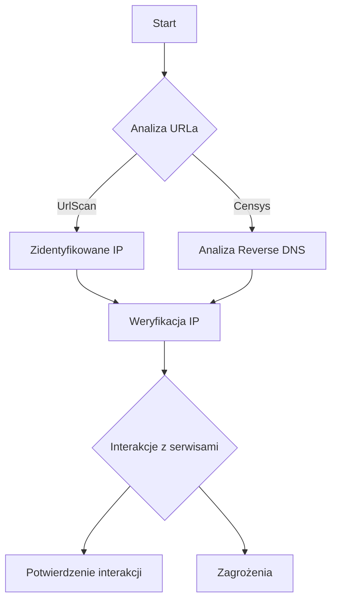

# Drive_0824_Narzędziownik OSINT 20 Reloaded - sesja 5_transkrypcja

> [!abstract] Podsumowanie
> Notatka dotycząca szkolenia OSINT, które oferuje szerokie wprowadzenie do analizy danych oraz narzędzi, takich jak Wireshark, w kontekście analizy zagrożeń i odpowiedzi na incydenty.

## 📝 Treść

---
title: Drive_0824_Narzędziownik OSINT 20 Reloaded - sesja 5_transkrypcja
created: "2026-01-16 09:47"
summary: Szkolenie dotyczące narzędzi OSINT, które wprowadza uczestników w tematykę analizy danych z wykorzystaniem narzędzi, takich jak Wireshark, oraz omawia zagadnienia związane z Threat Intelligence i...
type: transcript
tags:
  - calendar
  - compliance
  - compliance/dora
  - compliance/nis2
  - compliance/rodo
  - cybersec
  - cybersec/blue-team
  - cybersec/osint
  - cybersec/tools
  - productivity
  - todo
  - source/drive_import
status: do-weryfikacji
source_file: Drive_0824_Narzędziownik OSINT 2.0 Reloaded - sesja 5_transkrypcja.txt
---

# Drive_0824_Narzędziownik OSINT 20 Reloaded - sesja 5_transkrypcja

> [!abstract] Podsumowanie
> Szkolenie dotyczące narzędzi OSINT, które wprowadza uczestników w tematykę analizy danych z wykorzystaniem narzędzi, takich jak Wireshark, oraz omawia zagadnienia związane z Threat Intelligence i incydentami w sieciach.

## 📝 Treść

## Szkolenie OSINT - Wprowadzenie

### Informacje Wstępne
- Data szkolenia: 4 listopada 2025
- Czas trwania: około 3 godzin
- Przerwy: co godzinę po 5-10 minut
- Pytania: W dowolnym momencie, proszę używać wielkiej litery "Q"

### Prezentacja
- Prowadzący: Krzysiek, administrator Linuxowy i trener
- Cele szkolenia: Edukacja dotycząca narzędzi OSINT, jednostki jedynie informacyjne

### Tematyka
- Rozmowa na temat "miłości" w kontekście narzędzi analitycznych
- Analiza narzędzi do zbierania informacji (Threat Intelligence)
- Statystyki i aktualne informacje w dziedzinie bezpieczeństwa

### Opis Incydentu
1. Przykład incydentu sieciowego z analizą ruchu przy użyciu Wireshark.
2. Ruch sieciowy dotyczył serwera z portem 143.

### Narzędzie Wireshark
- Funkcjonalności:
  - Analiza ruchu w czasie rzeczywistym.
  - Możliwość analizy wcześniej zarejestrowanego ruchu z pliku.

### Analiza Ruchu HTTP
- Przykłady metod HTTP: GET i POST
- Zauważalne różnice w objętości danych przesyłanych przez różne metody

## Interaktywne Wyzwania
### Konkurs
- Zadanie dekodowania zakodowanego ciągu.
- Objęła technologie: Base64.
- Uczestnicy mogli użyć narzędzia CyberChef.

### Analiza Danych
- Użycie narzędzia **nslookup** do sprawdzenia źródła ruchu.
- Narzędzie dostosowane do różnych systemów operacyjnych.

### Poziom Zagrożeń
- Analiza potencjalnych zagrożeń związanych z danymi przesyłanymi przez publiczne usługi, takie jak Yandex.

## 📝 Actions
TODO: Opracować materiały do kolejnej części szkolenia OSINT zaplanowanej na 4 listopada 2025.  
TODO: Przygotować przykłady użycia Wiresharka w kontekście analizy ruchu HTTP.

## 📅 Calendar
TERMIN: 4 listopada 2025 - Szkolenie OSINT, część II [Synced](https://www.google.com/calendar/event?eid=Y3RyNGljZGEwcHI1ODA0bGcydmwxdGlxMHMgbWFyY2luLnVib2dpQG0)

## 🧠 Flashcards
#flashcard Kto prowadzi szkolenie? :: Krzysiek, administrator Linuxowy i trener  
#flashcard Jakie metody HTTP są analizowane? :: GET i POST  
#flashcard Co sugerują dwa znaki równości na końcu ciągu? :: Zakodowanie w Base64  

## Zastosowanie Yandex i zagrożenia

### Wprowadzenie
Użytkowanie narzędzi Yandex wiąże się z różnorodnymi zagrożeniami. Przede wszystkim należy rozważyć rodowód firmy, która pochodzi z Rosji, co wpływa na bezpieczeństwo danych. Kluczowe jest zrozumienie, że nie należy wprowadzać wrażliwych danych ani wyszukiwać zapytań o podobnej naturze.

### Rekomendacje dotyczące bezpieczeństwa
- **Zachowaj ostrożność**: korzystanie z usług Yandex wymaga szczególnej uwagi.
- **Ochrona danych**: dane wprowadzone do internetu mogą być trudne do usunięcia. Użytkownicy powinni być świadomi, że informacje zamieszczone w sieci pozostaną tam na stałe.
- **Odpowiednie środowisko**: dla badaczy pracujących w Internecie konieczne jest użycie odpowiednio skonfigurowanych środowisk oraz sandboxów, aby zapewnić własne bezpieczeństwo.

## Analiza wiadomości z WhatsApp

### Narzędzie do analizy
Do analizy historii czatu można wykorzystać aplikację WhatsApp Analyze. Umożliwia ona załadowanie pliku z historią czatu, co pozwala na uzyskanie informacji o:
- Użytkownikach biorących udział w rozmowie
- Liczbie wiadomości
- Najczęściej używanych emoji i słowach kluczowych

### Potencjalne zagrożenia
Zagrożeniem jest możliwość przypadkowego ujawnienia danych logowania w plikach, co może prowadzić do nieautoryzowanego dostępu do kont.

## Badanie danej osoby

### Przykład analizy
Podczas poszukiwań informacji o osobach ważne jest zachowanie ostrożności. W przypadku publicznych postów w mediach społecznościowych, każdy użytkownik powinien być świadomy konsekwencji. Zbiory danych dostępne online mogą zawierać informacje o:

- Kontach w serwisach społecznościowych (np. Instagram, Twitter)
- Potencjalnych adresach e-mail

## Przypadek Dark Soul

### Historia
Dark Soul, znany autor Ragnar Stileva, został zidentyfikowany dzięki informacjom zamieszczonym przez jego partnerkę w mediach społecznościowych. To przykład na to, jak niewłaściwe zarządzanie prywatnością przez osoby związane z działalnością przestępczą może prowadzić do ich identyfikacji.

### Wnioski
Użytkownicy muszą pamiętać, że nawet niewielkie szczeliny w prywatności mogą prowadzić do dużych problemów. Warto zadbać o zabezpieczenie swoich danych osobowych.

## Statystyki dotyczące zagrożeń

W 2023 roku w analizach malware w porcie NRAN odnotowano:
- Prawie 3 miliony analiz różnych typów malware.
- Wśród nich zarejestrowano tylko 4050 keyloggerów, ale znacznie więcej stealerów i loaderów.

### Dlaczego stealery są niebezpieczne?
Stealery kradną dane bezpośrednio ze schowka systemowego, co czyni je szczególnie skutecznymi w oszukiwaniu zabezpieczeń.

## 📝 Actions
TODO: Dostarczyć użytkownikom szkolenie dotyczące bezpiecznego korzystania z narzędzi Yandex.  
TODO: Zainstalować aplikację WhatsApp Analyze do analizy czatów.  
TODO: Zorganizować sesję informacyjną na temat prywatności w sieci.

## 📅 Calendar
SPOTKANIE: Szkolenie na temat bezpieczeństwa z narzędziami Yandex.   [Synced](https://www.google.com/calendar/event?eid=cnN2bnM4cWI0YXBmM3ZubnNvMjV2OGQ4cXMgbWFyY2luLnVib2dpQG0)
TERMIN: Ustalić datę do końca tygodnia. [Synced](https://www.google.com/calendar/event?eid=MmFiOGJmMm5qaXExaWVmbjMxZ3R1dW5ydGsgbWFyY2luLnVib2dpQG0)

## 🧠 Flashcards
#flashcard Jakie zagrożenia niesie za sobą używanie Yandex? :: Ujawnienie wrażliwych danych, brak kontroli nad danymi.  
#flashcard Czym jest WhatsApp Analyze? :: Narzędzie do analizy historii czatów z WhatsApp.  
#flashcard Dlaczego stealery są tak popularne? :: Kradną dane ze schowka systemowego, omijając zabezpieczenia.

## Analiza Trendów Złośliwego Oprogramowania

### Wprowadzenie
W ostatnich latach zaobserwowano wzrost liczby różnorodnych metod ataków, w szczególności wzrost popularności stealerów i loaderów. Z danych wynika, że w 2024 roku zanotowano ponad 51 tysięcy uploadów stealerów.

### Wzrost Popularności Stealerów
Stealery kradną dane bezpośrednio z pamięci podręcznej systemu, co czyni je skutecznym narzędziem w atakach, o ile atakujący uzyska dostęp do systemu. Liczba backdoorów wyniosła 2800, a exploitów jeszcze więcej, ale to stealery dominowały w statystykach.

### Narzędzia do Analizy Złośliwego Oprogramowania
W kontekście badania malware'ów, narzędzie NRAN umożliwia użytkownikom, nawet na warunkach niekomercyjnych, analizować pliki, URL-e i inne elementy w celu zidentyfikowania złośliwego oprogramowania.

### Zasady Testowania Malware'u
- Testowanie malware'u powinno być przeprowadzane w wydzielonych środowiskach (sandboxach), co zminimalizuje ryzyko.
- Używać oddzielnych systemów, nie powinno się testować na komputerach produkcyjnych ani rodzinnych.

### Wymagania Środowiskowe
- Zasięg działania malware'u często sięga poza wirtualne maszyny, dlatego należy zapewnić całkowite oddzielenie sieci testowej od głównych zasobów.
  
### Techniki Ataków
W obszarze ataków istotną kategorią są techniki "masquerading", które polegają na ukrywaniu złośliwych plików pod fałszywymi nazwami, co utrudnia ich wykrycie.

### Cyber Threat Intelligence
Analiza zagrożeń, znana jako Cyber Threat Intelligence, koncentruje się na identyfikacji, klasyfikacji i analizie zagrożeń dla systemów, w tym na różnych aspektach, takich jak CVSS, IOC, TTP, KB oraz APT.

## 📝 Actions
TODO: Zapewnić wydzielone środowisko do testowania malware'u.  
TODO: Używać sandboxów dla analiz złośliwego oprogramowania.  
TODO: Wsparcie i rozwój umiejętności z zakresu Linux dla osób nietechnicznych.  

## 📅 Calendar
SPOTKANIE: Omówienie zagrożeń APT29 i metod detekcji (data do ustalenia). [Synced](https://www.google.com/calendar/event?eid=OW1zcjRnN3VhdGRkNnJnZ2w0NTZvZGUxbnMgbWFyY2luLnVib2dpQG0)

## 🧠 Flashcards
#flashcard Jakie są najpopularniejsze metody ataków w 2024? :: Stealery i loadery.  
#flashcard Co to jest masquerading? :: Technika ukrywania złośliwych plików pod fałszywymi nazwami.  
#flashcard Czym jest Cyber Threat Intelligence? :: Analiza zagrożeń w cyberprzestrzeni.

## Cyber Threat Intelligence

Cyber Threat Intelligence (CTI) to specjalistyczna dziedzina analizy zagrożeń, skupiająca się na identyfikacji i ocenie potencjalnych zagrożeń w przestrzeni cyberspaceru. W ramach CTI ważnym elementem jest OSINT (Open Source Intelligence), który pomaga w analizach zagrożeń i wspieraniu działań obronnych organizacji.

### Analiza zagrożeń

Analiza zagrożeń w CTI ma na celu wspieranie organizacji w walce z cyberprzestępczością poprzez:
- Proaktywne zapobieganie atakom
- Profilaktykę
- Reagowanie na incydenty

W procesie tym kluczowa jest współpraca zespołów blue teamowych, mających na celu zminimalizowanie ryzyka i skutków cyberataków.

## Elementy CTI

CTI obejmuje różne poziomy działań:
1. **Strategiczne** - decyzje długofalowe i zarządzanie bezpieczeństwem.
2. **Taktyczne** - zarządzanie operacjami i zastosowanie odpowiednich narzędzi.
3. **Operacyjne** - bieżące operacje zabezpieczające i odpowiedzi na incydenty.
4. **Techniczne** - szczegółowa analiza i raporty.

Wdrożenie strategii na poziomie technicznym i operacyjnym jest kluczowe dla ochrony danych i infrastruktury organizacji.

## Kill Chain

### Etapy Kill Chain
1. **Rekonesans** - pozyskiwanie informacji o celach.
2. **Uzbrojenie** - przygotowywanie narzędzi i metod ataku.
3. **Dostarczenie** - wysyłanie ładunków do celu.
4. **Eksploatacja** - wykorzystanie słabości systemu.
5. **Utrzymanie dostępu** - zabezpieczenie dostępu do systemu.
6. **Eksfiltracja** - kradzież danych.
7. **Zarządzanie** - utrzymanie kontroli nad systemem.

### Uwaga na APT
Advanced Persistent Threat (APT) to szczególny rodzaj zagrożenia, który stosuje powolne i zorganizowane metody ataków, mające na celu długoterminowe wykorzystywanie systemów docelowych.

## Incident Response

Przygotowanie, wykrycie, analiza, reagowanie i odbudowa po incydencie to kroki, które powinny być spójnie realizowane w ramach procesu Incydent Response. Efektywne zarządzanie odpowiedzią na incydenty wymaga doświadczonego zespołu i jasno określonych procedur.

## 📝 Actions
TODO: Przygotować szereg szkoleń dla zespołu z zakresu CTI.  
TODO: Opracować plan działania w przypadku incydentów cybernetycznych.  
TODO: Ustalić procedury analizowania zagrożeń i ich raportowania.

## 📅 Calendar
TERMIN: 20:00 - Przerwa w szkoleniu.   [Synced](https://www.google.com/calendar/event?eid=bzQzcnQwdDNyZmg4M3Rqc2xocjJjajZvczggbWFyY2luLnVib2dpQG0)
SPOTKANIE: 22:00 - Omówienie incydentów i strategii CTI.   [Synced](https://www.google.com/calendar/event?eid=MWZkdjB1OThmNmkwbzRtdGluOTJ1azhiNWsgbWFyY2luLnVib2dpQG0)

## 🧠 Flashcards
#flashcard Co to jest CTI? :: Cyber Threat Intelligence, dziedzina analizy zagrożeń w cyberprzestrzeni.  
#flashcard Jakie są etapy Kill Chain? :: Rekonesans, uzbrojenie, dostarczenie, eksploatacja, utrzymanie dostępu, eksfiltracja, zarządzanie.  
#flashcard Co oznacza APT? :: Advanced Persistent Threat, uporczywe zagrożenie stosujące furtki w systemach.

## 📈 Analiza i Odpowiedź na Incydenty

### Przygotowanie i Detekcja Incydentów
Odpowiedź na incydent jest procesem składającym się z kilku kluczowych etapów, które są ze sobą skoordynowane, przemyślane i celowane w konkretne cele.

1. **Przygotowanie**: W tym etapie organizacje powinny stworzyć plany oraz procedury działania na wypadek incydentu.
2. **Detekcja**: Bieżące monitorowanie systemów celem identyfikacji potencjalnych zagrożeń.
3. **Analiza**: Po wykryciu incydentu, przystępuje się do analizy jego charakterystyki oraz skutków. 

### Ostrzeżenia o Słabościach w Analizach
Często spotykane są przypadki, gdzie analizy po incydencie są wykonane w sposób powierzchowny, co utrudnia efektywne działania naprawcze. Istnieje potrzeba stworzenia bardziej szczegółowych i zrozumiałych raportów.

### Dokumentacja i Wzorce Działania
Organizacje powinny posiadać odpowiednie dokumentacje procesów oraz procedur. Użycie wzorców, takich jak „piramida bólu”, jest kluczowe w zrozumieniu konsekwencji incydentów.

### Taktyki i Techniki Ataku
Analizowane są różne taktyki stosowane przez cyberprzestępców. Atakujący często wykorzystują znane techniki, co wymaga od obrońców zastosowania różnych metod ochrony.

1. **Pojedyncze miejsce ataku**: Atakującemu wystarczy zidentyfikować jedno słabe miejsce w zabezpieczeniach, aby uzyskać dalszy dostęp do systemów.
2. **Złożoność obrony**: Obrona systemów wymaga zajęcia się wieloma aspektami, co stawia administratorów w trudniejszej sytuacji w porównaniu do atakujących.

### MITRE ATT&CK Framework
MITRE CLA (Common Vulnerability Scoring System) pomaga w ocenie zagrożeń i identyfikacji technik stosowanych w atakach. Regularne aktualizacje tego frameworka są istotne dla skuteczności działań defensywnych.

## 📝 Actions
TODO: Zaktualizować procedury odpowiedzi na incydenty, uwzględniając analizę przypadków zagrożeń.  
TODO: Opracować dokładniejsze szablony dla raportów po incydentach.  
TODO: Regularnie przeglądać i aktualizować zasoby MITRE ATT&CK.  

## 📅 Calendar
TERMIN: Spotkanie dotyczące przeglądu odpowiedzi na incydenty, planowane na przyszły miesiąc.   [Synced](https://www.google.com/calendar/event?eid=c29qZXByOW1sdmNuN3JsYmEzcGVxaG5scmcgbWFyY2luLnVib2dpQG0)

## 🧠 Flashcards
#flashcard Czym jest piramida bólu? :: To wzorzec używany do analizy skutków incydentów w bezpieczeństwie.  
#flashcard Jakie są etapy odpowiedzi na incydenty? :: Przygotowanie, detekcja, analiza.  
#flashcard Co oznacza framework MITRE ATT&CK? :: To zbiór technik używanych przez cyberprzestępców, który pomaga w identyfikacji zagrożeń.

## Przegląd zagrożeń i oceny ryzyka

### Wprowadzenie do oceny ryzyka
Zidentyfikowane zagrożenia, w tym ataki ze strony grup, takich jak "Numbered Panda", mogą stanowić poważne wyzwanie dla bezpieczeństwa systemów informatycznych. Odpowiednia analiza i identyfikacja potencjalnych wektorów ataku są kluczowe dla oceny ryzyka.

### Kalkulatorki oceny ryzyka
Wykorzystanie kalkulatorów ryzyka, które umożliwiają ocenę zagrożeń, jest istotne w procesie zabezpieczania systemów. Na początku, wyniki oceny pokazują "score zero", co oznacza brak zaznaczeń. Kluczowe parametry do oceny to:

- **Wektor ataku**: Przykładowo, atak przez sieć może być bardziej krytyczny niż atak fizyczny.
- **Złożoność ataku**: Możliwości ataku mogą być klasyfikowane jako niskie lub wysokie.

Zrozumienie wpływu tych czynników na całościową ocenę ryzyka jest niezbędne dla skutecznego zarządzania bezpieczeństwem.

### Ocena ryzyka według CVSS
W przypadku systemów podatnych, użycie triady dostępności, integralności i poufności może skutkować oceną 9.3, co wskazuje na krytyczne zagrożenie. Systemy związane z systemem podatnym mogą wykazywać różne poziomy ryzyka w zależności od ich powiązań.

### Kompetencje w zarządzaniu bezpieczeństwem
Bezpieczeństwo systemów informatycznych powinno być priorytetem, niezależnie od płci czy stanowiska. Ważne jest, aby osoby na stanowiskach związanych z bezpieczeństwem posiadały odpowiednie kompetencje oraz dokonywały świadomych wyborów dotyczących dalszej kariery.

### Przykłady i porady dotyczące ścieżki kariery
- **Red teaming i pentesting**: Odróżnienie tych dwóch obszarów jest kluczowe w rozwijaniu kompetencji.
- **OSINT**: Specjalizacja w OSINT może być korzystna, a dobrzy osintowcy mogą liczyć na atrakcyjne wynagrodzenie.
- **Administracja systemów**: Niezależnie od wyboru pomiędzy systemami Windows a Linux, kluczowe jest, aby zawsze wprowadzać zabezpieczenia w pierwszej kolejności.

## 📝 Actions
TODO: Przeprowadzić analizę wektorów ataku na systemy informatyczne.
TODO: Opracować plan szkoleniowy dla zespołów odpowiedzialnych za bezpieczeństwo.
TODO: Stworzyć dokumentację dotyczącą ocen ryzyka na podstawie metodyki CVSS.

## 📅 Calendar
TERMIN: Przeprowadzenie warsztatów z zakresu bezpieczeństwa systemów – 15.04.2024. [Synced](https://www.google.com/calendar/event?eid=cjFzZDkzZTRwcnU0Z29vMTlrcmJqYTAwNzQgbWFyY2luLnVib2dpQG0)
SPOTKANIE: Sesja kwartalna zespołu ds. cyberbezpieczeństwa – 20.06.2024. [Synced](https://www.google.com/calendar/event?eid=aXIxOGoyODU3bXA1c2Zicmg2cmxqN2FlY2MgbWFyY2luLnVib2dpQG0)

## 🧠 Flashcards
#flashcard Co oznacza score zero w ocenie ryzyka? :: Brak zaznaczeń w kalkulatorze ryzyka.
#flashcard Jakie są kluczowe parametry oceny ryzyka? :: Wektor ataku, złożoność ataku.
#flashcard Co to jest CVSS? :: Metoda oceny ryzyka oparta na triadzie dostępności, integralności i poufności.

## 🛠️ Narzędzia do analizy i bezpieczeństwa

### DNS Dumpster 
Narzędzie do analizy hostingu oraz sieci związanych z domeną. 
- Sprawdza lokalizację i usługi hostingowe.
- Przykład: Do analizy użyto `securac.pl`, co ujawnia informacje o hostingach (Akamai, Linode).
- Umożliwia zidentyfikowanie aliasów oraz wykorzystywanych systemów.

### Ransom Look 
Narzędzie do monitorowania aktywności ransomware.
- Działa jako scrapper, zbierający informacje o najnowszych atakach.
- Możliwość obserwacji 509 grup z 342 aktualnie aktywnych.

#### Dostęp do sieci cebulkowej
- Wskazówki dotyczące bezpiecznego poruszania się po sieci torowej.
- Zaznaczenie potrzeby przeszkolenia się w zakresie bezpieczeństwa przed dotarciem na nieznane linki.

### Shodan
Narzędzie do identyfikacji urządzeń podłączonych do Internetu.
- Podczas okresów promocyjnych, takich jak Black Friday, Shodan oferuje korzystne oferty. 
- Rekomendowane zakupienie lifetime licencji, co zapewnia dostęp do setek informacji.
- Możliwości wyszukiwania poprzez różne kryteria, w tym typy urządzeń (np. kamery).

#### Analiza urządzeń
- Bezpieczeństwo kamer sieciowych: Wiele urządzeń działa na domyślnych ustawieniach.
- Użytkownik może wyszukiwać urządzenia i ich podatności poprzez CVE. 

### Grace Noise
Platforma umożliwiająca identyfikację botów oraz aktorów w sieci.
- Możliwość wykonywania analiz dotyczących działań w sieci przy użyciu adresu IP.

### Zumai
Chiński odpowiednik Shodana, który dąży do zdobycia pozycji lidera na rynku wykrywania urządzeń.
- Umożliwia wyszukiwanie zebranych danych na temat popularnych zapytań.

### UrlScan
Narzędzie do analizy URL i IP.
- Przykład: Sprawdzanie `Secure.pl`, które kontaktuje się z wieloma IP w różnych krajach.

## 📝 Actions
TODO: Przeprowadzić szkolenie dotyczące bezpiecznego poruszania się po sieci cebulkowej.  
TODO: Zbadać dostępne promocje Shodana i rozważyć zakup licencji.  
TODO: Zapewnienie przeszkolenia dotyczącego identyfikacji podatności urządzeń w sieci.

## 🧠 Flashcards
#flashcard Co to jest DNS Dumpster? :: Narzędzie do analizy hostingu i sieci związanych z domeną.  
#flashcard Co to jest Ransom Look? :: Narzędzie do monitorowania aktywności ransomware.  
#flashcard Jakie urządzenia można kontrolować za pomocą Shodan? :: Wszystkie urządzenia podłączone do Internetu, takie jak kamery.  
#flashcard Jakie informacje można uzyskać z Grace Noise? :: Identyfikacja botów i aktorów w sieci.  
#flashcard Co to jest UrlScan? :: Narzędzie do analizy URL i IP, które identyfikuje kontakty sieciowe.

## Skrypt do analizy ruchu sieciowego 

### Wprowadzenie
W toku przeprowadzania analizy ruchu sieciowego, wykorzystuje się różne narzędzia, które mogą pomóc w określeniu, jakie IP są kontaktowane przez analizowany adres URL. Narzędzia takie jak UrlScan i Censys stanowią fundamentalne zasoby w tym procesie.

### UrlScan
UrlScan to narzędzie umożliwiające analizę URL pod kątem kontaktów i interakcji z innymi serwerami. Przykład użycia:

```bash
urlscan.sh https://secure.pl
```

#### Wyniki
Po dokonaniu analizy, użytkownik uzyskuje dostęp do informacji o IP, z którymi dany serwis nawiązuje połączenia. Może to obejmować lokalizację serwerów oraz ich liczbę.

#### Przykład
- "This website contacted twelve IPs in four countries."
- Możliwość oceny, z jakimi serwisami, np. Facebook, strona nawiązuje interakcje.

### Narzędzie Censys
Censys to kolejne potężne narzędzie do przeprowadzania wyszukiwań w zakresie informacji o infrastrukturze sieciowej. Umożliwia ono przeprowadzanie analizy reverse DNS, portów, wersji TLS itp.

### Criminal IP
Criminal IP to rozwiązanie płatne, które umożliwia bardziej zaawansowane analizy, takie jak wyszukiwanie powiązań z adresami IP uznawanymi za złośliwe. Wymaga to dostępu do płatnego konta.

### Uwaga dotycząca bezpieczeństwa
Podczas prowadzenia badań nad urządzeniami, które są wystawione w internecie (np. drukarki), należy zachować szczególną ostrożność:

1. Istnieje ryzyko napotkania honeypotów.
2. Zawsze testować w wydzielonym środowisku.

### Mapa myśli
W przypadku analizy portów, wiele drukarek korzysta z portu 9100. Warto wiedzieć, że skanery (jak nmap) mogą ten port pomijać, co oznacza, że trzeba używać dodatkowych flag polecenia.



## 📝 Actions
TODO: Przeprowadzić analizę wybranych URLi za pomocą UrlScan i Censys.  
TODO: Zastosować zasady DORA oraz NIS2 przy badaniach nad infrastrukturą sieciową.  
TODO: Zainstalować i skonfigurować narzędzie do monitorowania ruchu sieciowego.  

## 📅 Calendar
SPAOTKANIE: 21.05 - zakończenie szkolenia i podsumowanie wyników analiz.  

## 🧠 Flashcards
#flashcard Co to jest UrlScan? :: Narzędzie do analizy URL i jego interakcji z innymi serwisami.  
#flashcard Jakie ryzyka związane są z badaniem wystawionych urządzeń w internecie? :: Möglichkeit napotkania honeypotów i złośliwego oprogramowania.  
#flashcard Co to jest port 9100? :: Port, na którym wiele drukarek przyjmuje zlecenia druku.

## Narzędzia do analizy malware

### Wprowadzenie

Praca z narzędziami do analizy malware jest kluczowa w zakresie zabezpieczeń i analizy zagrożeń. Poniżej przedstawiono kilka wartościowych narzędzi i ich zastosowania.

### VirusTotal

VirusTotal to platforma umożliwiająca analizę plików i URL-i w poszukiwaniu zagrożeń. Kluczowe cechy:
- Wspiera analizy OSINT (Open Source Intelligence).
- Możliwe wykorzystanie do identyfikacji malware.

### Malware Traffic Analysis

Malware Traffic Analysis to platforma edukacyjna zawierająca **training exercises** do praktycznego ćwiczenia analizy ruchu związanego z malware.
- Zawiera przykłady i pliki do analizy.
- Umożliwia wykrywanie malware w analizowanych danych.

### Alien Vault

Alien Vault to narzędzie używane do analizy zagrożeń i zarządzania bezpieczeństwem. Wymaga odpowiedniej infrastruktury do efektywnego funkcjonowania.
- Warto rozważyć klastrowanie node'ów, aby obsłużyć dużą liczbę agentów.

### Malpedia

Malpedia umożliwia przeszukiwanie bazy danych z informacjami o złośliwym oprogramowaniu. Oferuje:
- Statystyki i powiązania z APT (Advanced Persistent Threat).
- Możliwość identyfikacji i analizy próbki malware.

### Open CTI

Open CTI to platforma do analizy zagrożeń, dostępna za darmo na GitHubie. Główne cechy:
- Umożliwia integrację z API w celu śledzenia zagrożeń.
- Łatwe w użyciu dashboardy do prezentacji danych.

### MISP

MISP (Malware Information Sharing Platform) to platforma do dzielenia się informacjami o zagrożeniach. Zaleca się używanie MISP w kontekście OSINT-u i analizy malware.
- Warto zaktualizować do najnowszej wersji, aby korzystać z nowych funkcji.

## 📝 Actions
TODO: Sprawdzić i przetestować funkcjonalności VirusTotal.  
TODO: Wykonać ćwiczenia na Malware Traffic Analysis.  
TODO: Przeanalizować dane w Alien Vault pod kątem ewentualnych problemów z wydajnością.  
TODO: Zainstalować Malpedia i przetestować jego możliwości.  
TODO: Zaimplementować Open CTI w środowisku testowym.  
TODO: Zaktualizować MISP do najnowszej wersji.

## 🧠 Flashcards
#flashcard Jakie narzędzie wspiera analizy OSINT? :: VirusTotal  
#flashcard Co to jest Malware Traffic Analysis? :: Platforma edukacyjna do ćwiczenia analizy ruchu.  
#flashcard Jakie są zalety Alien Vault? :: Analiza zagrożeń i zarządzanie bezpieczeństwem.  
#flashcard Co to jest Open CTI? :: Platforma do analizy zagrożeń dostępna na GitHubie.  
#flashcard Jakie jest główne zastosowanie MISP? :: Dzielenie się informacjami o zagrożeniach.

## 🔐 Dokumentacja MISP i Narzędzi Cyberbezpieczeństwa

### Instalacja i Konfiguracja MISP
MISP (Malware Information Sharing Platform) wymaga systemu Ubuntu 22.04. Nie jest kompatybilny z nowszymi wersjami, takimi jak 24. Proces instalacji jest prosty i zajmuje około 30 minut.

```bash
# Pobieranie skryptu instalacyjnego
wget https://path_to_install_script.sh
# Uruchomienie skryptu
bash install_script.sh
```

### Zasady Bezpieczeństwa
Przy pobieraniu skryptów instalacyjnych, zaleca się ich dokładne przeglądanie, aby upewnić się, że nie zawierają złośliwego kodu. C wspólnie z DORA i NIS2, dbanie o integrację i niezawodność systemów jest kluczowe.

### Narzędzia do Analizy i OSINT
- **Harvester**: Narzędzie do zbierania subdomen i informacji z różnych źródeł.
- **crt.sh**: Serwis umożliwiający emitowanie wszystkich certyfikatów wydanych dla danej domeny.

#### Przykład Użycia crt.sh
Wprowadź domenę, aby uzyskać listę certyfikatów:

```bash
# Wprowadź domenę
crt.sh/?q=example.com
```

### Narzędzia w Konsoli
- **Fairbox Buster**: Narzędzie dostępne na GitHubie do wykonywania audytów. Rekomenduje się używanie go w wydzielonych środowiskach.

### Zasady Ogólne
Nie należy ufać źródłom zlokalizowanym za wschodnią granicą, ze względu na narastające ryzyko związane z cyberatakami. Umiejętność programowania w kontekście OSINT-u jest zaletą, ale nie jest absolutnie wymagana.

## 📝 Actions
TODO: Zainstalować MISP na systemie Ubuntu 22.04.  
TODO: Zrozumieć mechanizm działania narzędzi takich jak Harvester i crt.sh.  
TODO: Upewnić się, że wszystkie skrypty instalacyjne są przeglądane przed użyciem.  

## 📅 Calendar
TERMIN: Przekazanie prezentacji do piątku.   [Synced](https://www.google.com/calendar/event?eid=djNwNWViYTlscW1xcm0wcGRmOTk3NHV0ODAgbWFyY2luLnVib2dpQG0)

## 🧠 Flashcards
#flashcard Czym jest MISP? :: Platforma do dzielenia się informacjami o malware.  
#flashcard Jakie systemy wspiera MISP? :: Tylko Ubuntu 22.04.  
#flashcard Co to jest Fairbox Buster? :: Narzędzie do audytów dostępne w konsoli.  

## OSINT

Prezentacje będą dostępne do piątku, a informacja o miejscu ich publikacji zostanie przesłana e-mailem.

### Kontakt

Możliwość kontaktu przez:
- E-mail (podany na prezentacji)
- LinkedIn
- PGP (klucze do wymiany komunikacji)
- Discord (głównie na serwerze Akademii)

Zaproszenie do serwera Discord jest aktywne i dostępne dla zainteresowanych.

### Podsumowanie Szkolenia

Szkolenie dobiega końca. Uczestnicy proszeni są o ocenę sesji w celu poprawy jakości przyszłych szkoleń. Wnioski i sugestie są mile widziane, aby dostosować treści do oczekiwań uczestników.

## 📝 Actions
TODO: Przygotować i wysłać prezentacje do uczestników do piątku.  
TODO: Przypomnieć uczestnikom o możliwości kontaktu oraz o ocenie szkolenia.  
TODO: Zorganizować spotkanie w celu omówienia sugestii dotyczących szkoleń.  

## 📅 Calendar
TERMIN: Przygotowanie prezentacji do piątku.   [Synced](https://www.google.com/calendar/event?eid=NDdnazZwcGxhanAwaXFua2htbDIxNTV0amsgbWFyY2luLnVib2dpQG0)
SPOTKANIE: Wazuch - piątek. [Synced](https://www.google.com/calendar/event?eid=NWJxazhkcGVtYTBjczFkM2pxb3BuNzE3OGMgbWFyY2luLnVib2dpQG0)

## 🧠 Flashcards
#flashcard Jakie są dostępne kanały kontaktu? :: E-mail, LinkedIn, PGP, Discord.  
#flashcard Jakie są cele oceny szkolenia? :: Udoskonalenie treści i jakości przyszłych sesji.

## Powiązane notatki

- [[000_MOC_Cybersec]]
- [[000_MOC_Compliance]]
- [[000_MOC_Data_engineering]]
