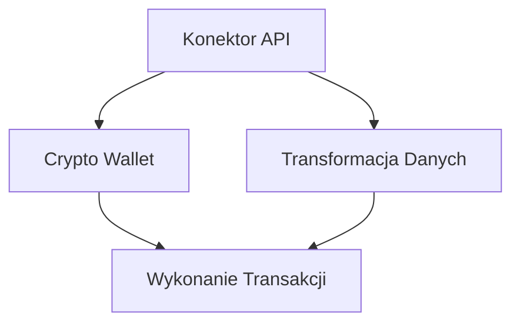

# Drive_0824_Narzędziownik OSINT 20 Reloaded - sesja 6_transkrypcja

> [!abstract] Podsumowanie
> Spotkanie poświęcone technikom OSINT i dezinformacji podkreśla znaczenie edukacji w zakresie kryptowalut i Darknetu oraz konieczność zachowania zgodności z normami prawnymi.

## 📝 Treść

---
title: Drive_0824_Narzędziownik OSINT 20 Reloaded - sesja 6_transkrypcja
created: "2026-01-16 09:47"
summary: Spotkanie dotyczące technik OSINT, w tym kryptowalut i Darknetu, z naciskiem na edukację oraz praktyczne zastosowanie narzędzi, odbędzie się w formie nieformalnej, sprzyjającej interakcji i zadawaniu...
type: transcript
tags:
  - calendar
  - compliance
  - compliance/dora
  - compliance/nis2
  - compliance/rodo
  - cybersec
  - cybersec/osint
  - productivity
  - todo
  - source/drive_import
status: do-weryfikacji
source_file: Drive_0824_Narzędziownik OSINT 2.0 Reloaded - sesja 6_transkrypcja.txt
---

# Drive_0824_Narzędziownik OSINT 20 Reloaded - sesja 6_transkrypcja

> [!abstract] Podsumowanie
> Spotkanie dotyczące technik OSINT, w tym kryptowalut i Darknetu, z naciskiem na edukację oraz praktyczne zastosowanie narzędzi, odbędzie się w formie nieformalnej, sprzyjającej interakcji i zadawaniu pytań.

## 📝 Treść

## 🎤 Transkrypcja spotkania OSINT

### Data i czas
**21 listopada, godz. 21:00**

### Wprowadzenie
Spotkanie prowadzi Tomasz Turba z Securitum. Zaprezentowane informacje mają charakter edukacyjny. Spotkanie dotyczy tematów związanych z dezinformacją, kryptowalutami oraz cyberprzestępczością.

### Tematy poruszane na spotkaniu
- Edukacja w zakresie cyberbezpieczeństwa
- Dezinformacja: przykłady i techniki (w tym deepfake)
- Kryptowaluty i anonimowość w sieci
- Przykłady dezinformacji
- Aspekty bezpieczeństwa w szkołach.

### Historia szkolenia
Historie w związku z przeprowadzonym szkoleniem w małym urzędzie. Początkowo tylko trzy osoby, a później pełna sala, co świadczy o wysokiej wartości szkolenia.

### Agenda
- Prezentacja na temat dezinformacji w Polsce, w tym infografiki dotyczące dezinformacji w obszarze energetycznym.
- Przykłady manipulacji z użyciem informacji o kryptowalutach i innych technologiach.
- Informacje o planowanej prezentacji dotyczącej Darknetu.

### Wnioski z rozmowy 
- Wzrost dezinformacji w Polsce, szczególnie w kontekście tematów kontrowersyjnych, takich jak zdrowie publiczne, technologia 5G oraz zmiany klimatyczne.
- Problemy z interpretacją norm i przyjmowaniem informacji w mediach.

## 📝 Actions
TODO: Przygotować materiały prelekcyjne na temat dezinformacji.
TODO: Zaplanować dodatkowe sesje na temat kryptowalut i Darknetu.

## 📅 Calendar
SPOTKANIE: 21 listopada, godz. 21:00. [Synced](https://www.google.com/calendar/event?eid=NGg3cm1mOHRibHJmNDFzZ2JwdTRhM2s5cmcgbWFyY2luLnVib2dpQG0)
SPOTKANIE: 1 grudnia, temat Cyberprzestępczość i Darknet. [Synced](https://www.google.com/calendar/event?eid=a3BmbmxiODh1dW4wY2Y3cGsyaW1pdGo0cTAgbWFyY2luLnVib2dpQG0)

## 🧠 Flashcards
#flashcard Co to jest dezinformacja? :: Celowe tworzenie i rozpowszechnianie fałszywych treści mających na celu wprowadzenie w błąd.
#flashcard Jakie są cele dezinformacji? :: Wyszukiwanie odbiorców, wpływanie na postawy społeczne, uzyskanie innych korzyści, np. destabilizacja.
#flashcard Co to jest misinformacja? :: Dezinformacja, która powstaje niezamierzenie i jest przekazywana w wyniku braku wiedzy.

## Misinformacja i Dezinformacja

### Definicje i Kontekst
Misinformacja odnosi się do niezamierzonego przekazywania błędnych informacji, które mogą być skutkiem braku wiedzy lub zrozumienia kontekstu. Dezinformacja to świadome wprowadzanie w błąd, mające na celu manipulację odbiorcami.

### Analiza Przykładów
- **Rosyjska Ambasada**: Doniesienia dotyczące ekstremistów blisko Aleppo bazowały na nieaktualnym obrazie z gry, co ilustruje, jak łatwo można zmylić opinię publiczną.
- **Filmik z Kijowa**: Analiza błędnie interpretowanego nagrania, które uznano za zapowiedź zamachu na prezydenta Załyńskiego. Okazało się, że zjawisko optyczne, a nie militarne działania, a obserwacja zimowego gęstego powietrza była kluczowa do zrozumienia.

### Etyczne Dylematy
Kwestie związane z dezinformacją są skomplikowane. Każdy ma swoje wyobrażenia na temat konfliktów, co wprowadza osobistą moralność do analizy faktów. Niezbędne jest zachowanie obiektywizmu w kontekście analityki OSINT (Open Source Intelligence).

### Phishing i Misinformacja
Pojawienie się phishingu związane z tematami dezinformacyjnymi, przykładem może być strona podszywająca się pod pomoc w ramach sytuacji w Ukrainie. Złe praktyki мошенников mogą wzbudzać panikę oraz nieufność.

## aspekty Compliance
Działania związane z misinformacją muszą być zgodne z przepisami takimi jak RODO, które_reguluje obieg danych osobowych, oraz nowymi normami bezpieczeństwa jak DORA i NIS2. Wszędzie tam, gdzie ma miejsce komunikacja i udostępnianie danych, należy dbać o transparentność, weryfikację oraz odpowiedzialność.

## 📝 Actions
TODO: Zidentyfikować sytuacje, w których dezinformacja może wpłynąć na odbiorców.
TODO: Przeprowadzić szkolenia dla zespołu w zakresie identyfikacji misinformacji.
TODO: Opracować plan komunikacji na wypadek ujawnienia dezinformacji w mediach.

## 📅 Calendar
TERMIN: Przygotowanie raportu dotyczącego misinformacji do 15 grudnia 2023. [Synced](https://www.google.com/calendar/event?eid=Z2Vva2kwODYxNGp0M2s5aGNrN3QxM25jN28gbWFyY2luLnVib2dpQG0)

## 🧠 Flashcards
#flashcard Co to jest misinformacja? :: Przekazywanie błędnych informacji niezamierzenie.
#flashcard Jakie są zasady DORA? :: Reguły dotyczące odporności instytucji finansowych na incydenty.
#flashcard Jakie przepisy reguluje RODO? :: Ochrona danych osobowych i prywatności w UE.

## ✉️ Deepfake i jego implikacje

### Wprowadzenie do deepfake'ów
Deepfake to technologia umożliwiająca generowanie fałszywych obrazów, filmów i dźwięków, która obecnie ma różnorodne zastosowania, zarówno pozytywne, jak i negatywne. W rzeczywistości technologia ta rodzi istotne zagrożenia w kontekście dezinformacji i manipulacji.

### Przykłady zastosowania deepfake'ów
1. **Manipulacja wizerunkiem**:
   - Przykład z prezydentem Ukrainy, gdzie jego głos został użyty do wprowadzenia w błąd społeczeństwa.
   - Konsekwencje dezinformacji podczas wojny mogą prowadzić do panicznych reakcji i niepokoju społecznego.

2. **Zastosowanie w mediach**:
   - Korekańska stacja telewizyjna zainwestowała w awatara AI do przekazywania wiadomości, co doprowadziło do oszczędności w zatrudnieniu, ale i krytyki związanej z jakością przekazów.

3. **Bezpieczeństwo i oszustwa**:
   - Sprawa, w której zrobiono deepfake głosu wiceprezesa banku, co doprowadziło do straty milionów dolarów. Takie incydenty zaznaczają potrzebę wzmocnienia zabezpieczeń w instytucjach finansowych.

### Aspekty bezpieczeństwa
- **Cyberbezpieczeństwo**: Działania związane z deepfake'ami wykazują potencjalne zagrożenie dla instytucji i osób prywatnych.
- **RODO**: Zastosowanie deepfake'ów może naruszać prywatność i bezpieczeństwo danych osobowych, co stoi w sprzeczności z regulacjami ogólnymi o ochronie danych.

## 📝 Actions
TODO: Przeanalizować mechanizmy ochrony przed deepfake'ami w instytucjach finansowych.  
TODO: Opracować plany edukacyjne na temat rozpoznawania dezinformacji w mediach.  
TODO: Wprowadzić polityki dotyczące wykorzystywania deepfake'ów w komunikacji publicznej.

## 📅 Calendar
TERMIN: Przeprowadzenie prelekcji na temat deepfake'ów w kontekście bezpieczeństwa IT, data: 15.04.2024.   [Synced](https://www.google.com/calendar/event?eid=dmRhOXZsOGw1bTdlc3FycnR0b2xmNW9mM2cgbWFyY2luLnVib2dpQG0)

## 🧠 Flashcards
#flashcard Czym jest deepfake? :: Technologia generująca fałszywe obrazy, filmy i dźwięki.  
#flashcard Jakie zagrożenia wiążą się z deepfake'ami? :: Dezinformacja, manipulacja wizerunkiem, oszustwa finansowe.  
#flashcard Jakie regulacje chronią przed nadużyciem deepfake'ów? :: RODO i przepisy dotyczące ochrony prywatności.

## Techniki Manipulacji

### Techniki Wspierane Narzędziami Technicznymi
- Farma trolli i botów jako przykład masowych kont zautomatyzowanych wspierających fałszywą narrację.
- Astroturfing - udawany, oddolny ruch społeczny, przy współpracy skoordynowanej kampanii.
- Brigading - masowe ankiety i zagłuszanie dyskusji przez publikacje identycznych treści w tym samym czasie.

### Emocjonalne Ataki
- Clickbaity jako przesadzone nagłówki oddziałujące na emocje, podobnie jak phishing.
- Emocjonalny framing - użycie słów-kluczy dla wzmocnienia przekazu, popularne wśród influencerów.

## Analiza Deepfake'ów i Technologii Manipulacji
- Techniki manipulacji mogą być wykorzystane w kontekście dezinformacji oraz w przestrzeni publicznej, szczególnie w związku z rozwojem AI i animacji.

## Compliance
- Aspekty związane z technologiami manipulacyjnymi mają znaczenie w kontekście DORA, NIS2 oraz RODO, ponieważ mogą wpływać na bezpieczeństwo danych osobowych oraz na zaufanie użytkowników do komunikacji w sieci.

## 📝 Actions
TODO: Kontynuować badania nad technikami manipulacji w kontekście AI.  
TODO: Stworzyć dokumentację na temat praktyk astroturfingu oraz brigadingu.  
TODO: Wprowadzić szkolenia bezpieczeństwa w zakresie rozpoznawania dezinformacji oraz technik manipulacyjnych.

## 📅 Calendar
SPOTKANIE: Sesja szkoleniowa na temat technik manipulacji i dezinformacji - 10.11.2023, godz. 14:00.   [Synced](https://www.google.com/calendar/event?eid=bG5oZm9ubDk5YTdjZGZrNDE5bjE5N2FwYmMgbWFyY2luLnVib2dpQG0)

## 🧠 Flashcards
#flashcard Co to jest astroturfing? :: Udawany, oddolny ruch społeczny wspierający skoordynowaną kampanię.  
#flashcard Jakie są cechy clickbaitów? :: Przesadzone nagłówki oddziałujące na emocje bez dostarczenia istotnej treści.  
#flashcard Co to jest brigading? :: Masowe ankiety zagłuszające dyskusje i wypychające konkretny przekaz.  
#flashcard Jakie są zalecenia compliance w kontekście manipulacji? :: Zasady DORA, NIS2 i RODO, mające na celu ochronę danych osobowych i bezpieczeństwo komunikacji.

## 🔍 Dezinformacja w erze cyfrowej

### Tematyka emocjonalna w komunikacji
Emocjonalne ramy, czyli zastosowanie słów-kluczy popularnych wśród influencerów, mają na celu wywołanie silnych reakcji emocjonalnych, co wpływa na decyzje odbiorców. Przykłady obejmują nagłówki typu "Ania znowu to zrobiła", które nie dostarczają konkretów, a jedynie wzbudzają ciekawość.

### Techniki manipulacji
- **Polaryzacja**: Wzmocnienie konfliktu socialnego poprzez grupy społeczne, które mogą lajkować i udostępniać kontrowersyjne treści.
- **Whataboutism**: Odwracanie uwagi od problemu poprzez wskazanie na inne, potencjalnie bardziej kontrowersyjne tematy.
- **Gaslighting**: Manipulacja psychologiczna, która podważa percepcję ofiary, co może prowadzić do poważnych problemów emocjonalnych.

### Przykłady dezinformacji
- **Strawman**: Zniekształcenie tezy przeciwnika w celu łatwiejszego jej obalania.
- **Repetitio**: Powtarzanie kłamstw, aż stają się one "prawdą".
- **Concern trolling**: Udawana życzliwość, która maskuje szkodliwe intencje.

### Problematyka dezinformacji w mediach
Zjawiska takie jak fałszywe cytaty, manipulacje tłumaczeniami, cherry picking źródeł, oraz wykorzystanie fałszywych autorytetów są coraz powszechniejsze, co stanowi duże wyzwanie weryfikacyjne dla użytkowników internetu.

### Problem ataków technicznych
- **Typosquatting**: Użycie podobnych znaków w domenach internetowych do stworzenia fałszywych stron.
- **Podszywanie się pod instytucje**, co często wiąże się z phishingiem i innymi atakami.

### Wnioski
Komunikacja w sieci wymaga krytycznego spojrzenia i umiejętności rozpoznawania technik manipulacyjnych, które mogą prowadzić do dezinformacji. Kluczowe jest również edukowanie społeczeństwa na temat zagrożeń i sposobów ich rozpoznawania, co wpłynie na wyższy poziom świadomości społecznej.

## 📝 Actions
TODO: Zbadać nowe techniki przeciwdziałania dezinformacji.  
TODO: Opracować szkolenie dotyczące rozpoznawania technik manipulacji emocjonalnej w mediach.  
TODO: Zwiększyć świadomość na temat typosquattingu i ataków phishingowych w organizacji.

## 📅 Calendar
SPOTKANIE: Ustalenie daty przeprowadzenia szkolenia w zakresie dezinformacji do końca miesiąca.   [Synced](https://www.google.com/calendar/event?eid=bGo1OWFtNmdyZWIyaWRocWJxaHU3djVlMTAgbWFyY2luLnVib2dpQG0)

## 🧠 Flashcards
#flashcard Co to jest gaslighting? :: Manipulacja psychologiczna, która podważa percepcję ofiary.
#flashcard Jakie techniki wykorzystuje polityka do dezinformacji? :: Strawman, repetitio, whataboutism.
#flashcard Czym jest typosquatting? :: Użycie podobnych znaków w domenach internetowych do stworzenia fałszywych stron.

## Analiza Zjawisk Cyberzagrożeń

### Przekierowania i Podszywanie się

W kontekście bezpieczeństwa informacyjnego, zauważalne są nagminne przypadki przekierowań na różne portale, co często prowadzi do sytuacji, w której użytkownicy nie są w stanie zweryfikować autentyczności strony.

- Podszywanie się pod portale w chmurze oraz inspirowane klony domenowe to powszechne zjawiska. Przykładem mogą być domeny, które różnią się jedynie końcówką, np. `.info` zamiast `.pl`.
- Zjawisko spoofingu wiadomości e-mail, gdzie fałszowane są nagłówki, stanowi kolejne niebezpieczeństwo. 

### Manipulacja Treścią

Techniki manipulacji informacji obejmują:

- Zatruwanie pozycji w wyszukiwarkach, co jest szczególnie widoczne w dobie AI. Przykładowo, konkurencyjna firma może wykupić frazy związane z innym podmiotem, powodując, że wyniki wyszukiwania nie ukazują autentycznego źródła.
  
### Zasada 5W w Dziennikarstwie

W kontekście weryfikacji informacji, istotne jest stosowanie zasady 5W (Who, When, Where, What, Why):
1. **Who** - Kto opublikował treść? 
2. **When** - Kiedy została opublikowana treść i jaka jest data publikacji? 
3. **Where** - Gdzie została opublikowana treść, a także weryfikacja samego portalu.
4. **What** - Jakie są dowody potwierdzające tezy zawarte w treści?
5. **Why** - Jakie mogą być motywy publikacji treści?

### Metody Weryfikacji

W celu weryfikacji autentyczności treści i informacji należy zwrócić uwagę na:

- Analizę IP oraz rejestrację domeny za pomocą narzędzi takich jak dns.pl.
- Wykorzystanie narzędzi analitycznych, takich jak Copilix, Forensically, czy ARIA, które pozwalają na detekcję treści generowanej przez AI oraz analizę dźwięku.

## 📝 Actions
TODO: Przeanalizować przypadki przestępstw związanych z spoofingiem i podszywaniem się pod portale.  
TODO: Zarekomendować szkolenia z zakresu weryfikacji źródeł dla pracowników.  
TODO: Zbadać skuteczność narzędzi do weryfikacji treści generowanych przez AI.

## 📅 Calendar
SPOTKANIE: Rozmowa na temat polityk bezpieczeństwa i weryfikacji informacji - Termin: 15.10.2023. [Synced](https://www.google.com/calendar/event?eid=aWI1Z2dpcmpocGdtNXJiY29vdWJiYXZuZmMgbWFyY2luLnVib2dpQG0)

## 🧠 Flashcards
#flashcard Jakie zjawiska związane są z podszywaniem się pod portale? :: Przekierowania, klony domen, spoofing e-maili.  
#flashcard Co to jest zasada 5W? :: Kto, kiedy, gdzie, co, dlaczego?  
#flashcard Jakie narzędzia można wykorzystać do weryfikacji treści generowanej przez AI? :: Copilix, Forensically, ARIA.

## Analiza Dezinformacji i Narzędzi do Weryfikacji

### Technologiczne Aspekty AI w Wykrywaniu Dezinformacji
Zastosowanie sztucznej inteligencji (AI) w detekcji dezinformacji stało się kluczowym elementem walki z fake newsami. Sentyment związany z AI jest stabilny, co sprawia, że technologia ta może być wykorzystywana do analizy treści, w tym audio i wideo.

### Wykrywanie Fałszywych Treści
Przykłady narzędzi wykorzystywanych do analizy contentu to skanery, takie jak DeepWare. Narzędzie to pozwala na weryfikację plików video i audio, sprawdzając ich jakość i autentyczność.

### Analiza IP i Bezpieczeństwo
Analiza adresów IP może ujawnić potencjalnie złośliwe serwery. Portal criminalip.ac.pl działa jako narzędzie do analizy bezpieczeństwa, wykorzystując dane z innych baz, takich jak MISP, by wskazać na podejrzane aktywności.

### Przykłady Dezinformacji w Mediach
Zidentyfikowanie profilu, który szerzy dezinformację, może być proste w przypadku analizowania treści. Przykładem jest kanał na YouTube, który przedstawia zniekształcone historie polityków w sposób atrakcyjny, ale nieprawdziwy.

### Rola Fact Checking
Narzędzia do fact-checkingu, takie jak Google Fact Check Tools oraz platformy takie jak Demagog i Bellingcat, są nieocenione w weryfikacji informacji. Dają możliwość analizy i potwierdzania prawdziwości twierdzeń.

### Platformy OSINT
Bellingcat oraz inne platformy OSINT (Open Source Intelligence) służą do przeprowadzania dogłębnych analiz i śledztw, które mogą ujawniać dezinformacyjne praktyki i powiązania.

### Inicjatywy Przeciwdziałania Dezinformacji
Inicjatywy takie jak Google News Initiative oraz Markup Tool dostarczają dodatkowe narzędzia do analizy informacji.

### Kryptowaluty i Dezinformacja
Kryptowaluty, będące aktualnie popularnym tematem, również często wykorzystywane są w dezinformacji ze względu na ich anonimowość i potencjał do nielegalnych transakcji. Wzrost regulacji ze strony rządów na całym świecie może zmienić charakter tego rynku.

## 📝 Actions
TODO: Zidentyfikować i analizy profili w mediach społecznościowych, które propagują dezinformację.  
TODO: Stworzyć bazę danych adresów IP podejrzanych o nielegalną działalność.  
TODO: Zainstalować i przetestować narzędzia fact-checking dostępne online.  

## 📅 Calendar
TERMIN: 21.05 - Szkolenie na temat kryptowalut i technologii blockchain.   [Synced](https://www.google.com/calendar/event?eid=NnFlaHNyc2U5Z2JpcjFlNThvM2lpdWZ1NTAgbWFyY2luLnVib2dpQG0)

## 🧠 Flashcards
#flashcard Co to jest DeepWare? :: Narzędzie do weryfikacji plików audio i wideo, używane do wykrywania fałszywych treści.  
#flashcard Jakie są przykłady narzędzi fact-checking? :: Google Fact Check Tools, Demagog, Bellingcat.  
#flashcard Co oznacza OSINT? :: Open Source Intelligence, czyli pozyskiwanie informacji z publicznie dostępnych źródeł.

## Blockchain i Kryptowaluty

### Decentralizacja
Blockchain to technologia, która funkcjonuje w modelu zdecentralizowanym, co oznacza, że każdy uczestnik sieci ma równouprawniony dostęp do jej zasobów. 

### Synchronizacja Portfela Bitcoinowego
Pierwsze wersje blockchaina wymagały długiego czasu na synchronizację portfela. W 2009 roku mogło to trwać nawet kilka dni, ponieważ każdy węzeł przechowuje pełną wersję rejestru transakcji.

### Cechy Technologii Blockchain
Najważniejsze cechy technologii blockchain to:
- **Decentralizacja**: Brak centralnego autorytetu.
- **Przejrzystość**: Uczestnicy mogą widzieć wszystkie transakcje.
- **Niezmienność**: Bloków do danych nie można zmienić.

### Kryptografia w Blockchain
Kryptowaluty bazują na algorytmach kryptograficznych, które zapewniają bezpieczeństwo i integralność danych. 
- **Integralność danych**: Umożliwienie dostępu do danych bez ich poufności.
- **Automatyzacja**: Smart kontrakty, które umożliwiają automatyczne realizowanie transakcji.

### Proces Transakcji
1. Użytkownik wysyła kryptowalutę.
2. Transakcja jest transmitowana do sieci.
3. Mechanizm konsensusu weryfikuje transakcję.
4. Zatwierdzona transakcja tworzy nowy blok.

### Konsensus w Blockchain
Różne mechanizmy konsensusu, takie jak:
- **Proof of Work (PoW)**: Wymaga rozwiązania matematycznych zagadek przez górników.
- **Proof of Stake (PoS)**: Walidatorzy potwierdzają transakcje, stakując swoje tokeny.

### Tokeny i Kryptowaluty
Kryptowaluty to cyfrowe waluty zabezpieczone kryptografią, działające w sieci blockchain. Są tworzone poprzez:
- **Mining**: Rozwiązywanie problemów matematycznych.
- **Staking**: Blokowanie tokenów do walidacji.

### Problemy na Rynku Kryptowalut
Występują oszustwa w postaci:
- **Fake coins**: Niekiedy projekty kryptowalutowe są murowane przez deweloperów, którzy nie zamierzają ich rozwijać.
- **Influencer marketing**: Wartość kryptowalut potrafi zmieniać się w wyniku działań influencerów. 

### Podsumowanie
Blockchain i kryptowaluty są złożonymi technologiami, które przekształcają sposób, w jaki myślimy o finansach. Od decentralizacji po zastosowania w różnych dziedzinach, takich jak smart kontrakty czy zarządzanie danymi, ich wpływ jest trudny do przecenienia.

## 📝 Actions
TODO: Przygotować materiały szkoleniowe dotyczące blockchaina i kryptowalut z uwzględnieniem aspektów bezpieczeństwa.
TODO: Zaplanować seryjny kurs dla uczestników na temat technologii blockchain.

## 📅 Calendar
SPOTKANIE: Ustalić termin następnego szkolenia z zakresu blockchain. [Synced](https://www.google.com/calendar/event?eid=MGlwdG5ncmlyM2pzcm9xZTk0dnBrMGtjcWsgbWFyY2luLnVib2dpQG0)

## 🧠 Flashcards
#flashcard Co to jest blockchain? :: Technologia zdecentralizowana umożliwiająca przechowywanie danych w łańcuchach bloków.
#flashcard Czym jest Proof of Work? :: Mechanizm konsensusu, w którym górnicy rozwiązują matematyczne łamigłówki.
#flashcard Czym jest Proof of Stake? :: Mechanizm konsensusu, w którym walidatorzy potwierdzają transakcje, blokując swoje tokeny.

## 💡 Aspekty Bezpieczeństwa Kryptowalut

Kryptowaluty stały się popularnym narzędziem do inwestycji, ale równocześnie przyciągają przestępców. W kontekście DORA i NIS2, ważne są następujące aspekty bezpieczeństwa:

### Problemy związane z oszustwami

1. **Influencerzy na YouTube** - Kiedy influencerzy promują kryptowaluty, predysponuje to do nagłych wzrostów ich wartości, co może być wykorzystane w akcjach pump and dump.
2. **Scam coiny** - Wzmożona działalność przestępcza, w tym inside trading, gdzie oszuści manipulują cenami swoich monet.
3. **Pranie pieniędzy** - Kryptowaluty, zwłaszcza anonimowe takie jak Monero czy Zcash, stają się narzędziem do prania brudnych pieniędzy. Przykłady obejmują ataki ransomware, które żądają okupu w kryptowalutach.

### Narzędzia do analizy blockchain

1. **Awesome OSINT Blockchain Analysis** - Opisuje techniki śledzenia transakcji kryptowalutowych. Obejmuje narzędzia do analizowania ruchów w blockchainie.
2. **Blockchain Explorery** - Kluczowe dla zrozumienia transakcji w różnych kryptowalutach. Warto zainwestować w znajomość takich narzędzi jak etherscan.io czy blockchain.com.

### Bezpieczeństwo NFT

1. **NFT (Non-Fungible Tokens)** - Chociaż NFT pomagają chronić prawa artystów poprzez unikalność, mogą być również wykorzystane do prania pieniędzy, gdy kosztują nieproporcjonalnie dużo w stosunku do wartości artystycznej.
2. **Ankieta wartości NFT** - Rynki NFT są często narażone na manipulacje, co może być szczególnie niebezpieczne w kontekście osób z przestępczymi powiązaniami.

## 📝 Actions
TODO: Zbadać wpływ influencerów na wartość kryptowalut oraz identyfikować potencjalne oszustwa.
TODO: Zrozumieć metodologię prania pieniędzy przy użyciu kryptowalut.
TODO: Zgłębić narzędzia zawarte w Awesome OSINT Blockchain Analysis oraz ich zastosowanie w analizie przestępczości.

## 🧠 Flashcards
#flashcard Jakie są problemy związane z manipulacją kryptowalutami? :: Wzrost wartości w wyniku promocji przez influencerów, scam coiny, pranie pieniędzy.
#flashcard Czym jest Awesome OSINT Blockchain Analysis? :: Narzędzie do analizy transakcji w blockchainie.
#flashcard Jak NFT mogą być używane w przestępczości? :: Pranie pieniędzy przez sztucznie zawyżone ceny.

## Analiza Ekosystemu Kryptowalut

### Wprowadzenie
Ekosystem kryptowalut jest rozległy i zróżnicowany, obejmujący zarówno popularne tokeny, jak i specjalistyczne monety, takie jak privacy coins. W tym dokumencie omówiono kluczowe aspekty transakcji w różnych sieciach blockchain, ich transparentność oraz możliwości analizy i identyfikacji transakcji.

### Privacy Coins
Monety takie jak Monero i Zcash są powszechnie używane przez osoby pragnące zachować anonimowość. Te monety stanowią podstawowy wybór wśród przestępców oraz osób działających w ukryciu.

### Weryfikacja Transakcji
Aby przeanalizować transakcje:
1. Użytkownik może wprowadzić adres transakcji, klucz lub hash transakcji, aby zweryfikować szczegóły operacji.
2. W przypadku Bitcoina, transakcje są widoczne w formie hashów zapisanych w blokach.

#### Przykład Weryfikacji
Przykładowa transakcja Bitcoin:
- Hash transakcji: `123abc...`
- Blok: zawiera wiele transakcji, co pozwala na ich monitorowanie.

### Obserwacja w Czasie Rzeczywistym
Ethereum oferuje narzędzia do szybkiej analizy transakcji:
- Ostatni blok Ethereum można zidentyfikować w ciągu kilku sekund, co umożliwia natychmiastowe weryfikowanie transferów.

### Zbieranie Danych
Analiza danych transakcyjnych na platformach takich jak Etherscan.io pozwala na zidentyfikowanie:
- Adresów portfeli.
- Wartości transakcji.
- Potencjalnych powiązań między różnymi adresami.

### Zastosowanie OSINT w Analizie
Dzięki zastosowaniu narzędzi OSINT (Open Source Intelligence) możliwe jest śledzenie transakcji oraz identyfikacja nadawców i odbiorców. Oprócz Etherscan można wykorzystać:
- BLOCKSCAN dla zaawansowanej analizy portfeli kryptowalutowych.
- ETHPLORER do monitorowania objętości operacji.

## 📝 Actions
TODO: Przetestować weryfikację transakcji na platformach Etherscan i BLOCKSCAN.  
TODO: Przygotować raport z analizy prywatnych monet oraz ich wpływu na rynek.  
TODO: Zbadać potencjalne procedury zgłaszania transakcji przestępczych do administracji skarbowej.

## 🧠 Flashcards
#flashcard Co to są privacy coins? :: Monety kryptograficzne, które oferują anonimowość transakcji.  
#flashcard Jakie są przykłady privacy coins? :: Monero i Zcash.  
#flashcard Co to jest Etherscan? :: Portal do analizy transakcji w sieci Ethereum.  
#flashcard Jak zweryfikować transakcję Bitcoina? :: Wprowadzenie adresu, klucza lub hasha transakcji.

## 🌐 Narzędzia do Analizy i Śledzenia Transakcji Kryptowalut

### Blokonomics
Blokonomics to narzędzie umożliwiające podpięcie portfeli kryptowalutowych. Umożliwia wykonywanie płatności testowych, co jest przydatne do weryfikacji działania adresów portfeli.

### Testowe płatności
Umożliwia wysłanie minimalnej wartości (np. 0.00001 BTC) na adres portfela, aby sprawdzić poprawność jego działania w eksploratorze blockchains.

### Bezpieczeństwo adresów portfeli
Na platformach kryptowalutowych istnieje ryzyko wykradania środków. Adresy portfeli mogą być blokowane w momencie wykrycia działań przestępczych, co utrudnia wycofywanie funduszy.

### Analiza Blockchain
Platformy takie jak Oke Link i Solana oferują dostęp do ponad 50 różnych blockchainów. Umożliwiają one analizę historii transakcji, co jest kluczowe w wykrywaniu potencjalnych oszustw.

### Narzędzia do analizy
1. **AML Crypto** - Sprawdza, czy adres portfela jest podejrzany.
2. **Coin Tracker** - Analizuje portfele, oferuje funkcje związane z podatkami i transakcjami.
3. **Address Analyzer** - Działa na zasadzie przeszukiwania danych historycznych, ale ogranicza się do DEX-ów (zdecentralizowane giełdy).

### Zgodność z regulacjami
Z perspektywy DORA, NIS2 oraz RODO, transakcje kryptowalutowe powinny być monitorowane pod kątem zgodności z przepisami dotyczącymi ochrony danych i bezpieczeństwa infrastruktury.

## 📝 Actions
TODO: Sprawdzić funkcjonalność narzędzia Blokonomics w kontekście testowania adresów portfeli.  
TODO: Zainwestować w narzędzia analizy blockchain.  
TODO: Zgłębić temat zgodności z regulacjami DORA, NIS2 oraz RODO w kontekście kryptowalut.  

## 🧠 Flashcards
#flashcard Jakie adnotacje oferuje Blokonomics? :: Podpięcie portfeli kryptowalutowych oraz możliwość płatności testowych.  
#flashcard Jakie narzędzia umożliwiają analizę portfeli kryptowalutowych? :: AML Crypto, Coin Tracker, Address Analyzer.  
#flashcard Jakie są główne wymagania w kontekście DORA i NIS2? :: Monitorowanie transakcji kryptowalutowych pod kątem bezpieczeństwa i zgodności z przepisami.

## Dokumentacja Techniczna - Przegląd Procesu Integracji Crypto Wallet i Transakcji

### Opis Procesu
Integracja z systemem wymaga podpięcia punktów API oraz crypto wallet w celu obsługi transakcji. Konfiguracja i transformata danych odbywają się w ramach zdefiniowanego bloku agenta. W zależności od potrzeb, system może dynamicznie łączyć się z zewnętrznymi źródłami oraz realizować transakcje, np. w blockchainie.

### Wymagania
1. Podłączenie do crypto wallet.
2. Parametr związany z transakcją powinien być zdefiniowany.
3. System powinien wspierać transformacje danych.

### Architektura
1. **Konektor API** - punkt centralny łączący systemy.
2. **Crypto Wallet** - miejsce przechowywania i zarządzania kryptowalutami.
3. **Transaction Flow** - proces realizujący transakcje na poziomie blockchain.

### Workflow
- Po nawiązaniu połączenia z crypto wallet, system zyskuje dostęp do wyspecyfikowanych transakcji.
- Możliwość generowania automatyzacji w celu śledzenia transakcji.

## Compliance
W kontekście DORA i NIS2, ważne jest zapewnienie odpowiednich zabezpieczeń podczas podłączenia do systemów oraz transakcji. Wszystkie działania powinny być zgodne z wytycznymi RODO, w szczególności przy przetwarzaniu danych osobowych.

## 📝 Actions
TODO: Sprawdzenie poprawności połączenia z crypto wallet.  
TODO: Zdefiniowanie parametrów transakcji.  
TODO: Weryfikacja konektora związanego z transakcjami.

## 📅 Calendar
TERMIN: 1 grudnia - szkolenie dotyczące bezpiecznego korzystania z systemów analitycznych. [Synced](https://www.google.com/calendar/event?eid=ZXNocjAwZW85Nm9mY3NhNDdxOWlob3YwcDAgbWFyY2luLnVib2dpQG0)

## Powiązane notatki

- [[000_MOC_Cybersec]]
- [[000_MOC_Compliance]]
- [[Drive_0824_Narzędziownik OSINT 20 Reloaded - sesja 5_transkrypcja]]
