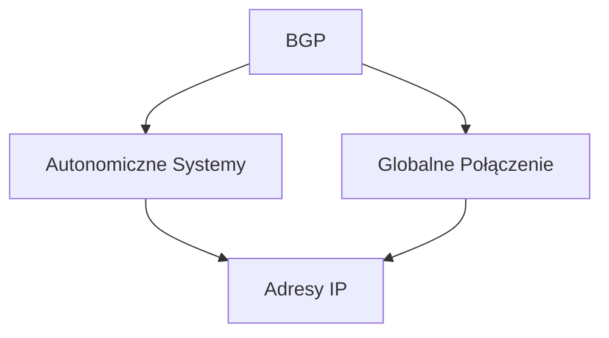
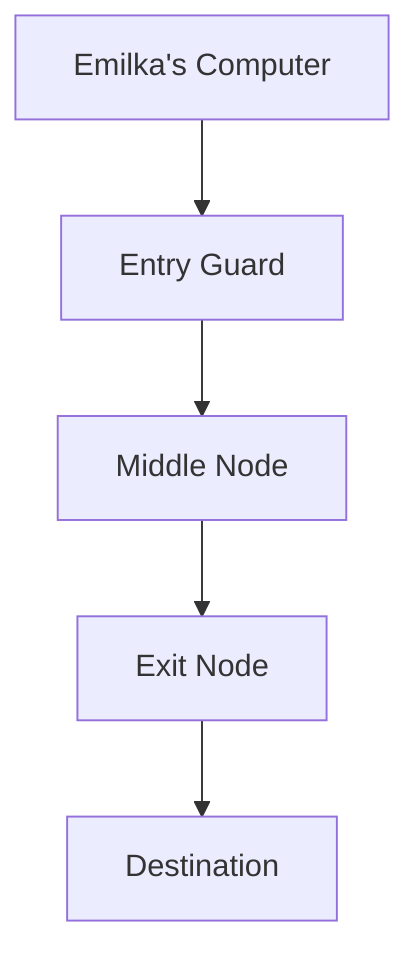

# Drive_0824_Narzędziownik OSINT 20 Reloaded - sesja 7_transkrypcja

> [!abstract] Podsumowanie
> Notatka omawia narzędzia OSINT oraz kwestie bezpieczeństwa związane z darkwebem i ich zgodność z regulacjami DORA i RODO.

## 📝 Treść

---
title: Drive_0824_Narzędziownik OSINT 20 Reloaded - sesja 7_transkrypcja
created: "2026-01-16 09:50"
type: transcript
tags:
  - biznes
  - biznes/zakupy
  - calendar
  - compliance
  - compliance/dora
  - compliance/nis2
  - compliance/rodo
  - cybersec
  - cybersec/osint
  - productivity
  - todo
  - source/drive_import
status: do-weryfikacji
source_file: Drive_0824_Narzędziownik OSINT 2.0 Reloaded - sesja 7_transkrypcja.txt
---

# Drive_0824_Narzędziownik OSINT 20 Reloaded - sesja 7_transkrypcja

## 📝 Treść

## 📅 Calendar
### SPOTKANIE: 
- 9 grudnia – Ostatni odcinek serii "Narzędziownik OSINT".
- 15 grudnia – Dni otwarte Securac Academy.

## 📝 Actions
TODO: Potwierdzić zastosowanie prezentacji do dzisiejszego spotkania.  
TODO: Sprawdzić łączność z uczestnikami przed rozpoczęciem szkolenia.  
TODO: Przygotować i zatwierdzić materiał do newslettera z certyfikatami.  
TODO: Wygenerować e-book z wytycznymi i narzędziami OSINT dla uczestników.  
TODO: Oznaczyć Securac w publikacjach na LinkedIn.  

## Osnawa
### Cele szkolenia
- Przedstawić tematykę darkwebu oraz technik anonimizacji  
- Zrozumieć zagrożenia związane z angażowaniem się w nielegalne działania w internecie.  

### Agenda szkolenia
1. Wprowadzenie do darkwebu:
   - Różnice pomiędzy Surface Web, Deep Web i Dark Web.
   - Zastosowanie sieci Tor i VPN w kontekście bezpieczeństwa.
2. Narzędzia do przeszukiwania Dark Webu.
3. Konfiguracja zabezpieczeń połączeń przeglądarki Tor i VPN.
4. Przykłady nielegalnych zjawisk w Dark Webie.

### Bezpieczeństwo zgodne z DORA, NIS2 i RODO
- Wszelkie informacje i materiały zawierają ostrzeżenia dotyczące prawnych ograniczeń oraz etyki działań w internecie.
- Podkreślono edukacyjny charakter materiału oraz obowiązek przestrzegania przepisów dotyczących danych osobowych (RODO).

## 🧠 Flashcards
#flashcard Co to jest Dark Web? :: Część internetu, która nie jest indeksowana przez tradycyjne wyszukiwarki.  
#flashcard Jakie są kluczowe różnice między Surface Web a Deep Web? :: Surface Web jest częściowo indeksowany i łatwo dostępny, podczas gdy Deep Web jest trudniejszy do przeszukiwania i wymaga specjalnych metod dostępu.  
#flashcard Co zapewnia użycie VPN w kontekście przeglądania Dark Webu? :: Zwiększa anonimowość połączenia i zabezpiecza dane przesyłane przez internet.  

## Deep Web i Dark Web

### Struktura Internetu
Internet składa się z różnych warstw zasobów, w tym Surface Web, Deep Web i Dark Web.

#### Surface Web
To część Internetu, która jest indeksowana przez wyszukiwarki. Obejmuje strony, które są łatwo dostępne bez logowania czy specjalnych procedur.

#### Deep Web
Zasoby Deep Webu to strony i portale, które nie są indeksowane. Aby uzyskać dostęp do tych zasobów, użytkownik musi spełnić określone wymagania, takie jak:

- Wypełnienie formularzy online
- Logowanie do konta

Przykładem jest wyszukiwarka udostępniania danych pomocy publicznej, która wymaga wybrania konkretnych kryteriów wyszukiwania, a wyniki nie są widoczne w wynikach wyszukiwania.

### Cechy Deep Webu
- Zasoby Deep Webu są znacznie większe niż Surface Web.
- Nowe regulacje oraz wdrażanie polityk ochrony danych, takich jak RODO w Europie, wpływają na dostępność informacji.

### Dark Web
Dark Web to specjalistyczna część sieci, która funkcjonuje w ukryciu. Wymaga użycia oprogramowania, takiego jak Tor, aby uzyskać dostęp. W Dark Web można spotkać różnorodne treści, od legalnych do wysoce niebezpiecznych.

### Crawler i AI w Deep Webie
Nowe technologie AI mogą wpływać na zdolność do przeszukiwania zasobów Deep Webu. Przykłady zastosowania AI w tym kontekście obejmują:

- **Rozpoznawanie interfejsów**: AI może dokonywać interakcji z formularzami i wybierać opcje.
- **Wyszukiwanie**: Użycie algorytmów AI do przeszukiwania stron, które wymagają logowania.

### TDM Protocol
Obecnie rozważany jest TDM Protocol (Text and Data Mining), który odnosi się do możliwości przetwarzania danych, w tym przeszukiwania zasobów chronionych prawami autorskimi. Ten protokół może być szczególnie istotny w kontekście regulacji związanych z ochroną danych.

## 📝 Actions
TODO: Zbadać możliwości implementacji TDM Protocol w projektach przetwarzania danych.  
TODO: Przygotować dokumentację na temat różnic między Deep Web a Dark Web.  
TODO: Przeanalizować przypadki użycia AI w kontekście eksploracji Deep Web.  

## 🧠 Flashcards
#flashcard Co to jest Deep Web? :: Zasoby nieindeksowane przez wyszukiwarki.  
#flashcard Jakie są różnice między Deep Web a Dark Web? :: Deep Web to nieindeksowane zasoby, Dark Web to część sieci dostępna tylko z użyciem specjalistycznego oprogramowania.  
#flashcard Co to jest TDM Protocol? :: Protokół do przetwarzania danych, związany z Text and Data Mining.

## 🌐 Sieci Internetowe i Protokół VPN

### Peer-to-Peer vs. Autonomiczne Systemy
Sieć Internetowa opiera się na autonomicznych systemach, gdzie każdy system otrzymuje unikalny adres IP. Przykładem takiej organizacji jest RIPE (Regional Internet Registry for Europe, Middle East and Central Asia), która przydziela adresację IP operatorom.

### Adresacja IP i RIPE Database
Aby przeszukać bazę RIPE, można użyć wyszukiwarki na stronie ripe.net. Przykład zapytania dla "cisco" może zwrócić adresację 62. 

```yaml
net_name: cisco
description: equinix customer cisco
country: DE
```

Znajomość administratorów i techników dla konkretnych adresów pozwala na weryfikację obsługi sieci.

### Baza ARIN
Dla adresów przypisanych w Ameryce Północnej używamy bazy ARIN (American Registry for Internet Numbers). Podobnie jak w RIPE, możemy wyszukiwać informacje o adresie, przykładowo dla "apple".

### Protokół BGP
BGP (Border Gateway Protocol) jest kluczowym protokołem w Internet, który zarządza rogzłoszeniem adresów IP. Można za jego pomocą śledzić, jak numery autonomiczne zmieniają się w czasie.



### Zastosowanie VPN
VPN (Virtual Private Network) nie zapewnia anonimowości, ale oferuje szyfrowanie danych. Umożliwia bezpieczne łączenie się z publicznymi sieciami Wi-Fi oraz zdalny dostęp do zasobów firmowych.

#### Kluczowe Funkcje VPN:
- **Szyfrowanie ruchu**: Ochrona danych przesyłanych przez niezaufane sieci.
- **Zmiana adresu IP**: Ukrycie lokalizacji użytkownika.
- **Zdalny dostęp**: Umożliwienie pracy zdalnej bez ryzykowania bezpieczeństwa.

### Aspekty Compliance
Zastosowanie VPN powinno być zgodne z regulacjami takimi jak DORA, NIS2 oraz RODO. Zapewniają one ochronę danych osobowych oraz odpowiedzialność w przypadku naruszeń.

## 📝 Actions
TODO: Zaktualizować dokumentację dotyczącą RIPE i ARIN.
TODO: Przeanalizować procesy związane z wykorzystaniem BGP w kontekście bezpieczeństwa.
TODO: Opracować zasady stosowania VPN zgodnie z wytycznymi DORA i RODO. 

## 🧠 Flashcards
#flashcard Czym jest RIPE? :: To Regional Internet Registry dla Europy, Bliskiego Wschodu i Azji Środkowej.
#flashcard Co to jest BGP? :: Protokół zarządzający routowaniem w Internecie.
#flashcard Jakie są kluczowe funkcje VPN? :: Szyfrowanie, zmiana IP, zdalny dostęp.

## VPN i Szyfrowanie

### Dostęp do Gemini przez VPN
Dostęp do systemu Gemini możliwy jest poprzez połączenie VPN. Blokada takiego dostępu jest trudna do zrealizowania, ponieważ adresy VPN mogą być zmienne i trudno je zidentyfikować.

### Wymiana kluczy w VPN
Wymiana kluczy do szyfrowania w VPN odbywa się zazwyczaj za pomocą algorytmu Diffie-Hellmana. Zależnie od rodzaju VPN, można wyróżnić dwa główne typy tuneli:

1. **Tunnel side-to-side**
   - Faza ISA-KMP: negocjowanie warstwy szyfrowania.
   - Faza IPsec: realizacja szyfrowania.

2. **SSL VPN**
   - Na przykład, zastosowanie SSL VPN od FortiGate, gdzie klient łączy się z zaporą sieciową bez konieczności zestawiania własnego tunelu.

### Użycie VPN do omijania blokad
VPN jest używany do omijania blokad, umożliwiając dostęp do zablokowanych treści, takich jak rosyjskie strony informacyjne czy chińskie wyszukiwarki (Baidu, Yandex). Użytkownik może zdobyć więcej informacji, korzystając z lokalizacji dostępnych przez VPN.

### Przeglądarki i anonimowość
VPN sam w sobie nie zapewnia anonimowości. Użytkownik może skorzystać z przeglądarek oferujących lepszą prywatność, jak MulWatt, która uzyskuje pozytywne wyniki w testach anonimowości. Warto również sprawdzić porównania przeglądarek na stronie privacytests.org.

### Wywiad i bezpieczeństwo
W kontekście bezpieczeństwa danych, warto zwrócić uwagę na sojusze międzynarodowe, takie jak "Nine Eyes" i "Fourteen Eyes", które umożliwiają wymianę informacji między krajami dotyczących danych logów VPN. Użytkownicy powinni być ostrożni, ponieważ niektóre usługi VPN mogą nie zapewniać rzeczywistej prywatności.

## 📝 Actions
TODO: Zbadać opcje tunele VPN i ich zastosowanie w zależności od potrzeb.  
TODO: Przetestować przeglądarki oferujące najlepsze możliwości prywatności.  
TODO: Zrozumieć zasady działania sojuszy wywiadowczych.  

## 🧠 Flashcards
#flashcard Jakie są główne fazy połączenia w tunelu side-to-side? :: Faza ISA-KMP i faza IPsec.  
#flashcard Co pozwala omijać blokady geograficzne w Internecie? :: VPN.  
#flashcard Jakie są przewagi przeglądarki MulWatt? :: Najlepsze wyniki w testach anonimowości.

## Analiza przeglądarek i dodatków

### Wprowadzenie
Przeglądarki internetowe oraz dodatki mają istotny wpływ na bezpieczeństwo oraz prywatność użytkowników. W niniejszej sekcji przedstawione zostaną kluczowe informacje dotyczące popularnych przeglądarek oraz dodatków, takich jak Goster, które blokują reklamy i zwiększają prywatność.

### Informacje systemowe
Podczas analizy połączeń można uzyskać szereg informacji, takich jak:
- Zainstalowany system operacyjny (np. Windows)
- Wersja przeglądarki (np. Firefox)
- Adres IP oraz wyniki związane z technologią CGNAT
- Ustawienia kamery, mikrofonu i karty graficznej
- Zmienne nagłówki HTTP

### Różnice między przeglądarkami
Zmienność wyników w zależności od używanej przeglądarki (np. Firefox vs. Edge) wskazuje na różnice w stosowanych nagłówkach oraz informacjach wysyłanych do serwisów. Przykładem jest dodatek Goster, który skutecznie chroni prywatność użytkownika i blokuje niepożądane reklamy.

## Sieć TOR

### Wprowadzenie
TOR, czyli The Onion Router, to technologia umożliwiająca anonimowe przeglądanie internetu. Powstała w latach 90. XX wieku, rozwijana przez US Naval Research Lab.

### Mechanizm działania
W kontekście architektury TOR, dane są szyfrowane w kilku warstwach, co przypomina cebulę. Każda warstwa może być odszyfrowana tylko przez odpowiedni węzeł w sieci. Dzięki temu możliwe jest zachowanie anonimowości użytkowników.



### Aspekty finansowania
W roku 2014 TOR otrzymał wsparcie finansowe z różnych źródeł, co budzi pytania o jego niezależność i anonimowość. Kluczowymi sponsorami byli:
- Departament Stanu USA
- Google
- EFF
- 4300 niezależnych darczyńców

Warto zauważyć, że sponsorowanie rozwoju TOR przez agencje rządowe może rodzić obawy o ewentualne próby deanonimizacji użytkowników.

## 📝 Actions
- TODO: Zbadać dodatkowe metody ochrony prywatności podczas korzystania z przeglądarek.
- TODO: Analizować zmiany w ustawieniach przeglądarek, aby zwiększyć poziom bezpieczeństwa.
- TODO: Zainstalować dodatek Goster oraz monitorować jego wpływ na prywatność.

## 📅 Calendar
- SPOTKANIE: Omówić problemy związane z anonimowością w Internecie podczas najbliższego webinaru. [Synced](https://www.google.com/calendar/event?eid=amlmN2NrMG5pbGVkamZhZHFlcDNoZHRpbTQgbWFyY2luLnVib2dpQG0)

## 🧠 Flashcards
#flashcard Co to jest Goster? :: To dodatek do przeglądarki blokujący reklamy i zwiększający prywatność użytkownika.
#flashcard Jak działa sieć TOR? :: Przesyła dane w warstwach szyfrowania, zapewniając anonimowość użytkowników.

## 🔒 Szyfrowanie w architekturze sieci Tor

### Wprowadzenie
Szyfrowanie jest kluczowym elementem architektury sieci Tor, gdzie dane są wielokrotnie szyfrowane, aby zapewnić anonimowość użytkowników. Podobnie jak w przypadku warstw cebuli, przesyłanie danych w sieci Tor odbywa się poprzez kolejne warstwy szyfrowania.

### Architektura Tor
1. **Węzły**: Użytkownik łączy się z węzłem wejściowym, zwanym także „entry guard” lub „entry relay”.
2. **Środkowy węzeł**: Następnie dane są przekazywane do węzła środkowego, który nie zna źródła ani celu komunikacji.
3. **Węzeł wychodzący**: Ostatnim węzłem w torze jest węzeł wychodzący, który przekazuje dane do zewnętrznego serwera.

### Warstwowe szyfrowanie
Każda warstwa szyfrowania działa, aby chronić prywatność:
- **Szyfrowanie danych**: Dane są wielokrotnie szyfrowane zanim opuszczą komputer użytkownika.
- **Warstwy odniesienia**: Każda warstwa szyfrowania może być odszyfrowana tylko przez odpowiedni węzeł, co zapewnia dodatkową warstwę bezpieczeństwa.

### Systemy anonimowości
- **Tor Browser**: Najprostszy sposób dostępu do sieci Tor.
- **I2P**: Architektura peer-to-peer dla anonimowego dostępu do Internetu.
- **Freenet**: Łączy elementy architektury peer-to-peer z typowym modelami klient-serwer.

### Bezpieczeństwo i anonimowość w Dark Web
Dark Web, który jest mroczniejszym segmentem Deep Web, wymaga specjalnego oprogramowania (np. Tor Browser) do dostępu. Na Dark Webie występują wyspecjalizowane wyszukiwarki i portale, jak Achmiya Phi oraz The Hidden Wiki, które pozwalają na nawigację w tej części internetu.

### Praktyczne zastosowania
Zalecenia dotyczące bezpieczeństwa w Dark Webie:
- **Tor over VPN**: Dla zwiększonej anonimowości.
- **System Tiles**: Specjalistyczna dystrybucja Debian dla bezpieczniejsze interakcji z Dark Webem.

## 📝 Actions
TODO: Zbadać różne metody dostępu do Dark Web.
TODO: Zainstalować i przetestować Tor Browser oraz system Tiles.
TODO: Weryfikować bezpieczeństwo dostępu do stron w Dark Webie.

## 📅 Calendar
SPOTKANIE: Omówienie wyników testów z wciąż działającym Tor Browser - 2023-10-30. [Synced](https://www.google.com/calendar/event?eid=djV1YTNnaDlmZHB2Z2phbWZoMjRuZXFiZmcgbWFyY2luLnVib2dpQG0)

## 🧠 Flashcards
#flashcard Co to jest Tor? :: Sieć anonymizująca, która chroni prywatność użytkowników poprzez szyfrowanie danych.
#flashcard Jakie są główne elementy architektury sieci Tor? :: Węzeł wejściowy, środkowy węzeł, węzeł wychodzący.
#flashcard Co to jest Dark Web? :: Część internetowa, do której dostęp mają tylko użytkowników używających specyficznego oprogramowania, jak Tor.

## Dokumentacja dotycząca korzystania z Darknetu

### Wprowadzenie
Korzystanie z darknetu wiąże się z koniecznością przestrzegania zasad bezpieczeństwa oraz odpowiednich narzędzi. Użytkowanie powinno być dokonane na własną odpowiedzialność.

### Zasady korzystania z Darknetu
1. **Bezpieczeństwo**: Sugeruje się korzystanie z maszyny wirtualnej w celu odseparowania potencjalnych infekcji od głównego systemu operacyjnego.
2. **Oprogramowanie**: VirtualBox oraz VMware Workstation są rekomendowanymi narzędziami do tworzenia maszyn wirtualnych.

### Tworzenie maszyny wirtualnej
Aby stworzyć maszynę wirtualną, należy wykonać następujące kroki:

1. **Wybór narzędzia**: Zainstaluj VirtualBox lub VMware Workstation.
2. **Pobranie systemu operacyjnego**:
   - Dla Kali Linuxa, odwiedź [kali.org](https://www.kali.org) w celu pobrania odpowiedniego ISO.
3. **Konfiguracja maszyny**:
   ```bash
   # Przykład do utworzenia maszyny w VMware Workstation
   VMware Workstation > "Utwórz maszynę wirtualną"
   Wybierz plik ISO i postępuj zgodnie z instrukcjami.
   ```

### Ustawienia maszyny wirtualnej
- **Pamięć RAM**: Procesory oraz ilość pamięci RAM powinny być ustawione na wartości wyższe, np. 8192 MB RAM i 4 procesory.
- **Dysk twardy**: Zarezerwowana przestrzeń na dysku powinna być odpowiednia do potrzeb, np. 25 GB.

### Bezpieczeństwo podczas korzystania z Darknetu
Aby zapewnić bezpieczeństwo, podczas korzystania z Tor Browser należy:

1. **Używać przeglądarki Tor**: Zainstaluj przeglądarkę z [torproject.org](https://www.torproject.org) i uruchom ją, aby połączyć się z siecią Tor.
2. **Zarządzać połączeniami**: Przy konfiguracji można wykorzystać mostki, które są polecane przy użyciu węzłów w sieci Tor.

### Ustawienia sieciowe
Podczas konfiguracji Kali Linux, warto wybrać odpowiedni interfejs sieciowy:
- **NAT**: Preferowany ze względu na bezpieczeństwo i izolację.
- **Bridge**: Może ujawniać więcej szczegółów o hostach lokalnych.

### Instalacja systemu operacyjnego Kali Linux
1. **Wskazanie dysku twardego**: Upewnij się, że wszystkie pliki są na jednej partycji podczas instalacji systemu.
2. **Tworzenie użytkownika**: Użytkownik powinien mieć unikalne hasło oraz nazwę.

### ⚠️ Aspekty Compliance
Zgodność z przepisami DORA, NIS2 i RODO jest kluczowa. Należy zwrócić uwagę na:
- **Ochrona danych**: Zapewnij, aby wszystkie wrażliwe dane były dobrze zabezpieczone oraz aby dbać o anonimowość w sieci.

## 📝 Actions
TODO: Zainstalować VirtualBox lub VMware Workstation.  
TODO: Pobierz ISO Kali Linuxa z oficjalnej strony.  
TODO: Utworzyć maszynę wirtualną w wybranym narzędziu.  
TODO: Zainstalować Tor Browser zgodnie z powyższymi wskazówkami.

## 📅 Calendar
TERMIN: Szkolenie dotyczące korzystania z Darknetu - data do ustalenia. [Synced](https://www.google.com/calendar/event?eid=N3VlNHFhNnBqMGFxaTJnbGdwamU5OHRzaW8gbWFyY2luLnVib2dpQG0)

## 🧠 Flashcards
#flashcard Co to jest Darknet? :: Część internetu, do której dostęp jest możliwy tylko przez specjalne oprogramowanie.  
#flashcard Jakie narzędzia rekomendowane są do korzystania z Darknetu? :: VirtualBox, VMware Workstation, Tor Browser.  
#flashcard Dlaczego zaleca się używanie maszyny wirtualnej do korzystania z Darknetu? :: Aby odseparować potencjalne infekcje od systemu operacyjnego.  

## 📡 Darknet i Tor

### 1. Wprowadzenie
Darknet to zaszyfrowana część internetu dostępna tylko poprzez specjalne oprogramowanie, takie jak Tor. Umożliwia on anonimowe przeglądanie oraz komunikację. W tym dokumencie omówione są kluczowe aspekty dostępu do darknetu oraz zabezpieczeń.

### 2. Przeglądarka Tor
Tor Browser jest dostępną przeglądarką, która zapewnia bezpieczeństwo i anonimowość podczas przeglądania darknetu. Zaleca się korzystanie z jego domyślnych ustawień, aby zminimalizować ryzyko.

### 3. Adresacja w darknet
Adresy darknetowe, takie jak *.onion, są mniej przyjazne dla użytkownika i mniej intuicyjne niż tradycyjne adresy internetowe. Rekomendowane źródła to między innymi:
- **The Hidden Wiki**  
- **The Onion Life**

### 4. Zabezpieczenia
Podczas odwiedzania stron darknetowych może istnieć ryzyko uruchomienia złośliwych skryptów, np. JavaScript. Dlatego zaleca się użycie rozszerzenia **NoScript** do blokowania skryptów, co jest domyślnie włączone w przeglądarce Tor.

### 5. Działalność w darknet
Na darknet można znaleźć różnorodne usługi, wiele z nich jest nielegalnych. Wśród dostępnych serwisów znajdują się:
- **Narkotyki** 
- **Sprzedaż kont bankowych**
- **Fałszywe dokumenty**

Należy być świadomym, że korzystanie z tych usług wiąże się z ryzykiem prawnym i osobistym.

### 6. Narzędzia dla hakerów
W darknet można znaleźć fora i baza danych narzędzi dla hakerów, w tym między innymi:
- **Hell Forum**
- **Rise Up**
- **DEFCON**

### 7. Usługi anonimowe
Serwisy takie jak **ProtonMail** czy **BBC** są dostępne w darknet, co daje możliwość korzystania z nich w trybie anonimowym.

## 📝 Actions
TODO: Zainstalować przeglądarkę Tor oraz rozszerzenie NoScript.  
TODO: Przeanalizować ryzyko związane z odwiedzanymi stronami darknetowymi.  
TODO: Zarejestrować się na bezpiecznych platformach, które oferują anonimowość.

## 🧠 Flashcards
#flashcard Co to jest darknet? :: Zaszyfrowana część internetu dostępna przez specjalne oprogramowanie.  
#flashcard Jakie są zalecane źródła w darknet? :: The Hidden Wiki, The Onion Life.    
#flashcard Jakie są podstawowe zabezpieczenia w przeglądarki Tor? :: Użycie rozszerzenia NoScript.

## Dark Web Overview

### Przestępcze praktyki
Hakerzy często stosują techniki phishingowe, aby zdobyć dostęp do kont użytkowników. Przykład:
- Za pierwszy strzał mogą żądać 50 dolarów.
- Jeśli atak nie powiedzie się, mogą wrócić z ofertą przejęcia konta za 500 dolarów.

### Działalność na darkwebie
Na darkwebie działają różne platformy i forum, takie jak:
- **BBC**: wersja bezpieczna portalu informacyjnego.
- **ProtonMail**: opcja zakupu anonimowych skrzynek mailowych.
- **SecureDrop**: do bezpiecznego przesyłania informacji.
- **Hell Forum**: wymaga opłaty rejestracyjnej, oferuje dostęp do zamkniętej społeczności.

Praktyka zalecana, aby unikać profilowania:
- Używanie bezpiecznych narzędzi komunikacyjnych.
- Korzystanie z anonimowych sposobów przesyłania informacji.

### Operacje na Cebulce
Forum Cebulka wymaga przejścia przez kapczę. Użytkownik musi:
1. Zainstalować narzędzie GPG for USB.
2. Wygenerować klucz publiczny i używać go do rejestracji.

Zalecenia:
- Nie używać tego samego pseudonimu, który jest używany w innych platformach.
- Używać silnego hasła i unikać kont e-mail, które mogą być mniej bezpieczne.

### Zasady działania sklepów
Paczki związane z nielegalnymi zakupami:
- Koszt wysyłki zaczyna się od 8 euro.
- Promocje na zamówienia do określonej godziny, co sprzyja szybkim zakupom.

### Potencjalne zagrożenia
Czynniki ryzyka związane z darkwebem:
- Złośliwe oprogramowanie może być aktywowane przez kliknięcie niebezpiecznych linków.
- Fraud GPT: AI przypisany do działań przestępczych, a jego koszt 1000 dolarów może być niską inwestycją dla cyberprzestępców.

## 📝 Actions
TODO: Monitorować bezpieczeństwo w darkwebie i regularnie aktualizować strategie ochrony.
TODO: Zastanowić się nad wdrożeniem dodatkowych zabezpieczeń do UFOH, aby ograniczyć ryzyko ataków phishingowych.

## 📅 Calendar
TERMIN: Spotkanie dotyczące analizy działań na darkwebie - data do ustalenia. [Synced](https://www.google.com/calendar/event?eid=YTlwZW1zZWVodDhpdGV0a21jNWVqbnRodXMgbWFyY2luLnVib2dpQG0)

## 🧠 Flashcards
#flashcard Jakie techniki stosują hakerzy? :: Phishing
#flashcard Co to jest SecureDrop? :: Bezpieczna platforma do przesyłania informacji.
#flashcard Jakie narzędzie rekomenduje Cebulka? :: GPG for USB
#flashcard Jakie zagrożenie niesie Fraud GPT? :: Złośliwe oprogramowanie i działania przestępcze.

## Darkweb i Narzędzia do Analizy

### Wprowadzenie do Darkwebu
Darkweb to część internetu, która nie jest indeksowana przez tradycyjne wyszukiwarki. Wymaga specjalnego oprogramowania, takiego jak Tor, aby uzyskać dostęp. Umożliwia to anonimowe przeglądanie oraz komunikację, ale jednocześnie rodzi szereg wyzwań związanych z bezpieczeństwem.

### Narzędzia do Pracy na Darkwebie
Na darkwebie dostępne są różnorodne narzędzia i wyszukiwarki, takie jak:
- **Achmii Fi** - wyszukiwarka do przeszukiwania darkwebu.
- **Tornado** - narzędzie do zbierania linków onion.
- **Onionscan** - skaner linków na darkwebie.
- **Torbot** - narzędzie do wyciągania danych ze stron.

### Instalacja Kali Linux i VPN
Zaleca się instalację Kali Linux jako systemu operacyjnego do pracy z narzędziami do analizy darkwebu. Po zainstalowaniu systemu warto skonfigurować tunel VPN.

#### Proces instalacji
```bash
# Instalacja Kali Linux
# Dodać sektor rozruchowy
```

#### Zestawienie VPN over Tor
1. Zainstalować klienta VPN (np. Proton VPN).
2. Połączyć się z VPN.
3. Użyć narzędzia TorRC do połączenia z siecią Tor.

### Anonimowość i Bezpieczeństwo
Połączenie VPN over Tor zwiększa anonimowość użytkownika. Internet dostawca (ISP) widzi jedynie połączenie z VPN, a nie do sieci Tor, co wpływa na bezpieczeństwo użytkownika.

### Dwa Typy Połączeń
1. **Tor over VPN** - użytkownik łączy się z VPN, a później do Tor. 
2. **VPN over Tor** - użytkownik łączy się z Tor, a następnie do VPN. 

Oba podejścia oferują różne poziomy bezpieczeństwa, jednak VPN over Tor może ujawniać więcej informacji o użytkowniku.

### Kluczowe Aspekty Bezpieczeństwa (DORA, NIS2, RODO)
Zastosowanie narzędzi darkwebowych może być związane z przetwarzaniem danych osobowych. Należy zapewnić zgodność z przepisami DORA, NIS2 oraz RODO, zwłaszcza gdy przetwarzane są dane osobowe użytkowników.

## 📝 Actions
TODO: Zainstalować Kali Linux i skonfigurować sektor rozruchowy.  
TODO: Wybierać narzędzia do analizy darkwebu i przetestować ich działanie.  
TODO: Zestawić połączenie VPN over Tor i przetestować anonimowość.

## 📅 Calendar
SPOTKANIE: Omówić wyniki działań w analizie darkwebu - (data do ustalenia). [Synced](https://www.google.com/calendar/event?eid=ajU3cHVldHI5dmxocHM3c21vM2JqbnE4bzAgbWFyY2luLnVib2dpQG0)

## 🧠 Flashcards
#flashcard Co to jest darkweb? :: Część internetu nie indeksowana przez tradycyjne wyszukiwarki, wymagająca specjalnych narzędzi do dostępu.  
#flashcard Jakie są narzędzia do pracy na darkwebie? :: Achmii Fi, Tornado, Onionscan, Torbot.  
#flashcard Co to jest Tor over VPN? :: Połączenie, w którym użytkownik łączy się z VPN, a potem do sieci Tor.  
#flashcard Co to jest VPN over Tor? :: Połączenie, w którym użytkownik najpierw łączy się do sieci Tor, a potem do VPN.

## 🍃 Wywiad i konfiguracja VPN oraz TOR

### ⚙️ Konfiguracja ProtonVPN

1. Użytkownik loguje się na swoje konto ProtonVPN.
2. Sprawdzenie zakładki `Account`, gdzie znajdują się kluczowe dane do połączenia, takie jak OpenVPN i KV2 Username.
3. Użytkownik przechodzi do zakładki `Downloads`, aby pobrać narzędzie ProtonVPN. W celu uzyskania większej anonimowości, korzysta z opcji konfiguracji OpenVPN zamiast domyślnej aplikacji.

### 🌐 Wybór serwera VPN

1. Wybór platformy — przykładowo Windows.
2. Użytkownik decyduje się na sposób komunikacji — UDP lub TCP.
3. Użytkownik przegląda dostępne serwery, wybierając te z obciążeniem poniżej 75%. 

### 🔧 Import konfiguracji OpenVPN

1. Po pobraniu konfiguracji OpenVPN, użytkownik otwiera plik, który automatycznie importuje do OpenVPN.
2. Wprowadza nazwę użytkownika oraz hasło.
3. Użytkownik łączy się z wybranym serwerem.

### 🟢 Użycie analizy obciążenia serwera

1. Użytkownik musi monitorować obciążenie serwerów i ddokonywać wyboru na podstawie aktualnych warunków. Połączenia mogą być długotrwałe, dlatego należy testować różne serwery.

### 🔒 Bezpieczeństwo i anonimowość

1. Korzystanie z OpenVPN zmniejsza ryzyko przechwycenia danych przez vendorów VPN-owych. 
2. Dodatkowe połączenie z siecią TOR przy użyciu PowerShella oraz narzędzia TorRC zapewnia dodatkowy poziom anonimowości.

### 🔧 Użycie Kali Linux oraz instalacja narzędzi

1. Instalacja OpenVPN i TOR na Kali Linux:
   ```bash
   sudo apt update
   sudo apt install openvpn tor
   ```

### ⚙️ Konfiguracja TOR

1. Użytkownik modyfikuje plik konfiguracyjny TorRC, aby dostosować port socx.
2. Włączenie Tor:
   ```bash
   sudo systemctl start tor
   sudo systemctl status tor
   ```
   
### 🕸️ Proxy-Chain

1. Instalacja proxy-chains:
   ```bash
   sudo apt install proxychains
   ```
2. Modyfikacja pliku konfiguracyjnego proxychains, aby ustawić `dynamic_chain`.
   
## 📝 Actions

TODO: Sprawdzić obciążenie serwerów przed połączeniem z VPN.  
TODO: Importować plik config OpenVPN do aplikacji po pobraniu.  
TODO: Zmienić konfigurację proxychains na `dynamic_chain`.  

## 📅 Calendar

SPOTKANIE: 2026-12-05 - Podsumowanie działań z użyciem VPN i TOR.   [Synced](https://www.google.com/calendar/event?eid=NWptaHQ4bjIwaWQzbGRnZ3U0NnAwMTNpZ2cgbWFyY2luLnVib2dpQG0)

## 🧠 Flashcards

#flashcard Jaką konfigurację należy użyć w proxychains? :: dynamic_chain  
#flashcard Jakie są kluczowe kroki, aby połączyć się z ProtonVPN? :: Zalogować się, pobrać config OpenVPN, zaimportować, połączyć.  
#flashcard Jakie jest minimalne obciążenie serwera VPN, które powinno być brane pod uwagę? :: 75%  

## Tor Over VPN

### Konfiguracja Tor

Konfiguracja Tor z dynamicznym łańcuchem jest kluczowa dla zapewnienia anonimowości. Użycie komendy `proxychains4` w połączeniu z Tor umożliwia korzystanie z aplikacji w sieci Tor.

```bash
proxychains4 firefox
```

Po tej komendzie przeglądarka Firefox zostanie uruchomiona z obsługą sieci Tor.

### Testowanie Połączenia

Aby sprawdzić z jakim adresem IP użytkownik wychodzi w sieci, można użyć strony `showmyip.com`. To potwierdzi, przez jaki węzeł Tor dokonano połączenia.

### Ustawienia Proxy Chains

Należy upewnić się, że wartości proxy DNS są ustawione na dynamiczny łańcuch, co zwiększa poziom anonimowości. Użycie opcji `strict chain` nie jest zalecane, ponieważ może ograniczać skuteczność połączenia.

### VPN over Tor

Aby zainstalować i uruchomić VPN w połączeniu z Tor, należy zainstalować OpenVPN i uruchomić go z `proxychains4`.

```bash
proxychains4 openvpn --config your-config-file.ovpn
```

## Compliance

Zastosowanie opisanego rozwiązania powinno być zgodne z regulacjami, takimi jak DORA, NIS2 oraz RODO. Zastosowanie VPN oraz Tor wspiera prywatność danych i anonimowość użytkowników.

## 📝 Actions
TODO: Konfigurować Tor z dynamicznym łańcuchem.
TODO: Przetestować połączenie przez `showmyip.com`.
TODO: Użyć OpenVPN z `proxychains4`.

## 📅 Calendar
TERMIN: Zaplanować następne szkolenie dotyczące Tor i VPN. [Synced](https://www.google.com/calendar/event?eid=dnN0Mjhuc3RnbmZnZXBwaTUxamNwaTMxOW8gbWFyY2luLnVib2dpQG0)

## 🧠 Flashcards
#flashcard Jak skonfigurować dynamiczny łańcuch w Tor? :: Użyj proxychains4 z odpowiednimi opcjami.
#flashcard Co to jest proxychains4? :: Narzędzie do uruchamiania aplikacji przez serwery proxy.
#flashcard Jakie regulacje są związane z ochroną danych? :: RODO, DORA, NIS2.

## Podsumowanie

Osoby zaangażowane w rozwój w dziedzinie OSINT (Open Source Intelligence) mają nadzieję na dalszy postęp w tej branży. Uczestnicy zostali zachęceni do wypełnienia ankiety, co ma na celu zebranie opinii i sugestii na przyszłość. 

## Kluczowe Informacje

- Rozwój w gałęzi OSINT
- Ankieta do wypełnienia dla uczestników
- Podziękowania za udział i zachęta do przyszłego kontaktu

## 📝 Actions
TODO: Zbadać wyniki ankiety, aby określić kierunki rozwoju w obszarze OSINT.

## 📅 Calendar
TERMIN: Sprawdzenie wyników ankiety do końca miesiąca.  [Synced](https://www.google.com/calendar/event?eid=cWFlbnJjMGpvbnBzNmFpOXVuNTdoNDlwMGcgbWFyY2luLnVib2dpQG0)

## 🧠 Flashcards
#flashcard Jakie są główne obszary rozwoju w OSINT? :: Rozwój w gałęzi OSINT i wypełnienie ankiety.
#flashcard Dlaczego uczestnicy zostali zachęceni do wypełnienia ankiety? :: Aby zebrać opinie i sugestie na przyszłość.

## Powiązane notatki

- [[000_MOC_Cybersec]]
- [[000_MOC_Compliance]]
- [[000_MOC_Productivity]]
