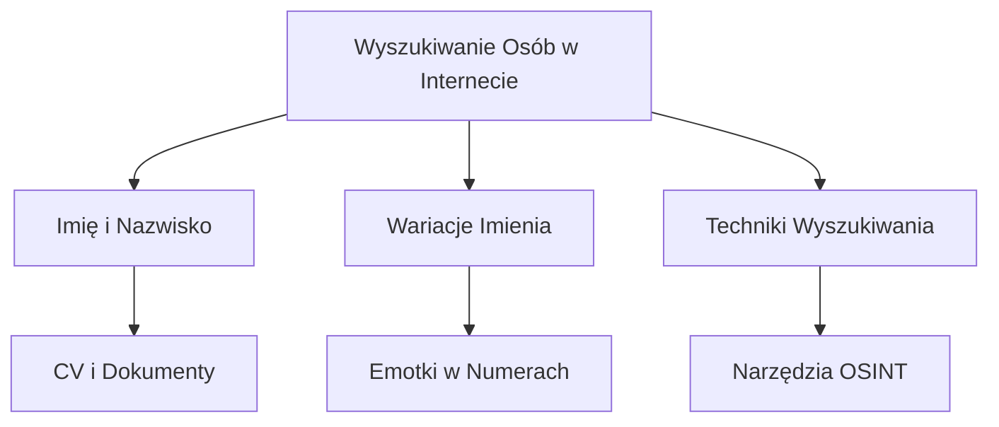
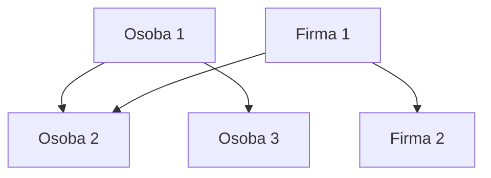

# Drive_0922_Kopia Narzędzia i techniki OSINT - Krzysztof Wosiński_transkrypcja

> [!abstract] Podsumowanie
> Szkolenie obejmuje kluczowe narzędzia i techniki OSINT, z naciskiem na ich zastosowanie w obszarze cyberbezpieczeństwa i zgodności z regulacjami.

## 📝 Treść

---
title: Drive_0922_Kopia Narzędzia i techniki OSINT - Krzysztof Wosiński_transkrypcja
created: "2026-01-16 09:50"
summary: Szkolenie dotyczy narzędzi i technik OSINT, z akcentem na edukacyjny charakter prezentowanych informacji oraz organizację zajęć.
type: transcript
tags:
  - calendar
  - compliance
  - compliance/dora
  - compliance/nis2
  - compliance/rodo
  - cybersec
  - cybersec/blue-team
  - cybersec/osint
  - productivity
  - tech
  - tech/python
  - todo
  - source/drive_import
status: do-weryfikacji
source_file: Drive_0922_Kopia Narzędzia i techniki OSINT - Krzysztof Wosiński_transkrypcja.txt
---

# Drive_0922_Kopia Narzędzia i techniki OSINT - Krzysztof Wosiński_transkrypcja

> [!abstract] Podsumowanie
> Szkolenie dotyczy narzędzi i technik OSINT, z akcentem na edukacyjny charakter prezentowanych informacji oraz organizację zajęć.

## 📝 Treść

## Szkolenie osintowe

### Wprowadzenie
Dzień dobry wszystkim. Witam na szkoleniu dotyczącego narzędzi i technik OSINT (Open Source Intelligence). Celem tego szkolenia jest wprowadzenie w tematy dotyczące otwartych źródeł informacji.

### Informacje organizacyjne
- Szkolenie potrwa około dwóch godzin, z materiałem przygotowanym na półtorej godziny.
- Pytania można zadawać na czacie.
- Prezentacja oraz certyfikat zostaną przesłane na koniec szkolenia.
- Nagranie szkolenia będzie dostępne na YouTube.

### Etyka OSINT
Wszystko, co prezentowane jest na tym szkoleniu, ma na celu edukację. Uczestnicy nie powinni angażować się w działania bez zgody zainteresowanych stron, co jest zgodne z przepisami RODO oraz zasadami DORA i NIS2.

### Agenda
1. Czym są otwarte źródła i jak z nich korzystać.
2. Prowadzenie śledztw OSINT w bezpiecznym środowisku pracy.
3. Techniki wyszukiwania informacji o osobach i firmach.
4. Narzędzia do analizy i geolokalizacji.

### Google Trends
Analiza Google Trends pokazuje, że popularność osintu wzrosła znacząco po 22 lutego 2022 roku, co zbiegło się z początku konfliktu w Ukrainie.

### Przykłady wyszukiwań
- Trendy dotyczące matur 2023 ukazują, jakie pytania były popularne w okresie egzaminów.
- Możliwość wyciągania wniosków na temat bezpieczeństwa w kontekście osintowym umożliwia identyfikację potencjalnych naruszeń.

### OSINT w historii
OSINT zyskał na znaczeniu podczas II wojny światowej:
- Brytyjczycy i Amerykanie stworzyli odpowiednie struktury do zbierania informacji.
- Ciekawe przykłady skuteczności OSINT obejmują badanie cen pomarańczy w Paryżu jako wskaźnika skuteczności bombardowań.

## 📝 Actions
TODO: Przesłać link do prezentacji uczestnikom po szkoleniu.  
TODO: Udostępnić nagranie wideo na YouTube.  
TODO: Zebrać pytania uczestników na czacie do omówienia na koniec szkolenia.  

## 🧠 Flashcards
#flashcard Czym jest OSINT? :: OSINT to zbieranie i analiza informacji z otwartych źródeł.  
#flashcard Jakie są kluczowe narzędzia OSINT? :: Wyszukiwarki internetowe, bazy danych, techniki geolokalizacji.  
#flashcard Jakie są zagrożenia związane z OSINT? :: Nieautoryzowane działanie, naruszenie prywatności, niezgodność z prawem.

## OSINT w Dziennikarstwie i Analizie Pomorskiej

### Wprowadzenie do OSINT
OSINT (Open Source Intelligence) to metodyka wywiadowcza, która obejmuje cały cykl zbierania, analizy i raportowania informacji. Istotne aspekty obejmują:

- Formułowanie pytania
- Zbieranie informacji
- Analizowanie danych
- Raportowanie wyników

### Zastosowania OSINT
OSINT znajduje zastosowanie w dwóch głównych dziedzinach:

1. **Business Intelligence**
2. **Dziennikarstwo Śledcze**

Obie dziedziny korzystają z technik OSINT, jednak OSINT jest znacznie szerszą koncepcją.

### Przykład zastosowania OSINT
Dziennikarze, tacy jak Christian Tribert, wykorzystali zdjęcia satelitarne do analizy pozycji rosyjskich statków transportujących ropę. Analizy wykazały, że statek **Cathay Phoenix** transmitował fałszywą lokalizację. Użycie systemu AIS (Automatic Identification System) umożliwiło prezentację nieprawdziwych danych dotyczących lokalizacji.

### Problematyka AIS
System AIS pozwala statkom na otwarte nadawanie i odbieranie informacji, co niesie ryzyko jego nadużycia. Użytkownicy mogą wprowadzać fałszywe informacje o lokalizacji statków. Przykład ingerencji w system AIS pokazuje, jak można manipulować danymi w celach niezgodnych z prawem.

### Weryfikacja informacji
Analiza zdjęć satelitarnych ujawniła, że statek nie znajdował się w deklarowanej lokalizacji, lecz w porcie w Koźminie, co stanowiło dowód na działalność handlową pomimo embarga nałożonego na Rosję. Dziennikarze zbierali dane o statkach, ich trasach i historycznych lokalizacjach, aby ujawnić prawdę.

### Dostęp do zdjęć satelitarnych
Dostęp do zdjęć satelitarnych jest zazwyczaj zarezerwowany dla rządów oraz dziennikarzy, którzy mogą je nabyć od firm takich jak **Bellingcat**. Koszt tych zdjęć może być znaczny, co może ograniczać ich dostępność dla nieprofesjonalnych użytkowników.

### Systemy monitorowania lotów
Dla monitorowania statków i samolotów można wykorzystywać systemy takie jak:

- **marintraffic.com** - do śledzenia statków.
- **Flightradar24** - do monitorowania samolotów.

Systemy te mogą dostarczać szczegółowe dane, aczkolwiek niektóre funkcjonalności są płatne.

### Wykorzystanie OSINT w bezpieczeństwie
Z punktu widzenia bezpieczeństwa, OSINT może być używany do:

- Weryfikacji informacji
- Detekcji oszustw
- Przygotowania ataków socjotechnicznych

### Compliance
Z perspektywy regulacji, praktyki OSINT powinny być zgodne z DORA (Digital Operational Resilience Act), NIS2 (Network and Information Security Directive) oraz RODO (General Data Protection Regulation), zwłaszcza w zakresie ochrony danych osobowych i prywatności użytkowników.

## 📝 Actions
TODO: Przeprowadzić analizę efektywności narzędzi OSINT w kontekście bezpieczeństwa danych.  
TODO: Zorganizować warsztaty na temat praktycznego zastosowania OSINT w dziennikarstwie śledczym.

## 📅 Calendar
TERMIN: Zorganizować spotkanie w celu omówienia strategii stosowania OSINT w działalności dziennikarskiej. [Synced](https://www.google.com/calendar/event?eid=MGdsMnQ3OHV0OXVza2tqOWEyYXFqZzVxMTQgbWFyY2luLnVib2dpQG0)

## 🧠 Flashcards
#flashcard Co to jest OSINT? :: OSINT to metodyka wywiadowcza oparta na otwartych źródłach informacji.  
#flashcard Jakie są główne zastosowania OSINT? :: Business Intelligence i Dziennikarstwo Śledcze.  
#flashcard Co to jest AIS? :: System, który pozwala statkom na otwarte nadawanie i odbieranie informacji o lokalizacji.

## OSINT w Działaniach Socjotechnicznych

### Wprowadzenie
OSINT (Open Source Intelligence) jest kluczowym narzędziem w analizie informacji, które może być wykorzystywane zarówno w pozytywnym kontekście, jak i w działaniach socjotechnicznych. Obejmuje działania związane z pozyskiwaniem informacji z dostępnych źródeł, co może prowadzić do nasilających się zagrożeń, w tym phishingu i ataków socjotechnicznych.

### Rodzaje Działań OSINT
#### Przykłady zastosowań OSINT:
- Poszukiwanie zaginionych osób.
- Weryfikacja prawdziwości informacji (fake news).
- Przygotowanie do ataków socjotechnicznych.

#### Wykorzystanie OSINT w atakach:
- Informacje pozyskiwane przez OSINT mogą być użyte do konstruowania przekonujących wiadomości phishingowych.
- Oszuści mogą zbierać dane, takie jak imiona i struktura firmy, aby stworzyć wiarygodną korespondencję.

### Typy OSINT
#### OSINT Pasywny
- Korzystanie z wyszukiwarek i innych źródeł bez kontaktu z celem.
- Przykłady: badania w ramach działań poszukiwawczych (search party).

#### OSINT Aktywny
- Bezpośrednia interakcja z obiektem badań (np. lajkowanie, wiadomości).
- Wyższe ryzyko wykrycia, ale dostarcza bardziej szczegółowych informacji.

### Automatyzacja OSINT
- Istnieje wiele narzędzi do automatyzacji OSINT, w tym OSINT Framework, które zbierają narzędzia do różnych zastosowań.

## 📝 Actions
TODO: Zapoznać się z zasadami OSINT oraz jego zastosowaniem w działaniach socjotechnicznych.  
TODO: Wykonać przegląd narzędzi dostępnych w OSINT Framework i ocenić ich przydatność w kontekście swoich działań.  
TODO: Zrealizować przykłady OSINT pasywnego i aktywnego w kontekście użytkowników własnej firmy.  

## 📅 Calendar
TERMIN: Udział w najbliższych wydarzeniach search party organizowanych przez Tracelabs.   [Synced](https://www.google.com/calendar/event?eid=cGd2aDhjb282a2c0bDM3bWQ0N2NjZGoxYWsgbWFyY2luLnVib2dpQG0)

## 🧠 Flashcards
#flashcard Co to jest OSINT? :: OSINT to inteligencja pozyskiwana z dostępnych źródeł.  
#flashcard Jakie są dwa rodzaje OSINT? :: OSINT pasywny i aktywny.  
#flashcard Kiedy wykorzystuje się OSINT w działaniach socjotechnicznych? :: Przed wykonaniem ataku, aby zebrać informacje o celu.

## Opis procesu wyciągania informacji z internetu

### Wprowadzenie do automatyzacji
Automatyzacja procesów związanych z wyciąganiem informacji z stron internetowych może stać się istotnym narzędziem w pracy związanej z OSINT (Open Source Intelligence). Przy pomocy prostych skryptów w JavaScript można np. zautomatyzować proces zbierania obrazków, imion, nazwisk, adresów e-mail i innych ważnych danych.

### Metody pozyskiwania danych
1. **Archiwa internetowe**  
   Możliwość wyciągania informacji z archiwum internetu (np. Wayback Machine) w przypadku usunięcia danych. Archiwum to przechowuje wiele stron, dokumentów i multimedia, które mogą być użyteczne.
   
2. **Snapshoty stron internetowych**  
   Możliwość zlecenia archiwizacji aktualnego stanu strony webowej. Użytkownik może otrzymać dostęp do snapshotu strony bez jej odwiedzania.

3. **Zrzuty ekranu i notatki**  
   Rekomendacja do regularnego robienia zrzutów ekranu oraz notatek z odwiedzonych stron, aby zachować ważne informacje.

### Przydatne narzędzia
- **Wayback Machine**: Narzędzie, które automatycznie archiwizuje strony internetowe, pozwala na zdobycie wersji sprzed wielu lat.
- **Oprogramowanie do lajtowego OSINT**: Przykładem są programy, które umożliwiają automatyzację i wzbogacenie działań śledczych.
- **Xmind**: Aplikacja do tworzenia map myśli, która może być użyteczna w organizacji zdobytych informacji.

### Aspekty bezpieczeństwa
- Należy mieć na uwadze, że narzędzia do wyciągania danych mogą być źródłem zagrożeń. Podczas korzystania z PDF-ów generowanych przez zewnętrzne aplikacje trzeba zabezpieczyć swoje dane oraz prywatność.
- Istotne jest także zachowanie zgodności z regulacjami (DORA, NIS2, RODO), zwłaszcza w zakresie ochrony danych osobowych.

## 📝 Actions
TODO: Zbadać i wdrożyć prosty skrypt do automatycznego wyciągania danych z wybranych stron.  
TODO: Zainstalować i skonfigurować Wayback Machine w celu archiwizacji ważnych stron.  
TODO: Regularnie wykonywać zrzuty ekranu oraz notować ważne informacje z odwiedzanych stron.  
TODO: Stworzyć mapę myśli z użyciem Xmind na podstawie zgromadzonych danych.

## 🧠 Flashcards
#flashcard Co to jest OSINT? :: Otwarte źródła informacji, wykorzystywane w analizie i wywiadzie.  
#flashcard Jakie są zalety Wayback Machine? :: Pozwala na dostęp do archiwalnych wersji stron internetowych.  
#flashcard Co to jest snapshot strony? :: Obraz obecnego stanu strony zapisany w archiwum.  
#flashcard Jakie są zasady bezpieczeństwa przy wyciąganiu danych? :: Zgodność z DORA, NIS2, RODO oraz ostrożność przy używaniu zewnętrznych narzędzi.  

## Dokumentacja OSINT i Tworzenie Alternatywnych Tożsamości

### Adresy E-mail i Wzory Tworzenia
W zajęciach związanych z OSINT (Open Source Intelligence) kluczowe jest zrozumienie, jak są tworzone adresy e-mail w danej domenie. Na przykład w przypadku firmy Cisco (`cisco.com`), wzór może wyglądać na `f.nazwisko@cisco.com` (gdzie `f` to pierwsza litera imienia). Przykładowy adres dla Jana Kowalskiego to `jkowalski@cisco.com`.

### Phishing i Wykorzystywanie Numerów Telefonów
Phishing często wykorzystuje zdobyte informacje o adresach e-mail. Z kolei numer telefonu można pozyskać z wielu źródeł, takich jak:

- Wyszukiwanie w Google.
- Aplikacje, które gromadzą dane kontaktowe użytkowników.

### Analiza Danych
Dla zainteresowanych analizą danych, rekomendowana jest książka "Psychology of Intelligence Analysis" autorstwa Richarda Hoyera, która opisuje sposoby, w jakie ludzki umysł może zniekształcać dane.

### Problemy w Wyszukiwaniu
W przypadku, gdy w firmie występuje wiele osób o tym samym imieniu i nazwisku, można spotkać się z problemem tworzenia nadmiarowych adresów e-mail. Często stosuje się dodawanie cyfr lub innych kombinacji.

### Przygotowanie Narzędzi do OSINT
Przed rozpoczęciem zbierania informacji, ważne jest przygotowanie odpowiednich narzędzi oraz środowiska. Zastosowanie tzw. "sockpuppets" (alternatywnych tożsamości) w mediach społecznościowych ułatwia zbieranie informacji bezpośrednio, zabezpieczając tożsamość operatora.

### Alternatywne Tożsamości
Tworzenie alternatywnych kont wymaga:

- Adresu e-mail.
- Imienia i nazwiska.
- Zdjęcia, które można generować za pomocą narzędzi takich jak `generated photos` lub `human generator`.

### Generowanie Obrazów
Do generowania twarzy z użyciem sztucznej inteligencji można używać narzędzi takich jak `Mid Journey`. Dzięki umiejętnemu konstruowaniu zapytań tekstowych można uzyskać realistyczne obrazy.

### Bezpieczeństwo i Anonimowość
Należy pamiętać, że korzystanie z VPN-ów nie gwarantuje pełnej anonimowości. Informacje o użytkowniku mogą być pozyskane z jego przeglądarki i urządzenia.

## 📝 Actions
TODO: Zbadać wzory tworzenia adresów e-mail w różnych domenach.
TODO: Zastosować różne metody wyszukiwania numerów telefonów.
TODO: Przygotować narzędzia do zbierania danych OSINT.
TODO: Wypróbować generatory twarzy i obrazy AI w kontekście OSINT.

## 🧠 Flashcards
#flashcard Jakie są typowe wzory tworzenia adresów e-mail w danej domenie? :: F.nazwisko@domena.com
#flashcard Co to jest sockpuppet w kontekście OSINT? :: Alternatywna tożsamość używana do zbierania informacji bez ujawniania prawdziwej tożsamości.
#flashcard Jakie narzędzie umożliwia generowanie twarzy za pomocą AI? :: Mid Journey.

## Wyszukiwanie informacji w Internecie

### Wykorzystanie Google Dorking

Google Dorking jest techniką, która pozwala na zaawansowane wyszukiwanie informacji przy użyciu specjalnych zapytań. Można wykorzystać różne operatory, aby uzyskać konkretne wyniki i zminimalizować ilość niepotrzebnych danych.

#### Operatory wyszukiwania

1. **Wildcard (*)**: Symbol gwiazdki używany jako symbol zastępczy. Pozwala na wyszukiwanie wyników, w których niektóre dane są nieznane.
   - Przykład: `Stefan*Nowak` zwróci wszystkie osoby o imieniu Stefan i nazwisku Nowak z różnymi dodatkowymi informacjami.
  
2. **Minus (-)**: Stosowany, aby wykluczyć wyniki z określonej domeny.
   - Przykład: `tekst -site:Securac.pl` wyklucza wszystkie wyniki z domény Securac.pl.

3. **inTitle**, **inURL**, **inText**: Operatory pozwalające na wyszukiwanie konkretnych fraz w tytule strony, URL lub w treści.
   - Przykłady:
     - `inTitle:webcam` - wyszukuje strony, które mają w tytule słowo "webcam".
     - `inURL:index.php` - wyszukuje strony z "index.php" w adresie URL.
     - `inText:index of` - wyszukuje w treści strony słowo "index of".

### Wyszukiwanie dokumentów i plików

Różne formaty plików można wyszukiwać na podstawie rozszerzeń. Przykład operacji:

- **FileType**: Stosowany do określenia formatu pliku.
  - Przykład: `FileType:CSV` wyszukuje pliki w formacie CSV.

### Cache i starsze wersje stron

Użycie operatora **cache** pozwala na przeszukiwanie starszych wersji stron, które zostały zarchiwizowane przez Google. Można je wywołać w formacie:

```bash
cache:securac.pl
```

### Poszukiwania w różnych wyszukiwarkach

Zaleca się korzystanie z różnych wyszukiwarek, takich jak Bing, Yandex czy DuckDuckGo, gdyż nie wszystkie informacje są dostępne w Google.

## 📝 Actions

TODO: Zdefiniować i przetestować złożone zapytania Google Dorking w celu znalezienia specyficznych informacji.

TODO: Zbadać różne wyszukiwarki internetowe pod kątem ich operatorów wyszukiwania i zasobów.

## 🧠 Flashcards

#flashcard Co to jest Google Dorking? :: Technika zaawansowanego wyszukiwania informacji przy użyciu specjalnych zapytań w Google.
#flashcard Jakie operatory są używane w Google Dorking? :: Wildcard (*), Minus (-), inTitle, inURL, inText, FileType.
#flashcard Co robi operator cache? :: Pozwala na przeszukiwanie starszych wersji stron zapisanych w pamięci podręcznej Google.

## Wyszukiwanie Obrazów i Analiza Danych

### Wprowadzenie
W ostatnich latach zastosowanie technologii do wyszukiwania obrazów oraz analizy danych wizualnych znacznie wzrosło. Na czoło wysuwają się platformy takie jak Google i Yandex, oferujące zaawansowane mechanizmy do identyfikacji i analizy obrazów.

### Mechanizmy Wyszukiwania
#### Google Lens
Google Lens wprowadził innowacje w zakresie rozpoznawania obrazów. Umożliwia identyfikację obiektów, tekstu oraz lokalizacji na zdjęciach. System potrafi analizować i wyciągać informacje z obrazów w sposób, który jeszcze kilka lat temu był nieosiągalny.

#### Bing i Yandex
Bing oraz Yandex również rozwijają swoje technologie w tym zakresie. Yandex wyróżnia się zdolnością rozpoznawania tekstu w różnych alfabetach, co czyni go konkurencyjnym narzędziem w porównaniu do Bing.

### Porównanie Wyszukiwarek
W badaniach porównawczych, Google znacząco przewyższało inne platformy pod względem skuteczności rozpoznawania obrazów. W kontekście analizowania lokalizacji, Google oraz Yandex były najlepszymi rozwiązaniami. Bing natomiast stracił na efektywności w ostatnich latach.

### Deep Web i Dark Web
Warto zaznaczyć, że standardowe wyszukiwarki mają dostęp jedynie do niewielkiej części internetu. Zaledwie 4-10% stanowi tzw. clear net, podczas gdy Deep Web i Dark Web pozostają praktycznie nierozpoznane. Deep Web to dynamicznie generowane zasoby, a Dark Web to sieci dostępne jedynie za pomocą specjalnych narzędzi, jak np. Tor.

### Bezpieczeństwo w Dark Webie
Przed przeszukiwaniem Dark Webu, zaleca się podjęcie odpowiednich środków ostrożności, w tym korzystanie z maszyn wirtualnych lub systemów operacyjnych zaprojektowanych z myślą o bezpieczeństwie, takich jak Tails czy Hoonix.

## 📝 Actions
TODO: Przeanalizować i ocenić skuteczność Google Lens w kontekście wyszukiwania obrazów.  
TODO: Zbadać możliwości Yandex w zakresie rozpoznawania tekstu w różnych alfabetach.  
TODO: Opracować strategię ochrony prywatności podczas korzystania z Dark Webu.  

## 🧠 Flashcards
#flashcard Jakie są główne mechanizmy wyszukiwania obrazów? :: Google Lens, Bing, Yandex  
#flashcard Co to jest Deep Web? :: Część internetu, która nie jest indeksowana przez standardowe wyszukiwarki.  
#flashcard Jakie systemy operacyjne można używać do bezpiecznego przeszukiwania Dark Webu? :: Tails, Hoonix  

## Wyszukiwanie Osób w Internecie

### Metody Wyszukiwania
Wyszukiwanie osób w internecie opiera się głównie na imieniu i nazwisku danej osoby. Dla przykładu, aby znaleźć Stanisława Nowaka, można poszukiwać również jego wariantów, takich jak "Stefan Nowak". Warto uwzględniać różne formy imion (np. Jakub vs Kuba) oraz dodatkowe informacje jak CV.

### Techniki Wyszukiwania
1. **Słowa Kluczowe w Tekście:** Użycie fraz jak "Curriculum Vitae Jakub Nowak" powinno umożliwić lokalizację dokumentów zawierających konkretne informacje.
  
2. **Emotki w Numerach Telefonów:** Emotki używane w kontekście numerów telefonów mogą uniemożliwiać standardowe wyszukiwanie. Przykładowo, szukając Pawła Nowaka z emotką obok numeru, Google się "zgubi".

3. **Funkcje Narzędzi OSINT:** W zależności od kontekstu, przydatne mogą być narzędzia jak OSINT Map czy framework OSINT, które mapują dostępne zasoby.

### Osobliwe Przykłady
Czasami, mimo zbioru danych jak imię, nazwisko, ksywka oraz zdjęcie, osoba może być całkowicie nieobecna w sieci. Taki przypadek to "człowiek-widmo", co odzwierciedla trudności w poszukiwaniach.

### Wykorzystanie Narzędzi
Własne narzędzia OSINT, jak generator kombinacji imienia i nazwiska, mogą pomóc w trafnym dostosowaniu strategii wyszukiwania. Możliwości obejmują wykorzystanie imienia do tworzenia loginów oraz sprawdzania różnych platform, takich jak Google, Bing, czy media społecznościowe.

### Grafika


## 📝 Actions
TODO: Zbadać możliwość zastosowania narzędzi OSINT w wyszukiwaniu osób.
TODO: Ulepszyć metodologię wyszukiwania w oparciu o zebrane dane.
TODO: Stworzyć zestawienie najczęstszych wariantów imion i nazwisk do efektywniejszego wyszukiwania.

## 🧠 Flashcards
#flashcard Jakie są podstawowe metody wyszukiwania osób w Internecie? :: Wyszukiwanie po imieniu i nazwisku, uwzględnianie wariantów imion, poszukiwanie dokumentów, użycie narzędzi OSINT.
#flashcard Co to jest "człowiek-widmo"? :: Osoba, która nie występuje w Internecie pomimo dostępnych danych jak imię, nazwisko i zdjęcie.

## Analiza Danych Osobowych i Wyszukiwanie w Internecie

### Weryfikacja Kont Użytkowników
Każde konto użytkownika powinno zostać dokładnie sprawdzone i zweryfikowane. Wyszukiwanie użytkowników można przeprowadzić przez wpisanie ich danych w adresie URL, co pozwala uzyskać informacje o istnieniu danego konta oraz aktywności użytkownika.

```python
# Przykład przeszukiwania konta użytkownika
def znajdz_uzytkownika(nazwa):
    url = f"https://allegro.pl/uzytkownik/{nazwa}"
    # Zrealizuj zapytanie HTTP do zebrania danych
    # ...
```

### Narzędzia Wyszukiwawcze
Istnieje wiele narzędzi, które ułatwiają zbieranie informacji o osobach i firmach. Przykładem może być `rejestra.io`, które umożliwia wyszukiwanie powiązań między osobami i firmami.

### Wizualizacja Powiązań
Wizualizacja powiązań między osobami i firmami dostarcza istotnych informacji i pozwala na zrozumienie relacji w sieci biznesowej.



### Opinie i Feedback
Opinie o firmach w serwisach takich jak GoWork mogą być źródłem cennych informacji na temat organizacji. Zdecydowanie warto je analizować, ponieważ często zamieszczają one informacje o infrastrukturze, bezpieczeństwie oraz kulturze pracy.

### Problemy z Bezpieczeństwem
Organizacje nieświadomie mogą ujawniać zbyt wiele informacji w materiałach reklamowych, ogłoszeniach o pracę, co może być wykorzystywane przez złośliwych aktorów.

## 👍 Wzmacnianie Bezpieczeństwa
Organizacje powinny być świadome, co publikują w internecie oraz jak mogą to wpłynąć na ich bezpieczeństwo. Należy zwrócić uwagę na informacje, które są udostępniane publicznie oraz na to, czy nie naruszają one przepisów RODO i DORA.

## 📝 Actions
TODO: Sprawdzić dostępność kont użytkowników w sieci.
TODO: Analizować opinie o firmach w serwisach branżowych.
TODO: Przeprowadzić audyt publikowanych informacji organizacji.

## 📅 Calendar
SPOTKANIE: Audyt bezpieczeństwa danych - 15.03.2024. [Synced](https://www.google.com/calendar/event?eid=bGRsZzA1c2UzM201M2hsMmZtc29zOTRnb2sgbWFyY2luLnVib2dpQG0)

## 🧠 Flashcards
#flashcard Jakie narzędzie pozwala na wizualizację powiązań między firmami? :: rejestra.io
#flashcard Co powinno być sprawdzane w przypadku kont użytkowników? :: Ich aktywność i istnienie.
#flashcard Jakie informacje mogą być źródłem cennych danych o firmie? :: Opinie w serwisach branżowych.

## 📅 Calendar
TERMIN: 20:00 [Synced](https://www.google.com/calendar/event?eid=Z3Rub21qb2Y1MnFkZjhjdDRlbW9mNnBpYTQgbWFyY2luLnVib2dpQG0)

## ## Geolokalizacja i OSINT
Geolokalizacja odgrywa znaczącą rolę w kontekście OSINT (Open Source Intelligence), umożliwiając weryfikację faktów i poszukiwanie osób. Istnieją przypadki, gdzie wykorzystano ją do udowadniania przestępstw na tle praw człowieka. Warto zwrócić uwagę na działania w Ukrainie, gdzie geolokalizacja jest stosowana do monitorowania wydarzeń i potwierdzania faktycznych incydentów.

### Przykłady zastosowania geolokalizacji
- **Weryfikacja wydarzeń**: Geolokalizacja pozwala na potwierdzenie faktów oraz weryfikację informacji, które mogą być fałszywe.
- **Poszukiwanie osób**: Przykład: Złapanie przestępcy, który ukrywał się, ponieważ jego partnerka wrzucała zdjęcia z lokalizacją na mediach społecznościowych.
- **Testowanie bezpieczeństwa**: Sprawdzenie potencjalnych zagrożeń, analizowanie lokalizacji w kontekście bezpieczeństwa.

## 🔍 Narzędzia do geolokalizacji
- **Google Maps**: Wykorzystywane do uzyskiwania zdjęć Street View oraz dostępnych informacji historycznych.
- **Google Earth Pro**: Aplikacja desktopowa umożliwiająca dostęp do historycznych zdjęć satelitarnych oraz pomiarów odległości i powierzchni, przydatnych w analizach.

## 📝 Actions
TODO: Zbadać przypadki zastosowania geolokalizacji w kontekście OSINT i weryfikacji doniesień o naruszeniach praw człowieka.
TODO: Przetestować narzędzia takie jak Google Earth Pro w celu analizy historycznych danych geolokalizacyjnych.

## 🧠 Flashcards
#flashcard Co to jest geolokalizacja? :: Proces ustalania położenia obiektu na podstawie dostępnych danych.
#flashcard Jakie narzędzia możesz użyć do geolokalizacji? :: Google Maps, Google Earth Pro.

## 📅 Calendar
TERMIN: 22.10 - początek słabego cienia [Synced](https://www.google.com/calendar/event?eid=N2Jzb2ZodWhqcDAwY2E5cXVlaXQ5Mmp2amcgbWFyY2luLnVib2dpQG0)

## 📝 Actions
TODO: Sprawdzić dostępność zdjęć satelitarnych z lat 30. dla Warszawy.
TODO: Zanalizować możliwości mierzenia powierzchni i odległości na podstawie zdjęć satelitarnych.
TODO: Opracować wskazówki dotyczące analizy cienia w kontekście daty wykonania zdjęcia.
TODO: Przygotować przykłady użycia analizy cienia dla różnych lokalizacji.
TODO: Wziąć udział w Securak Hacking Party oraz wykorzystać oferowany kod na bilety.
TODO: Skontaktować się z Securakiem w sprawie zdobycia kubków.

## 🧠 Flashcards
#flashcard Czym różni się wersja Pro Google F-Pro od innych? :: Jest wersją desktopową, a nie płatną.
#flashcard Jakie zdjęcia są dostępne w Google F-Pro? :: Historical satellite images, including aerial photographs from WWII.
#flashcard Jakie czynniki wpływają na analizę miejsca na podstawie zdjęć? :: Ruch uliczny, znaki, budynki, kolorystyka.
#flashcard Co to jest gra GeoGuessr? :: Gra polegająca na odgadnięciu lokalizacji na podstawie zdjęć z Google Street View.
#flashcard Jakie narzędzia online można wykorzystać do analizy cienia? :: Mapy ilustrujące jak cień pada w danym miejscu.
#flashcard Co może być problemem przy rejestracji konta online? :: Wymagana jest weryfikacja poprzez numer telefonu.

## 🗣️ Dyskusja na temat anonimowości i OSINT

### Problematyka użycia SIM i narzędzi do anonimowości
Nie zawsze istnieje potrzeba stosowania najwyższego poziomu ochrony. Możliwe jest korzystanie z numeru telefonu oraz innych kart SIM w celu zwiększenia prywatności. Osoby zainteresowane niekiedy pytają o dostępność nagrań i materiałów edukacyjnych, co jest zrealizowane.

### Generowanie loginów
Bezpieczne tworzenie loginów nie powinno wiązać się z ujawnieniem imienia i nazwiska. Przykłady pokazują, że nawet pośrednie powiązania z osobistymi informacjami narażają na niebezpieczeństwo. Zaleca się używać loginów, które nie są bezpośrednio związane z tożsamością użytkownika.

### Zakupy anonimowe
Zakupy przez Internet, w tym poprzez Allegro, zawsze zostawiają ślady. Płatności w bitcoinach są obarczone ryzykiem, zwłaszcza gdy transakcje nie są dokonywane z zachowaniem ostrożności. Określone aplikacje, takie jak Vike, ułatwiają zakupy, ale ich wykorzystanie również powinno być dobrze przemyślane.

### Rozwiązania eSIM
Dostępne są eSIM-y, które można kupić w roamingu. Należy jednak upewnić się, czy działają one na terytorium Polski. Można nabyć je za granicą i wgrywać do telefonu, co może być korzystne w kontekście przydatności pakietów danych.

### Techniki socjotechniczne
Informacje o lokalizacjach są często zdobywane za pomocą technik socjotechnicznych. Łatwość w zdobywaniu takich danych poprzez phishing lub inne metody pokazuje, jak ważna jest świadomość zagrożeń w sieci.

### VPN i bezpieczeństwo
Użycie VPN zwiększa anonimowość, lecz nie zwalnia z obowiązku ostrożności. Istnieje ryzyko, że dostawcy usług VPN mogą sprzedawać dane użytkowników. Należy wybierać zaufane usługi, a korzystanie z Tora w połączeniu z VPN może zapewnić dodatkową warstwę bezpieczeństwa.

## 📝 Actions
TODO: Sprawdzić dostępność SIM-ów w różnych źródłach, takich jak Allegro.
TODO: Przeprowadzić szkolenie z technik osintowych dla początkujących.
TODO: Upewnić się, że generowane loginy są odpowiednio bezpieczne.

## 📅 Calendar
SPOTKANIE: Kolejna rozmowa na temat bezpieczeństwa i OSINT-u w przyszłym tygodniu. [Synced](https://www.google.com/calendar/event?eid=Y2l0dmo4c2NsbDBqbWk1bTIycGZoMHA3cmMgbWFyY2luLnVib2dpQG0)

## 🧠 Flashcards
#flashcard Jakie są zasady tworzenia bezpiecznych loginów? :: Login nie powinien być powiązany z osobistymi danymi.
#flashcard Jakie ryzyka niesie korzystanie z zakupów online? :: Zawsze pozostawia się ślad, co może prowadzić do ujawnienia tożsamości.
#flashcard Czym jest eSIM? :: To wirtualna karta SIM, która może być używana do łączenia się z siecią bez fizycznej karty.

## Powiązane notatki

- [[000_MOC_Cybersec]]
- [[000_MOC_Compliance]]
- [[000_MOC_Productivity]]
