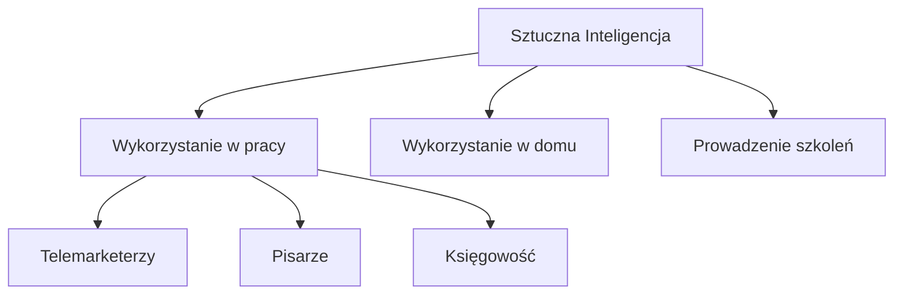
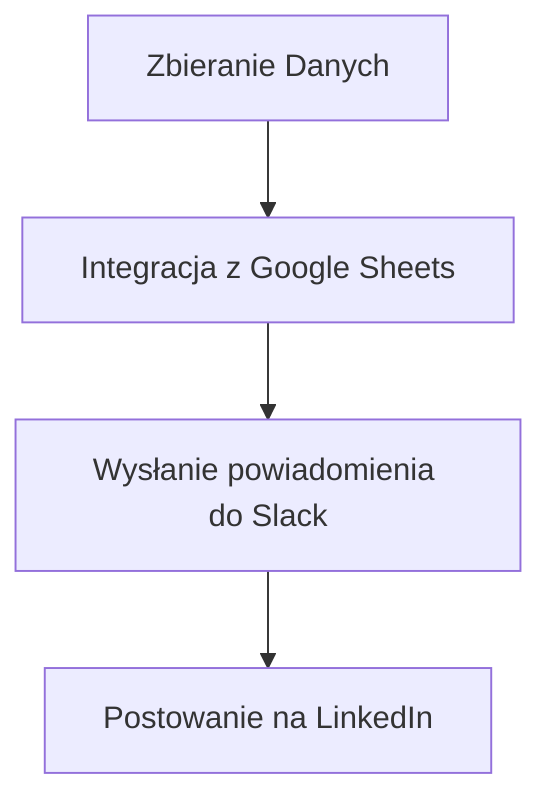
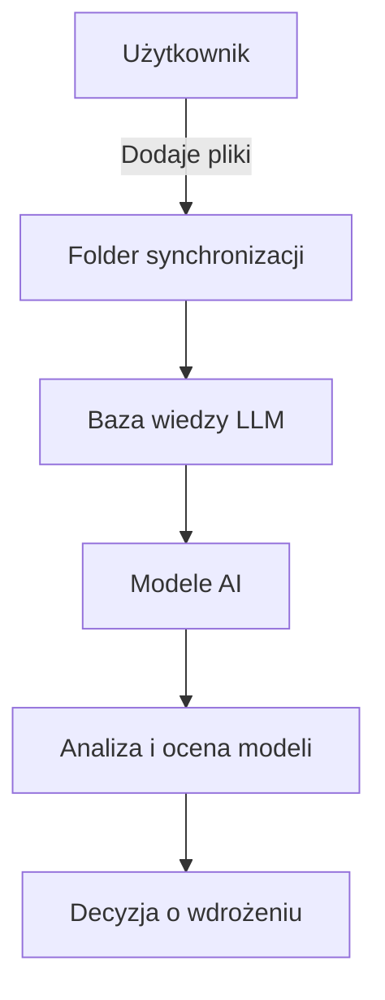

## 🎓 Szkolenie: Poznaj 10 umiejętności AI na 2026 rok

### Wprowadzenie
Piątek, 16 stycznia 2026 roku, gromadzi na live'ie ponad 1000 uczestników, a liczba zapisanych uczestników wynosi ponad 11 tysięcy. Szkolenie prowadzi Tomasz Turba, przedstawiciel trenera Securaka. Tematyka dotyczy umiejętności związanych ze sztuczną inteligencją (AI) w nadchodzących latach.

### Cel Szkolenia
Celem szkolenia jest zapoznanie uczestników z 10 kluczowymi umiejętnościami w zakresie AI, które mogą być istotne w kontekście zmieniającego się rynku pracy oraz nowych technologii.

### Profil Prowadzącego
Tomasz Turba posiada blisko 20-letnie doświadczenie w dziedzinie cyberbezpieczeństwa oraz związane z AI, co zapewnia merytoryczną wartość prezentacji.

### Agenda
- Powitanie uczestników i wprowadzenie do tematyki
- Omówienie znaczenia AI w życiu codziennym i przyszłości zawodowej
- Zasady współpracy i zadawania pytań
- Prezentacja agendy i kluczowych tematów szkolenia

### Tematyka Szkolenia
W toku szkolenia poruszone zostaną kwestie:
- Wykorzystania AI w różnych dziedzinach (produkcyjnej, codziennej, zdrowotnej)
- Potencjalnego wpływu AI na przyszłość różnych zawodów
- Technologii AI jako narzędzia wspierającego codzienne decyzje

### Zastosowanie Statystyk
Na podstawie badania Menlo Ventures z 2025 roku, ponad 51% treści w internecie generowane jest przez AI, co pokazuje rosnące znaczenie technologii w codziennym życiu.



## 📝 Actions
TODO: Przygotować listę 10 umiejętności AI na 2026 rok.
TODO: Opracować materiały dodatkowe do szkolenia.

## 📅 Calendar
SPOTKANIE: Dwa 2-godzinne segmenty szkolenia z przerwami co 2-5 minut. [Synced](https://www.google.com/calendar/event?eid=aGloaTEwbDlpaW90ZHVzbDFoZGxlaHE0aGsgbWFyY2luLnVib2dpQG0)

## 🧠 Flashcards
#flashcard Jakie umiejętności powinno się rozwijać w kontekście AI na rok 2026? :: Inżynieria promptów, analiza danych, automatyzacja procesów.

## AI w Pracy i Umiejętności Kluczowe

### Zagrożone Zawody
Zgodnie z badaniami Uniwersytetu Stanford, zawody szczególnie narażone na zmiany związane z AI obejmują:
- Telemarketerzy
- Pisarze i recenzenci
- Agenci ubezpieczeniowi
- Pracownicy w sektorze księgowości i podatków

### Kluczowe Umiejętności AI na 2023
W 2023 roku, istotne będą następujące umiejętności związane z AI:

1. **Inżynieria promptów (Prompt Engineering)**
   - Technika formułowania instrukcji do modeli AI.
   - Przykład: Podsumowanie treści z linku w trzech punktach, gdzie każdy punkt ma mniej niż 15 słów.
  
   ```python
   # Przykładowy prompt do chatGPT
   "Podsumuj treść z linku w trzech punktach, każdy punkt nie dłuższy niż 15 słów."
   ```

2. **Promptowanie na podstawie roli**
   - Ustalanie kontekstu poprzez przypisanie modelu konkretnej roli (np. ekspert cyberbezpieczeństwa).
  
   ```python
   # Przykład roli w promptowaniu
   "Jesteś ekspertem cyberbezpieczeństwa i trenerem. Przedstaw zagadnienie w phishingu w przystępny sposób."
   ```

### Różnica między Asystentami a Agentami AI
- **Asystent AI**: Działa na zasadzie reaktywnym, wykonując polecenia na żądanie.
- **Agent AI**: Działa autonomicznie, mniej uzależniony od człowieka, pełniąc rolę projekt managera.

### Przykłady i Narzędzia
- **Perplexity**: Asystent z aktualizowaną wiedzą prawną, który odpowiada na pytania dotyczące przepisów.
- **Tworzenie Asystentów**: Można stworzyć asystenta AI np. w chatGPT, wykorzystując marketplace z gotowymi modelami.

### Harmonogram Realizacji Zadań
Za pomocą zaawansowanych funkcji, można zaprogramować asystenta lub agenta do wykonywania regularnych zadań, co znacznie zwiększa efektywność pracy.

```bash
# Przykład harmonogramu
"Monitoruj najnowsze publikacje z portalu sekurak.pl codziennie o 09:00."
```

## 📝 Actions
TODO: Zapoznać się z technikami prompt engineering.
TODO: Stworzyć pierwszego asystenta AI w chatGPT.
TODO: Zbadać szczegółowo różnice między asystentami a agentami AI.

## 📅 Calendar
SPOTKANIE: Szkolenie dotyczące AI - [data nieokreślona] [Synced](https://www.google.com/calendar/event?eid=bjVpN3QwdnU2dHBjcWIwbWkwbm52ZGZ2a2sgbWFyY2luLnVib2dpQG0)

## 🧠 Flashcards
#flashcard Jakie zawody są zagrożone przez AI? :: Telemarketerzy, pisarze, agenci ubezpieczeniowi, księgowi
#flashcard Czym jest prompt engineering? :: Technika pisania instrukcji do modelu AI
#flashcard Jakie są różnice między asystentem a agentem AI? :: Asystent działa reaktywnie, agent autonomicznie.

## Dokumentacja Techniczna - Agenty AI i Automatyzacja Workflowów

### Wprowadzenie
Agenty AI, takie jak Elem Arena AI, oferują możliwość benchmarkowania modeli AI oraz porównywania ich wydajności. Przykładowo, modele takie jak Gemini i Groh można testować i porównywać w trybie bitwy.

### Funkcjonalności
1. **Tworzenie Asystentów AI**: Proces budowy asystentów AI został znacznie uproszczony. Użytkownicy mogą skonfigurować parametry, takie jak nazwa asystenta oraz jego funkcje, a następnie generować jego profile i inne zasoby w sposób zautomatyzowany.

2. **Testowanie i Porównywanie**: Asystenci mogą być testowani pod kątem ich odpowiedzi na zadawane pytania. Zbierane są odpowiedzi z różnych modeli, co pozwala na identyfikację ich mocnych i słabych stron, zwłaszcza w kontekście halucynacji AI.

3. **Automatyzacja Workflowów**: Narzędzia takie jak N8N, Make czy Zapier pozwalają na automatyzację procesów, integrując różne aplikacje i usługi.

### Bezpieczeństwo i Zgodność
Zarówno przy tworzeniu asystentów AI, jak i przy automatyzacji procesów, należy uwzględniać aspekty ochrony danych osobowych zgodnie z regulacjami RODO oraz DORA. Obejmuje to m.in. zapewnienie odpowiednich zabezpieczeń technicznych i organizacyjnych.

### Najważniejsze Zagadnienia
- **Halucynacje AI**: Modele AI, zwłaszcza te ogólnodostępne, często generują fałszywe informacje. Specjalistyczne modele, takie jak te używane w asystentach, są mniej podatne na takie zjawiska.

- **Human in the Loop**: W procesach decyzyjnych modelu ważną rolę odgrywa człowiek, co zwiększa efektywność i dokładność wykonania zadań.

### 🎯 Przykład Workflow
Workflow automatyzacji można skonfigurować w N8N, gdzie różne klocuszki reprezentują różne zadania, takie jak integracja z Google Sheets czy Slack. Poniżej przykład diagramu:



## 📝 Actions
- TODO: Przeprowadzić testy porównawcze modeli Gemini i Groh.
- TODO: Zainstalować N8N lokalnie i skonfigurować pierwszy workflow.
- TODO: Zbadać regulacje RODO i DORA w kontekście użycia modeli AI.

## 📅 Calendar
- SPOTKANIE: Omówienie procesów automatyzacji - 15 listopada 2023, 10:00. [Synced](https://www.google.com/calendar/event?eid=ZDk5ZW0ydDBmb3QzczFlODluNzhuOW5wZWsgbWFyY2luLnVib2dpQG0)

## 🧠 Flashcards
#flashcard Co to jest Elem Arena AI? :: Miejsce do benchmarkowania modeli AI.
#flashcard Czym są halucynacje AI? :: Zjawisko generacji fałszywych informacji przez modele AI.
#flashcard Co to jest Human in the Loop? :: Podejście informujące o roli człowieka w procesach decyzyjnych modelu AI.

## AI Agents Overview

Agenty AI pełnią różnorodne funkcje, takie jak wprowadzanie danych do kalendarza, realizacja złożonych zadań programistycznych, czy pisanie rozpraw doktorskich. Obecnie obserwuje się przejście od modeli LLM (Large Language Models) do modeli LRM (Large Reasoning Models), które umożliwiają symultaniczne wykonywanie wielu zadań. 

### Funkcjonalności modeli LRM

Modele LRM pozwalają na:
- Planowanie i dekomponowanie zadań na mniejsze.
- Wybór narzędzi do realizacji zadań.
- Samodzielną ocenę i poprawę skuteczności działań.

### Przykłady zastosowań

#### Manus 
Manus to rozwiązanie, które wykorzystuje agenty AI do programowania, np. tworzenia animacji Układu Słonecznego w przeglądarce. W kilka minut model był w stanie opracować odpowiednie rozwiązanie, które było zgodne z rzeczywistymi wzorami orbitalnymi.

#### Taskade 
Taskade to narzędzie biznesowe, które można wykorzystać w różnych scenariuszach, w tym podczas tworzenia gier czy dynamicznych aplikacji edukacyjnych. 

## 📝 Actions
TODO: Zbadać funkcjonalności modeli LRM i ich zastosowania w kontekście tworzenia aplikacji.
TODO: Przeanalizować możliwości Manus i Taskade w kontekście realizacji zadań programistycznych.

## RODO i bezpieczeństwo danych

W kontekście wdrożeń rozwiązań AI, kluczowe jest przestrzeganie zasad RODO, zwłaszcza w zakresie przetwarzania danych osobowych. Tworzenie lokalnych modeli AI zmniejsza ryzyko wycieków danych, co jest istotne w kontekście compliance.

## 📅 Calendar
SPOTKANIE: Przegląd narzędzi AI - 20:05, piątek.  [Synced](https://www.google.com/calendar/event?eid=ODExZ2NwamhrN2F0Ym9yMzlkOHRpOWdrNG8gbWFyY2luLnVib2dpQG0)

## 🧠 Flashcards
#flashcard Co to jest w modelu LRM? :: Model LRM to Large Reasoning Model, który pozwala na symultaniczne wykonywanie wielu zadań.
#flashcard Jakie są główne funkcje agenta AI? :: Planowanie, dekomponowanie zadań, wybór narzędzi, samodzielna ocena skuteczności.
#flashcard Co to jest Manus? :: Manus to narzędzie wykorzystujące agenty AI do realizacji zadań programistycznych.
#flashcard Jakie są aspekty RODO w kontekście AI? :: Przestrzeganie zasad przetwarzania danych osobowych, minimalizacja ryzyka wycieków danych.

## Dokumentacja techniczna LLM i SEO w kontekście AI

### Wprowadzenie
Wdrożenie systemów opartych na modelach LLM (Large Language Models) w firmach umożliwia stworzenie zaawansowanej bazy wiedzy, pozwalającej na efektywne zarządzanie danymi oraz optymalizację procesów. Synchronizacja folderów z dokumentami firmowymi dotyczy również aspektów bezpieczeństwa związanych z DORA i RODO.

### Architektura systemu 
System umożliwia interaktywne dodawanie i przetwarzanie dokumentów przez pracowników. Administratorzy mogą tworzyć specjalne foldery dla poszczególnych działów, co upraszcza organizację dokumentacji.



### Wdrażanie i zarządzanie modelami LLM
Za pomocą systemu można zarządzać modelami AI, rankingu ich efektywności (np. ELO) oraz dostosowywać modele do specyficznych potrzeb działów. Modele mogą być testowane przez wybrane grupy pracowników, co pozwala na realne dostosowanie narzędzi do ich potrzeb.

### Zagadnienia bezpieczeństwa
Zarządzanie użytkownikami w systemie powinno opierać się na odpowiednich rolach, ograniczających dostęp do wrażliwych danych. Wszystkie prompty i działania użytkowników powinny być monitorowane i zgodnie z najlepszymi praktykami, użytkownicy powinni być o tym informowani. 

### Nowe podejście do pozycjonowania (AEO-GEO)
Wzrost znaczenia modeli LLM powoduje zmianę w metodach pozycjonowania, gdzie standardowe SEO ustępuje nowym technikom poszukiwania, takie jak Zero Click Search. Modele muszą być konfigurowane tak, aby uwzględniały relacje zaufania do poszczególnych źródeł informacji.

### Wnioski i przygotowanie do działania
Wdrożenie systemów LLM oraz technik pozycjonowania AEO-GEO wymaga ciągłej aktualizacji wiedzy i znajomości dostępnych narzędzi. Firmy muszą również zgłaszać potrzeby i aktualizować treści na stronach internetowych, aby dostosować się do zmieniających się algorytmów wyszukiwania.

## 📝 Actions
TODO: Przeprowadzić audyt dokumentów i synchronizacji folderów.
TODO: Określić role użytkowników i zdefiniować dostęp do danych.
TODO: Monitorować wyniki modeli AI i zaktualizować je zgodnie z wynikami oceny.

## 📅 Calendar
SPOTKANIE: 9 października - Analiza wdrożenia systemu LLM. [Synced](https://www.google.com/calendar/event?eid=M2U3ZDNwNGt1ODFyMmt0b25nZWtuNWxhcGsgbWFyY2luLnVib2dpQG0)
TERMIN: 12 października - Prezentacja wyników i efektywności modeli AI.  [Synced](https://www.google.com/calendar/event?eid=ZDBmZWdvZ21qMGR2MmdldnVwM2tlMXVrbmMgbWFyY2luLnVib2dpQG0)

## 🧠 Flashcards
#flashcard Co to jest LLM? :: Modele dużych zbiorów danych do przetwarzania języka naturalnego. 
#flashcard Co oznacza AEO-GEO? :: Nowe podejście do pozycjonowania bazujące na zaufaniu do modeli LLM.
#flashcard Jakie są kluczowe aspekty bezpieczeństwa w systemach AI? :: Zarządzanie rolami, monitorowanie działań użytkowników, informowanie o kontroli.

## Dokumentacja techniczna - System Prezentacji Securitum

### Podsumowanie
System Prezentacji Securitum to narzędzie, które umożliwia tworzenie i generowanie prezentacji dotyczących firmy Securitum, jej historii oraz prowadzonej działalności. System usprawnia proces przygotowywania materiałów, oferując graficzne elementy, infografiki oraz możliwość modyfikacji treści.

### Kluczowe funkcje
- Generowanie prezentacji w różnych formatach (PowerPoint, PDF, obrazy).
- Możliwość edytowania treści i graficznych elementów na slajdach.
- Szybka generacja prezentacji z użyciem gotowych szablonów.

### Proces tworzenia prezentacji
1. **Inicjacja**:
    - Użytkownik określa temat prezentacji (np. Historia Securitum).
    - Możliwość wyboru stylu (np. niebieski).
  
2. **Generacja**:
    - System generuje prezentację slajd po slajdzie, dodając odpowiednie infografiki i tabele.
  
3. **Modyfikacja**:
    - Użytkownik może edytować treść, zmieniać obrazy oraz szablony, dostosowując prezentację do swoich potrzeb.

4. **Udostępnianie**:
    - Po zakończeniu edycji możliwe jest pobranie gotowej prezentacji w wybranym formacie lub jej bezpośrednie udostępnienie.

### Zawartość prezentacji
- **Wprowadzenie do Securitum**: Historia firmy, kierunki rozwoju.
- **Elementy graficzne**: Infografiki, tabele, animacje.
- **Informacje kontaktowe**: Strona internetowa, e-mail, numer telefonu.
- **Aspekty bezpieczeństwa**: Podkreślenie, że bezpieczeństwo jest kluczowe i konieczne w kontekście działalności.

### Aspekty bezpieczeństwa
- **Compliance z RODO**: Wszystkie dane osobowe muszą być przetwarzane zgodnie z regulacjami.
- **Zarządzanie bezpieczeństwem danych**: Monitorowanie zagrożeń i użycie bezpiecznych praktyk w kodzie źródłowym generowanych stron.

### 📝 Actions
TODO: Przygotować prezentację na temat Historii Securitum na jutrzejsze spotkanie o godzinie 12:00.
TODO: Sprawdzić kompatybilność generowanych prezentacji z aktualnymi standardami RODO.
TODO: Zaktualizować informacje kontaktowe w systemie prezentacji.

### 📅 Calendar
TERMIN: Przygotowanie prezentacji na zarząd – 12:00, jutro.

## 🧠 Flashcards
#flashcard Co to jest system prezentacji Securitum? :: Narzędzie do generowania i edytowania prezentacji o firmie Securitum.
#flashcard Jakie formaty prezentacji można wygenerować za pomocą systemu? :: PowerPoint, PDF, obrazy.
#flashcard Jakie aspekty compliance są ważne w kontekście używania systemu? :: Zgodność z RODO oraz zarządzanie bezpieczeństwem danych.

## 🚀 Przyszłość agentów LRM

### Wprowadzenie
Agenci LRM (Learning Resource Management) zyskują na znaczeniu, oferując autonomiczne podejmowanie decyzji i analizę. Modele takie jak Gemini oraz Chad GPT (wersje 5.2, O3, O4) ilustrują potencjał LRM w praktyce. Deepseek R1, zwłaszcza w wersji lokalnej (670 miliardów parametrów), także stanowi istotne rozwiązanie w tym kontekście.

### Przykłady LRM
Przykładem zaawansowanego rozwiązania LRM jest firma [superagi.com](https://superagi.com), która oferuje szereg narzędzi do uruchamiania agentów z obsługą CRM, zarządzaniem projektami oraz integracjami z aplikacjami, jak WhatsApp. Takie zbiory funkcji mogą przekształcić AI w kluczowe narzędzie biznesowe.

### Kluczowe funkcje agentów LRM
- Autonomia w podejmowaniu decyzji
- Integracja z systemami CRM
- Analityka biznesowa i dashboardy
- Obsługa komunikacji (np. telefonicznej, mailowej)
- Tworzenie modeli semantycznych

## 🎓 Szkolenie i narzędziownik AI

### Program
Szkolenie obejmuje 13 sesji na żywo, z nagraniami dostępnymi na stałe oraz materiałami w formie PDF. Po ukończeniu uczestnicy otrzymują certyfikaty w języku polskim i angielskim.

### Społeczność
Dostęp do platformy Discord z ponad 10,000 członków ułatwia wymianę doświadczeń i rozwój kompetencji.

### Bonusy
- Nagrody dla uczestników konkursu (dostęp do narzędziownika AI oraz pamiątkowe kubki).
- Rabaty do poniedziałku na szkolenia.

## 📅 Calendar
- SPOTKANIE: Rozwiązanie konkursu o godz. 20:56 [Synced](https://www.google.com/calendar/event?eid=Z28wMWNsZ2dlbG5xM29ucm1rZ2lrcnJlcHMgbWFyY2luLnVib2dpQG0)
- TERMIN: Zakończenie rabatu - poniedziałek [Synced](https://www.google.com/calendar/event?eid=ZW82MHAzcmhhaW5pMmdlaDFpZ2tidnZ0aTAgbWFyY2luLnVib2dpQG0)

## 📝 Actions
- TODO: Opracować konkretną strategię wdrożenia agentów LRM w organizacji.
- TODO: Zarejestrować się na szkolenie narzędziownika AI przed końcem rabatu.
- TODO: Uczestniczyć w sesjach Q&A oraz zgłaszać pytania.

## 🧠 Flashcards
#flashcard Co to jest agent LRM? :: Autonomiczny model AI wspierający procesy decyzyjne.
#flashcard Jakie funkcje oferuje narzędziownik AI? :: Integracja agentów CRM, obsługa analityki biznesowej, zarządzanie projektami.
#flashcard Gdzie można uzyskać dostęp do społeczności AI? :: Na platformie Discord z grupą 10,000 członków.

## Dokumentacja Techniczna - AI i Modele LLM

### Wprowadzenie
Obsługa i wykorzystanie modeli LLM (Large Language Models) w kontekście RAG (Retrieval-Augmented Generation), a także bezpieczeństwo danych w środowiskach taki jak Google Workspace.

### Problemy z Długością Kontekstu
Długość kontekstu modeli LLM w systemach RAG może stanowić wyzwanie. Problem ten można zminimalizować poprzez odpowiednią bazę wektorową lub embedding.

### Integracja z Google Workspace
Użytkownicy Google Workspace z licencją biznesową mają dostęp do chmury prywatnej. Usługi działające w takim środowisku są stabilne i dobrze wsparte.

### Cloud Code
Cloud Code wspiera integracje z serwerami MCP i może być wykorzystane jako LRM (Large Retrieval Model) dzięki dużemu oknu kontekstowemu.

### Szukanie Pracy w AI
Zaleca się korzystanie z narzędzi do analizy AI oraz uczestnictwo w warsztatach i szkoleniach.

### Algorytmy Wyszukiwania
Dedykowane narzędzia mogą być stworzone w celu wyszukiwania odpowiedzi na zadane pytania z wykorzystaniem embeddingów i wektorów.

### Lokalny Asystent Programowania
Sugerowanymi modelami do lokalnych asystentów są PCoder i QVEN. Wdrażanie modeli lokalnych jest kluczowe w środowisku o restrykcyjnych przepisach RODO.

### Promptowanie i Weryfikacja Odpowiedzi
Zalecane jest stosowanie specjalnych zdań zabezpieczających w promptach, aby zwiększyć dokładność odpowiedzi generowanych przez modele.

### Prawa Autorskie
Modele AI powinny być traktowane jako odrębne aplikacje z własnymi licencjami. Zgodność z AI Act jest ważna dla ochrony praw autorskich.

### Specyfikacje dla Lokalnego AI
Minimalne specyfikacje sprzętowe dla lokalnego AI obejmują kartę graficzną GeForce Ti 1060.

## 📝 Actions
TODO: Zbadać i wprowadzić odpowiednią bazę wektorową dla modelu LLM.  
TODO: Opracować i wdrożyć lokalne modele w środowisku o restrykcyjnym RODO.  
TODO: Uczestniczyć w szkoleniu na temat technologii AI.  
TODO: Przemyśleć inne możliwości wdrożenia lokalnych narzędzi AI.  

## 📅 Calendar
SPOTKANIE: Zarezerwować udział w nadchodzących warsztatach AI.   [Synced](https://www.google.com/calendar/event?eid=N200Y2JvYnQ5MGlmbjN2ZXZkbDN1dHZ1dTQgbWFyY2luLnVib2dpQG0)

## 🧠 Flashcards
#flashcard Jakie są kluczowe modele lokalne do programowania? :: PCoder, QVEN  
#flashcard Jakie minimalne specyfikacje sprzętowe są potrzebne dla lokalnego AI? :: Karta graficzna GeForce Ti 1060  
#flashcard Co zaleca się w kontekście promptowania modeli AI? :: Zastosowanie specjalnych zdań zabezpieczających.