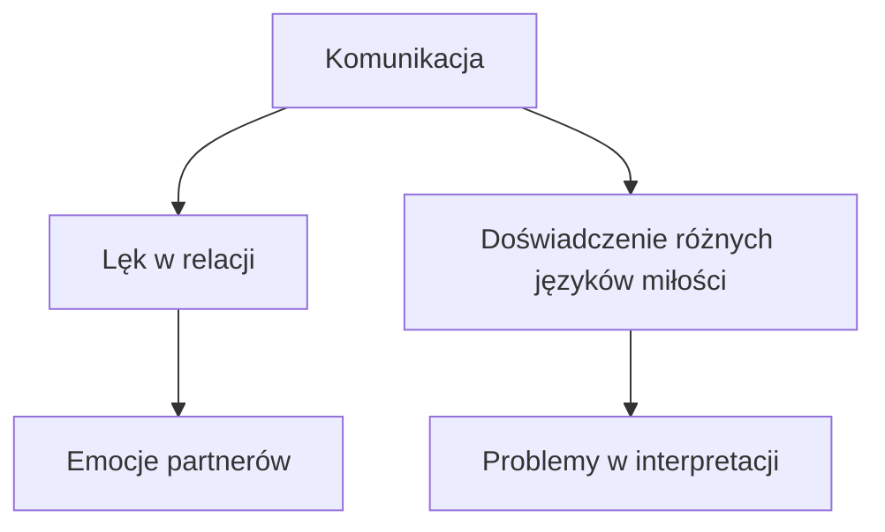

## Rozwój Relacji Międzyludzkich

### Potrzeba Wyjątkowości
W relacjach między kobietami a mężczyznami często występuje silna potrzeba wyjątkowości. Kobiety mogą postrzegać swoją wartość w kontekście posiadania partnera. Istotne jest zapewnienie partnerce poczucia, że nie zostanie odrzucona.

### Elementy Bezpieczeństwa w Związku
Bezpieczeństwo jest kluczowym aspektem relacji. Kobieta czuje się bezpiecznie, gdy ma partnera, który wykazuje pewność siebie i decyzyjność. Prowadzenie w relacji nie powinno być postrzegane jako kontrola, lecz jako odpowiedzialność i dojrzałość.

### Dobra Komunikacja
Słuchanie jest fundamentalne. Brak wysłuchania drugiej osoby jest jedną z najgorszych rzeczy, które mogą wystąpić w relacji. W ważnych momentach lepiej jest przyznać, że nie można obecnie rozmawiać, niż udawać zainteresowanie.

### Zmniejszanie Lęku
Kobiety często doświadczają lęku przed odrzuceniem, co prowadzi do niepewności w relacjach. Istotne jest, aby zarówno kobiety, jak i mężczyźni, pracowali nad swoimi wewnętrznymi lękami, aby uniknąć chaotycznych zachowań i testów w relacji.

## 📝 Actions
TODO: Rozważyć wprowadzenie regularnych spotkań w celu omawiania potrzeb emocjonalnych w relacji.  
TODO: Zachęcać do transparentnej komunikacji w zmniejszaniu lęków związanych z odrzuceniem.

## 📅 Calendar
SPOTKANIE: 2 września o 20.00 - "Największy dietetyczny live w historii".   [Synced](https://www.google.com/calendar/event?eid=cXBmMGZtMXN0ZnVpdTJxbmlpa21tZDc0MG8gbWFyY2luLnVib2dpQG0)

## 🧠 Flashcards
#flashcard Co jest kluczowe w relacjach międzyludzkich? :: Słuchanie i potrzebne poczucie bezpieczeństwa.  
#flashcard Jakie są działania, które zmniejszają lęk w relacji? :: Praca nad wewnętrznymi lękami i transparentna komunikacja.

## Analiza komunikacji w relacjach

### Działanie kontra wyrażanie uczuć
W wielu relacjach zauważalne są różnice w sposobach wyrażania miłości i troski. Osoby często używają różnych języków miłości, co inne dla każdej ze stron może być kluczowe.

### Wpływ lęków na relacje
Lęki obu partnerów manifestują się na różne sposoby. Zrozumienie, że lęk nie jest jedynie kobiecą domeną, jest istotne. Mężczyźni również mogą doświadczać lęku, co wpływa na dynamikę relacji. Komunikacja i dojrzałość emocjonalna są kluczowe dla zdrowego funkcjonowania związku.

### Język miłości
Każda osoba ma dominujący język miłości, który może różnić się od języka jej partnera. Ważne jest, aby zrozumieć, jakie formy miłości są wyrażane i jak są odbierane. Zrozumienie, że można wyrażać uczucia na różne sposoby, jest kluczowe dla budowania zdrowych relacji.

## 🎯 Kluczowe wnioski
1. Różnice w językach miłości wpływają na doświadczanie relacji.
2. Lęki partnerów powinny być zrozumiane, lecz nie mogą decydować o dynamice relacji.
3. Komunikacja i empatia są podstawą budowania zdrowej relacji.

## 📝 Actions
TODO: Zorganizować spotkanie, aby omówić różnice w językach miłości.  
TODO: Przeprowadzić test dotyczący języka miłości i porównać wyniki.

## 📅 Calendar
SPOTKANIE: Omówienie różnic w językach miłości - 15.11.2023.   [Synced](https://www.google.com/calendar/event?eid=YW1wNW82MW9lM3BlZWJuZ2Y5czRpN2ZrZ2sgbWFyY2luLnVib2dpQG0)

## 🧠 Flashcards
#flashcard Jakie są różnice w językach miłości? :: Osoby mogą mieć różne dominujące języki miłości, co wpływa na ich odbiór emocjonalny.  
#flashcard Jak lęki wpływają na relacje? :: Lęki mogą manifestować się u obu partnerów i wpływać na dynamikę związku.  
#flashcard Co jest kluczem do zdrowych relacji? :: Kluczowymi elementami są komunikacja, zrozumienie i empatia.  

## Analiza kryzysu męskości i oczekiwań społecznych

### Wprowadzenie
Współczesny mężczyzna zmaga się z oczekiwaniami, które często są sprzeczne i prowadzą do frustracji. Wykształcenie oraz społeczne standardy nieustannie wpływają na postrzeganie ról płciowych, co skutkuje kryzysem męskości.

### Społeczna percepcja męskości
- Obawy dotyczące tradycyjnych ról płciowych.
- Coraz więcej mężczyzn mieszka z rodzicami oraz spędza czas w internecie.
- Tendencja do bierności i obojętności.

### Kobiety a edukacja emocjonalna
- Kobiety od lat uczestniczą w procesie świadomego rozwoju osobistego.
- Istnieje potrzeba wsparcia mężczyzn w tym procesie, aby osiągnęli zdrowe relacje.

## Problematiką komunikacji w związkach

### Toksyczne wzorce
- Często mężczyźni i kobiety są obciążani negatywnymi stereotypami.
- Mężczyźni uczą się, że emocje są oznaką słabości, co może prowadzić do emocjonalnej dystansowości.

### Granice i oczekiwania
- Niezrozumienie własnych granic prowadzi do toksycznych relacji.
- Ważne jest, aby mężczyźni komunikowali swoje potrzeby i oczekiwania bez strachu przed odrzuceniem.

## Źródła konfliktów w relacjach

### Brak szacunku jako kluczowy czynnik
- Większość związków kończy się brakiem szacunku.
- Niezrozumienie granic emocjonalnych może prowadzić do destrukcji relacji.

### Dynamika związków
- Ludzie często zwiążą się w celu regulacji emocjonalnej, a nie z prawdziwego przywiązania.
- Zarówno kobiety, jak i mężczyźni muszą zrozumieć swoje motywacje.

## Zidentyfikowane czerwone flagi w relacjach

### Uwaga na zachowania
- Uważność partnera na drugą osobę jest kluczowa.
- Sposób, w jaki mówią o byłych, może być wskazówką mówiącą wiele o ich obecnych intencjach.

### Otwartość na komunikację
- Ważne, aby osoby na randkach miały możliwość wyrażenia swoich emocji i uczuć.
- Problemy z komunikacją mogą prowadzić do dalszych konfliktów.

### Dobry intencjonalizm
- Podchodzenie do relacji z otwartym umysłem i dobrymi intencjami jest kluczowe.
- Wspieranie się nawzajem w budowaniu zdrowych relacji wymaga czasu i zaangażowania.

## 📝 Actions
TODO: Przeanalizować i zidentyfikować oczekiwania wobec mężczyzn w kontekście kryzysu męskości.  
TODO: Edukować młodych mężczyzn w zakresie emocjonalnej inteligencji oraz komunikacji.  
TODO: Wspierać inicjatywy mające na celu budowanie zdrowych relacji.  

## 🧠 Flashcards
#flashcard Czym jest kryzys męskości? :: Kryzys męskości odnosi się do problemów z tożsamością i rolą mężczyzn w społeczeństwie.  
#flashcard Jakie są czerwone flagi w relacji? :: Czerwone flagi to zachowania, które mogą świadczyć o braku szacunku lub negatywnych intencjach partnera.  
#flashcard Co wpływa na bierność mężczyzn? :: Brak jasnych komunikatów społecznych oraz oczekiwań w relacjach emocjonalnych.

## 📅 Calendar
TERMIN: Spotkanie dotyczące analizy relacji międzyludzkich i aplikacji randkowych. [Synced](https://www.google.com/calendar/event?eid=aGhqcm5kM2swaWJsN2s5MzYwdnFraW91YWcgbWFyY2luLnVib2dpQG0)

## Temat: Analiza Działań i Psychologii Związków

### Wprowadzenie
Zrozumienie emocjonalnych reakcji i dynamiki w relacjach interpersonalnych jest kluczowe dla budowania znaczących związków. W szczególności, głęboka analiza intencji oraz percepcji zachowań partnerów może pomóc w unikaniu nieporozumień i udoskonaleniu komunikacji.

### Kluczowe Punkty
1. **Detoks emocjonalny**: Czasami konieczne jest odejście od relacji, aby zyskać nową perspektywę i zrozumienie swoich potrzeb.
2. **Intencje w relacjach**: Dobre intencje mogą pomóc w nawiązaniu głębszej łączności i zrozumieniu drugiej osoby. Ważne jest, aby nie przyjmować zachowań innych jako odzwierciedlenie własnej wartości.
3. **Konfrontacja z prawdą**: Należy unikać unikania konfrontacji, zrozumieć, że konflikt może wzmocnić związek poprzez klarowne komunikowanie swoich potrzeb.
4. **Komunikacja**: Wyważona i jasno wyrażona komunikacja jest kluczowa w relacjach, aby zminimalizować niedomówienia i konflikty.
5. **Psychologia wyborów**: Zrozumienie, dlaczego ludzie wchodzą w pewne relacje oraz jak ich przeszłość wpływa na obecne decyzje, może być pomocne w nawiązywaniu zdrowych relacji.

### Problemy w Aplikacjach Randkowych
1. **Niskie standardy**: Często ludzie wchodząc w relacje przez aplikacje randkowe, mają niskie oczekiwania i akceptują zachowania, które mogą być szkodliwe.
2. **Manipulacja emocjonalna**: Istnieją niezdrowe dynamiki, takie jak szantaż emocjonalny, które mogą prowadzić do krzywdzenia obu stron.
3. **Porównywanie się**: Media społecznościowe stają się źródłem porównań, co prowadzi do poczucia niższości i problemów z akceptacją siebie.

## 📝 Actions
TODO: Zorganizować warsztaty na temat zdrowej komunikacji w relacjach.
TODO: Opracować materiały edukacyjne dotyczące emocjonalnej inteligencji i konfrontacji.
TODO: Zbadać problemy związane z aplikacjami randkowymi i ich wpływ na relacje międzyludzkie.

## 🧠 Flashcards
#flashcard Co to jest detoks emocjonalny? :: Czasowe odejście od relacji dla uzyskania nowej perspektywy.
#flashcard Jakie są dobre intencje w relacjach? :: Praktyka zrozumienia drugiej osoby i wyrażenia swoich potrzeb.
#flashcard Co oznacza komunikacja wyważona? :: Jasne i bezpośrednie wyrażanie myśli oraz uczuć w relacji.

## Analiza Relacji Interpersonalnych

### Wprowadzenie
W kontekście relacji międzyludzkich, szczególnie romantycznych, istnieje wiele aspektów dotyczących oczekiwań, zależności oraz konsekwencji. Warto zastanowić się nad tym, na ile osoby zaangażowane w te relacje są świadome długofalowych konsekwencji swoich wyborów.

### Moralność a relacje
Ocenianie relacji międzyludzkich przez pryzmat moralności może prowadzić do uproszczeń. Kluczowe jest zrozumienie, jakie są konsekwencje zależności pomiędzy partnerami oraz w jaki sposób te zależności mogą się rozwijać. 

### Edukacja i finansowe konsekwencje
Brak edukacji dotyczącej finansów i konsekwencji prawnych w relacjach może prowadzić do problemów. Ważne jest, aby osoby wchodzące w związki rozumiały, na co się decydują, i miały jasno określone oczekiwania oraz możliwości.

### Zmiana i potencjał
Często ludzie w relacjach kierują się nadzieją na zmianę drugiej strony. Zrozumienie, że partnerzy nie muszą się zmieniać, a ich kreowanie na potencjalnych „bohaterów” może prowadzić do rozczarowań.

### Rola równości w związkach
Dążenie do równości w związku (50-50) może być nierealne. Ważniejsze jest, aby partnerzy czuli się sprawiedliwie traktowani i nie czuli się pokrzywdzeni.

### Obawy dotyczące przemocy
W obecnych czasach wiele osób zadaje sobie pytanie, czy lepiej być w toksycznym związku niż być samemu. Pojawia się obawa przed samotnością, co wpływa na decyzje o pozostaniu w szkodliwych relacjach.

### Wsparcie psychologiczne
Psycholodzy często starają się być neutralni, jednak w pewnych sytuacjach konieczne może być wskazanie na problemy w relacjach w sposób jednoznaczny. Uświadomienie sobie, że kiedy jedna strona nie chce się angażować, druga powinna reconsiderować swoje oczekiwania.

### Wnioski dla kobiet
1. **Szukaj partnera, który jest gotów na współpracę**, a nie tylko biernie przyjmuje uznanie.
2. **Pomagaj w relacjach**, ale nie pełniąc roli matki lub mentora, a jako pełnoprawny partner.
3. **Zachowuj krytyczne spojrzenie na swoje oczekiwania i wymagania.**
4. **Konfrontuj siebie oraz innych z rzeczywistością**, co pozwoli na efektywniejszy rozwój w relacjach.

## 📝 Actions
TODO: Opracować materiały edukacyjne dotyczące konsekwencji finansowych w relacjach.
TODO: Zorganizować warsztaty na temat zdrowych relacji.

## 🧠 Flashcards
#flashcard Jakie konsekwencje mogą wynikać z zależności w relacji? :: Długofalowe konsekwencje psychiczne i finansowe.
#flashcard Dlaczego dążenie do równości w związku (50-50) może być nierealne? :: Każdy z partnerów wnosi różne doświadczenia i zasoby.
#flashcard Jakie jest kluczowe pytanie dotyczące angażowania się w relacje? :: Ile czasu jesteśmy gotowi czekać na zmiany w partnerze?