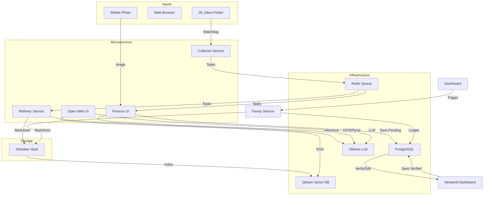

# Dokumentacja Techniczna - Obsidian Brain v2

**Wersja:** 2.0.0
**Status:** MVP Ukończone
**Data:** 19.01.2026

## 1. Przegląd Systemu

**Obsidian Brain v2** to system mikroserwisów służący do automatyzacji zarządzania wiedzą osobistą (Second Brain) w oparciu o aplikację Obsidian. System przekształca pasywny zbiór notatek w aktywną bazę wiedzy, wykorzystując lokalne modele AI (Ollama) do przetwarzania treści, generowania podsumowań i umożliwienia rozmowy z własnymi notatkami (RAG).

### Główne cele architektoniczne:
- **Modularność:** Podział na niezależne serwisy (Collector, Refinery, Finance, Chat).
- **Prywatność:** Wszystkie dane i modele AI działają lokalnie (Docker).
- **Skalowalność:** Komunikacja asynchroniczna przez Redis Queue.
- **Odporność:** Błędy w jednym module nie zatrzymują całego systemu.

---

## 2. Architektura

System oparty jest na kontenerach Docker orkiestrowanych przez `docker-compose`.

### Diagram Komponentów



### Stos Technologiczny

| Warstwa | Technologia | Rola |
|---------|-------------|------|
| **Język** | Python 3.10 | Główny język backendu |
| **Infrastruktura** | Docker Compose | Orkiestracja kontenerów |
| **Kolejka (Message Broker)** | Redis | Komunikacja między serwisami |
| **Baza Danych (Relacyjna)** | PostgreSQL | Przechowywanie danych strukturalnych (finanse) |
| **Baza Wektorowa** | Qdrant | Wyszukiwanie semantyczne (RAG) |
| **AI / LLM** | Ollama (DeepSeek-R1, Llama 3) | Lokalne przetwarzanie języka naturalnego |
| **Frontend** | Brain CLI (Rich), Open Web UI | Interfejsy dla użytkownika |

---

## 3. Komponenty Systemu (Mikroserwisy)

### 3.1 Shared Library (`shared/`)
Biblioteka współdzielona przez wszystkie serwisy Python. Zapewnia spójność typów danych i konfiguracji.
- **Messaging:** Wrapper na Redis (`TaskQueue`).
- **Types:** Modele Pydantic (`YoutubeTask`, `ArticleTask`, `ReceiptTask`).
- **Config:** Centralne zarządzanie zmiennymi środowiskowymi (`.env`).
- **Logging:** Strukturalne logowanie JSON.

### 3.2 Collector Service (`modules/collector/`)
"Oczy i uszy" systemu. Odpowiada za pobieranie surowych danych.
- **Funkcja:** Monitoruje folder `00_Inbox` na obecność plików.
- **Obsługiwane źródła:**
  - **YouTube:** Pobiera audio, transkrybuje (Whisper).
  - **Artykuły:** Pobiera treść (Trafilatura).
  - **Paragony:** Wykrywa obrazy (`.jpg`, `.png`) i przesyła do Finance.
- **Output:** Wysyła zadania do `queue:refinery` lub `queue:finance`.

### 3.3 Refinery Service (`modules/refinery/`)
"Mózg" systemu. Przetwarza surowe dane na gotowe notatki.
- **Funkcja:** Pobiera zadania z Redis, analizuje treść przez LLM, generuje Markdown.
- **Proces AI:**
  1. Analiza treści (Podsumowanie, Kluczowe punkty, Tagi).
  2. Mapowanie na szablon Jinja2.
  3. Zapis pliku `.md` bezpośrednio do Obsidian Vault.

### 3.4 Finance Service (`modules/finance/`)
Serwis do przetwarzania paragonów (Headless) zoptymalizowany pod kątem szybkości i kosztów.
- **Typ:** Backend Worker.
- **Funkcja:** Pobiera obrazy z `queue:finance` i przetwarza je przez **Async Receipt Pipeline**.

#### ⚙️ Architektura Potoku (Async Receipt Pipeline)
System działa w modelu kaskadowym (waterfall) w celu minimalizacji użycia LLM:
1.  **Warstwa 1 (Cache):** Sprawdza `ReceiptCache` (dokładne dopasowanie, LRU, wzorce sklepowe). Jeśli linia tekstu była już widziana, zwraca dane natychmiast.
2.  **Warstwa 2 (Fuzzy Matching):** Równoległe dopasowywanie rozmyte (`rapidfuzz`) do znanej taksonomii produktów (`product_taxonomy.json`). Wykorzystuje `ThreadPoolExecutor`.
3.  **Warstwa 3 (AI Fallback):** Asynchroniczne wywołanie LLM (DeepSeek-R1) tylko gdy "pokrycie" paragonu jest niskie (<30%).
4.  **Normalizacja:** `TaxonomyGuard` dba o spójność nazw, kategorii i jednostek (np. "MLEKO UHT" -> "Mleko 3.2%").

- **Output:** Zapisuje dane w tabeli `expenses` (PostgreSQL) ze statusem `verified=false` oraz aktualizuje lokalny cache.

### 3.5 Brain CLI (`brain.py`)
Centralny interfejs zarządzania systemem w terminalu.
- **Technologia:** Python + Rich + Typer.
- **Funkcje:**
  - `status`: Dashboard monitorujący kontenery Docker i kolejki Redis.
  - `finance`: Pomocnik do wrzucania paragonów do Inbox.
  - `chat`: (Planowane) Interfejs czatu w terminalu.

### 3.5 Chat Service (`modules/chat/`)
Interfejs konwersacyjny z własną bazą wiedzy.
- **Silnik:** Open Web UI (`http://localhost:3000`).
- **RAG (Retrieval Augmented Generation):**
  - **Indeksowanie:** Skrypt `setup_rag.py` przetwarza notatki Vault na wektory w Qdrant.
  - **Pipeline:** Przy każdym zapytaniu system wyszukuje 5 najbardziej relewantnych fragmentów notatek i dołącza je do promptu LLM.

### 3.6 Migration & Monitoring (`scripts/`)
Zestaw narzędzi administracyjnych i operacyjnych.
- **Migracja:** `migrate_notes.py` kopiuje i waliduje dane ze starego Vaulta.
- **Health Check:** `health_check.py` sprawdza dostępność wszystkich serwisów (Postgres, Redis, Ollama, Qdrant).
- **Dashboard (Streamlit):**
  - **Overview & Queues**: Monitoring stanu kontenerów i kolejek Redis.
  - **Expenses Analytics**: Wizualizacja zatwierdzonych wydatków.
  - **Human In The Loop**: Interfejs do ręcznej weryfikacji i edycji nowo wprowadzonych paragonów przed ich zatwierdzeniem. Zatwierdzenie wyzwala aktualizację Agenta 09 (Pantry).

### 3.7 Pantry Service (`modules/pantry/`) - Agent 09
Inteligentny agent zarządzający zapasami domowymi.
- **Architektura:** Ledger-based (księgowa). Stan produktu nie jest zapisany jako jedna liczba, lecz wynika z agregacji transakcji.
- **Główne funkcje:**
  - `process_receipt`: Pobiera dane z zatwierdzonego paragonu i dodaje "zakupy" do rejestru.
  - `consume_product`: Rejestruje zużycie produktu (np. wykorzystanie w kuchni).
  - `adjust_stock`: Synchronizuje stan wirtualny z rzeczywistym (inwentaryzacja) poprzez transakcję korygującą.
- **Deduplikacja:** Wykorzystuje hash SHA256 (data + sklep + kwota), aby zapobiec duplikatom produktów z tego samego paragonu.
- **Output:** Automatycznie regeneruje pliki `Spiżarnia.md` oraz `Lista Zakupów.md` w Obsidianie.

---

## 4. Modele Danych

### Zadania (Tasks) - Pydantic

**YoutubeTask**
```python
{
  "id": "yt_20260118_...",
  "type": "youtube",
  "url": "https://...",
  "title": "Video Title",
  "transcript": "Full text...",
  "duration_seconds": 120
}
```

**ArticleTask**
```python
{
  "id": "art_20260118_...",
  "type": "article",
  "url": "https://...",
  "content": "Article body...",
  "author": "John Doe"
}
```

### Baza Danych (PostgreSQL) - Schema

**Tabela: `expenses`**
- `id`: Integer (PK)
- `shop_name`: String
- `total_amount`: Float
- `purchase_date`: DateTime
- `items`: JSON (lista produktów)
- `verified`: Boolean (czy zatwierdzone przez człowieka)
- `ocr_raw_text`: Text

**Tabela: `pantry_produkty`**
- `id`: Integer (PK)
- `nazwa`: String (Unique)
- `kategoria`: String
- `minimum_ilosc`: Numeric (Próg dla listy zakupów)
- `jednostka_miary`: String

**Tabela: `pantry_paragony`**
- `id`: Integer (PK)
- `hash_identyfikacyjny`: String (Unique, SHA256)
- `data_zakupow`: Date

**Tabela: `pantry_pozycje_paragonu` (Ledger: IN)**
- `id`: Integer (PK)
- `paragon_id`: FK(pantry_paragony)
- `produkt_id`: FK(pantry_produkty)
- `ilosc`: Numeric

**Tabela: `pantry_posilki` (Ledger: OUT)**
- `id`: Integer (PK)
- `produkt_id`: FK(pantry_produkty)
- `ilosc`: Numeric
- `data`: Date

---

## 5. Konfiguracja i Wdrożenie

### Zmienne Środowiskowe (`.env`)
Kluczowe zmienne konfiguracyjne:
- `OBSIDIAN_VAULT_PATH`: Ścieżka absolutna do Vaulta.
- `INBOX_PATH`: Ścieżka do folderu `00_Inbox` wewnątrz Vaulta.
- `OLLAMA_MODEL`: Model używany do wnioskowania (np. `deepseek-r1:14b`).
- `POSTGRES_PASSWORD`: Hasło do bazy danych.

### Procedura Uruchomienia
1. Sklonuj repozytorium.
2. Uruchom `./scripts/init.sh` (przygotowanie środowiska).
3. Skonfiguruj `.env`.
4. Uruchom `docker compose up -d`.

### Logi i Debugowanie
- Wszystkie serwisy logują w formacie JSON (produkcja) lub Console (dev).
- Podgląd logów: `docker compose logs -f [service_name]`.

---

## 6. Rozwój (Development)

Aby dodać nową funkcjonalność:
1. **Zaktualizuj Shared Library** (jeśli zmieniasz typy danych).
2. **Dodaj Producer'a** (np. w Collectorze).
3. **Dodaj Consumer'a** (w Refinery lub nowym serwisie).
4. **Zaktualizuj `docker-compose.yml`**.

### Testowanie
Projekt wykorzystuje `pytest`.
- Uruchomienie testów: `pytest scripts/testing/`.
- Testy E2E: `scripts/testing/test_full_pipeline.py`.

---

*Dokumentacja generowana automatycznie przez Google Antigravity Agents.*
