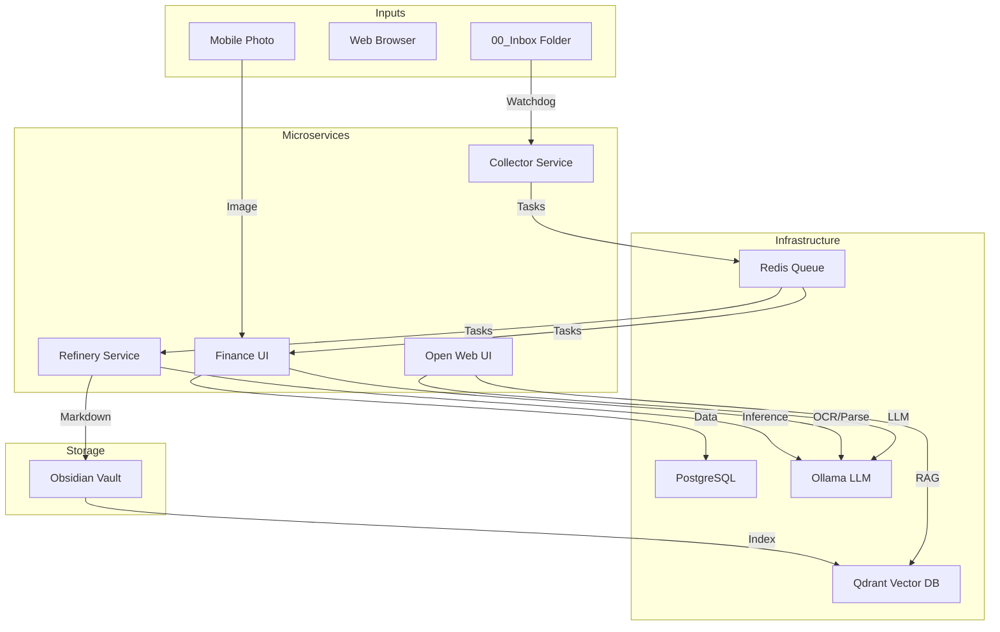

# Dokumentacja Techniczna - Obsidian Brain v2

**Wersja:** 2.0.0
**Status:** MVP Ukończone
**Data:** 18.01.2026

## 1. Przegląd Systemu

**Obsidian Brain v2** to system mikroserwisów służący do automatyzacji zarządzania wiedzą osobistą (Second Brain) w oparciu o aplikację Obsidian. System przekształca pasywny zbiór notatek w aktywną bazę wiedzy, wykorzystując lokalne modele AI (Ollama) do przetwarzania treści, generowania podsumowań i umożliwienia rozmowy z własnymi notatkami (RAG).

### Główne cele architektoniczne:
- **Modularność:** Podział na niezależne serwisy (Collector, Refinery, Finance, Chat).
- **Prywatność:** Wszystkie dane i modele AI działają lokalnie (Docker).
- **Skalowalność:** Komunikacja asynchroniczna przez Redis Queue.
- **Odporność:** Błędy w jednym module nie zatrzymują całego systemu.

---

## 2. Architektura

System oparty jest na kontenerach Docker orkiestrowanych przez `docker-compose`.

### Diagram Komponentów



### Stos Technologiczny

| Warstwa | Technologia | Rola |
|---------|-------------|------|
| **Język** | Python 3.10 | Główny język backendu |
| **Infrastruktura** | Docker Compose | Orkiestracja kontenerów |
| **Kolejka (Message Broker)** | Redis | Komunikacja między serwisami |
| **Baza Danych (Relacyjna)** | PostgreSQL | Przechowywanie danych strukturalnych (finanse) |
| **Baza Wektorowa** | Qdrant | Wyszukiwanie semantyczne (RAG) |
| **AI / LLM** | Ollama (DeepSeek-R1, Llama 3) | Lokalne przetwarzanie języka naturalnego |
| **Frontend** | Streamlit (Finance), Open Web UI (Chat) | Interfejsy dla użytkownika |

---

## 3. Komponenty Systemu (Mikroserwisy)

### 3.1 Shared Library (`shared/`)
Biblioteka współdzielona przez wszystkie serwisy Python. Zapewnia spójność typów danych i konfiguracji.
- **Messaging:** Wrapper na Redis (`TaskQueue`).
- **Types:** Modele Pydantic (`YoutubeTask`, `ArticleTask`, `ReceiptTask`).
- **Config:** Centralne zarządzanie zmiennymi środowiskowymi (`.env`).
- **Logging:** Strukturalne logowanie JSON.

### 3.2 Collector Service (`modules/collector/`)
"Oczy i uszy" systemu. Odpowiada za pobieranie surowych danych.
- **Funkcja:** Monitoruje folder `00_Inbox` na obecność plików tekstowych z linkami.
- **Obsługiwane źródła:**
  - **YouTube:** Pobiera audio, transkrybuje (Whisper), pobiera metadane.
  - **Artykuły WWW:** Pobiera treść (Trafilatura), usuwa reklamy/menu.
- **Output:** Wysyła zadanie z surowymi danymi do kolejki `queue:refinery`.

### 3.3 Refinery Service (`modules/refinery/`)
"Mózg" systemu. Przetwarza surowe dane na gotowe notatki.
- **Funkcja:** Pobiera zadania z Redis, analizuje treść przez LLM, generuje Markdown.
- **Proces AI:**
  1. Analiza treści (Podsumowanie, Kluczowe punkty, Tagi).
  2. Mapowanie na szablon Jinja2.
  3. Zapis pliku `.md` bezpośrednio do Obsidian Vault.
  4. Deduplikacja nazw plików.

### 3.4 Finance Service (`modules/finance/`)
Serwis do zarządzania wydatkami z interfejsem "Human-in-the-loop".
- **Interfejs:** Aplikacja w Streamlit (`http://localhost:8501`).
- **Proces:**
  1. Upload zdjęcia paragonu.
  2. OCR (Tesseract) + Parsing AI (DeepSeek) do JSON.
  3. Weryfikacja danych przez użytkownika w UI.
  4. Zapis do bazy PostgreSQL.
- **Monitoring:** Dashboard wydatków i statystyki.

### 3.5 Chat Service (`modules/chat/`)
Interfejs konwersacyjny z własną bazą wiedzy.
- **Silnik:** Open Web UI (`http://localhost:3000`).
- **RAG (Retrieval Augmented Generation):**
  - **Indeksowanie:** Skrypt `setup_rag.py` przetwarza notatki Vault na wektory w Qdrant.
  - **Pipeline:** Przy każdym zapytaniu system wyszukuje 5 najbardziej relewantnych fragmentów notatek i dołącza je do promptu LLM.

---

## 4. Modele Danych

### Zadania (Tasks) - Pydantic

**YoutubeTask**
```python
{
  "id": "yt_20260118_...",
  "type": "youtube",
  "url": "https://...",
  "title": "Video Title",
  "transcript": "Full text...",
  "duration_seconds": 120
}
```

**ArticleTask**
```python
{
  "id": "art_20260118_...",
  "type": "article",
  "url": "https://...",
  "content": "Article body...",
  "author": "John Doe"
}
```

### Baza Danych (PostgreSQL) - Schema

**Tabela: `expenses`**
- `id`: Integer (PK)
- `shop_name`: String
- `total_amount`: Float
- `purchase_date`: DateTime
- `items`: JSON (lista produktów)
- `verified`: Boolean (czy zatwierdzone przez człowieka)
- `ocr_raw_text`: Text

---

## 5. Konfiguracja i Wdrożenie

### Zmienne Środowiskowe (`.env`)
Kluczowe zmienne konfiguracyjne:
- `OBSIDIAN_VAULT_PATH`: Ścieżka absolutna do Vaulta.
- `INBOX_PATH`: Ścieżka do folderu `00_Inbox` wewnątrz Vaulta.
- `OLLAMA_MODEL`: Model używany do wnioskowania (np. `deepseek-r1:14b`).
- `POSTGRES_PASSWORD`: Hasło do bazy danych.

### Procedura Uruchomienia
1. Sklonuj repozytorium.
2. Uruchom `./scripts/init.sh` (przygotowanie środowiska).
3. Skonfiguruj `.env`.
4. Uruchom `docker compose up -d`.

### Logi i Debugowanie
- Wszystkie serwisy logują w formacie JSON (produkcja) lub Console (dev).
- Podgląd logów: `docker compose logs -f [service_name]`.

---

## 6. Rozwój (Development)

Aby dodać nową funkcjonalność:
1. **Zaktualizuj Shared Library** (jeśli zmieniasz typy danych).
2. **Dodaj Producer'a** (np. w Collectorze).
3. **Dodaj Consumer'a** (w Refinery lub nowym serwisie).
4. **Zaktualizuj `docker-compose.yml`**.

### Testowanie
Projekt wykorzystuje `pytest`.
- Uruchomienie testów: `pytest scripts/testing/`.
- Testy E2E: `scripts/testing/test_full_pipeline.py`.

---

*Dokumentacja generowana automatycznie przez Google Antigravity Agents.*
